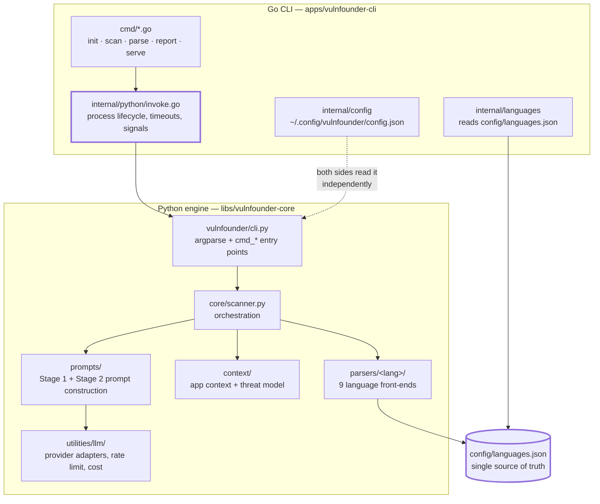
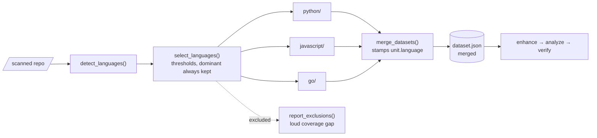
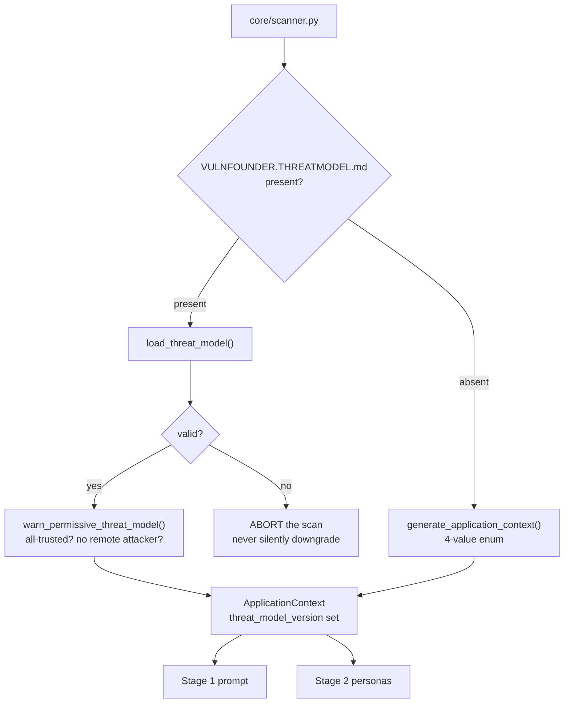

# VulnFounder architecture

How the scanner is put together, what depends on what, and where to stand when you
need to change something.

> **Where documentation lives.** In tracked files at the repository root and under
> `libs/vulnfounder-core/`. **Not** in `docs/` — that directory is gitignored
> (`.gitignore:11`), which is why twelve `docs/*.md` links elsewhere in this repo
> point at files that do not exist. Anything written there is silently discarded.

---

## 1. The shape of the thing

VulnFounder is a Go CLI wrapping a Python engine. The Go side owns the user's
workspace — projects, config, checkpoints, process lifecycle. The Python side owns
everything about analysis. They speak over a deliberately narrow contract.



The two thick-bordered nodes are the seams that break quietly. `config/languages.json`
is read by both runtimes; `invoke.go` is where the JSON envelope contract lives and
where drift between the two sides shows up as silence rather than an error.

---

## 2. A scan, end to end

```mermaid
sequenceDiagram
    participant U as user
    participant Go as Go CLI
    participant Py as vulnfounder/cli.py
    participant S as core/scanner.py
    participant P as parsers/&lt;lang&gt;
    participant C as context/
    participant L as LLM

    U->>Go: vulnfounder scan ./repo
    Go->>Py: python -m vulnfounder scan … (argv only)
    Py->>S: scan_repository(...)
    S->>P: detect languages, parse each
    P-->>S: per-language datasets
    S->>S: merge_datasets → one dataset.json
    S->>C: load VULNFOUNDER.THREATMODEL.md, else generate app context
    C-->>S: ApplicationContext (custom or built-in)
    S->>L: Stage 1 — detection, per unit
    L-->>S: findings
    S->>L: Stage 2 — attacker simulation (--verify)
    L-->>S: verdicts
    S-->>Py: ScanResult
    Py-->>Go: one JSON envelope on stdout; human text on stderr
    Go-->>U: rendered summary; exit 0 clean / 1 vulns found / 2 error
```

**The contract in one paragraph.** stdout carries exactly one JSON envelope
(`{status, data, errors}`); stderr carries human output and is streamed unparsed;
exit codes are 0 clean, 1 vulnerabilities found, 2 error. Only `ANTHROPIC_API_KEY`
crosses as an environment variable. Config is *not* passed — both sides read
`~/.config/vulnfounder/config.json` independently, which is a known drift vector
(see §6).

---

## 3. Multi-language: fan out, merge once

Parsing fans out per language into `<run>/<lang>/`, because every parser writes the
same seven flat filenames and would otherwise overwrite its siblings. The datasets
then merge into one, and the expensive LLM stages run **once** over the merged set.



**Why merge rather than fan the whole pipeline out:** one `--limit`, one cost
budget, one dedup pass, one report. The cost is that the LLM stages see a mixed-
language corpus — see §7 for the caveat that carries.

`auto` means *every detected language above threshold*, and that is the default.
`-l <lang>` is the opt-out.

---

## 4. Threat models: replacing "app type"

The original design classified a repository into one of four values
(`web_app | cli_tool | library | agent_framework`), each mapping to a hardcoded
attack model, and collapsed the whole attacker question into one boolean. A
repository can now ship `VULNFOUNDER.THREATMODEL.md` and describe itself. Existing
`OPENANT.THREATMODEL.md` files remain readable during the migration window.



Two properties worth knowing before you touch this:

- **Absence falls back; malformed aborts.** A missing file is a choice. A present
  but broken file is an error, because a scan that silently reverts to `web_app`
  looks entirely successful while analysing under the wrong security model.
- **The file is attacker-controlled.** It comes from the scanned repository. Its
  prose is *not* prompt-injection fenced — a documented, accepted gap. The
  permissive-model warnings exist because a schema-valid model can legitimately
  suppress findings, and that suppression must at least be visible.

---

## 5. Where to stand to change something

| I want to… | Start here | Then |
|---|---|---|
| add a language | `config/languages.json` | `parsers/<lang>/`, then run `tests/test_scanner_contract.py` — it discovers parsers from the registry, so a new language enters the suite automatically |
| change what a prompt says | `prompts/vulnerability_analysis.py` (Stage 1), `prompts/verification_prompts.py` (Stage 2) | `prompts/threat_model_render.py` if it concerns attacker personas |
| change the threat-model schema | `context/threat_model.py` (`REQUIRED_TOP_LEVEL`, the `_validate_*` helpers) | `context/VULNFOUNDER_THREATMODEL_TEMPLATE.md`, and `tests/test_threat_model_rejection.py` |
| touch repository traversal | `core/repo_walk.py` — **one** walker for all Python parsers | never per-parser; that is why traversal bugs used to land in 1 of 5 |
| open a file from a scanned repo | `utilities/file_io.py` — `read_repo_file` / `write_repo_file` / `repo_path_state` | never bare `open()`; these guard symlinks, FIFOs and size |
| add a provider | `utilities/llm/providers/` | the adapter Protocol in `utilities/llm/adapter.py` |
| change the Go↔Python contract | `core/schemas.py` **and** `apps/vulnfounder-cli/internal/` together | §6 — they are not bound by anything mechanical |

---

## 6. Known structural hazards

These are documented rather than fixed. Each has bitten at least once.

| Hazard | Where | Consequence |
|---|---|---|
| Go/Python contract is convention, not schema | `core/schemas.py` ↔ `internal/types/results.go` | Already failed: `formatter.go:120` reads `data["reports"]`, Python emits `step_reports`, so the CLI's Reports section has never rendered. `types.ReportData` has zero references — a struct that looks like type safety while production reads untyped maps |
| Config path resolved independently on both sides | `internal/config/config.go` vs `utilities/llm/registry.py` | On Windows Go writes `%APPDATA%` and Python reads `~/.config` — the engine never sees the wizard's config |
| Model defaults duplicated | `utilities/llm/builtins.py` ↔ `cmd/setup.go` | The Go wizard pre-fills retired model IDs; a fresh user's config 404s on every phase |
| Import cycle | 11-module SCC via `utilities/__init__.py` | Held together by deferred in-function imports; initialization order is invisible to static reading |
| `scan_repository` is 841 lines / 26 params | `core/scanner.py` | The change hotspot for anything pipeline-shaped |
| Rate limiter is process-local | `utilities/rate_limiter.py` | Coordinated backoff works within one process; N concurrent scans do not coordinate |
| No temperature set anywhere | repo-wide | Two scans of one commit can disagree; findings are not run-over-run comparable |
| No spend ceiling | — | `--limit` caps units, not dollars |

---

## 7. The premise this design rests on, and its caveat

Merging languages into one dataset is justified by the claim that the LLM stages
are language-agnostic. That is true of Stage 1 and Stage 2 prompts. It is **not**
true of the enhancer: `utilities/agentic_enhancer/prompts.py` lists sinks
(`eval`, `exec`, SQL, `innerHTML`) and entry-point examples that are Python/JS
only — one is Streamlit-specific. That prompt produces the classification gating
the `exploitable` cost filter, so non-Python/JS languages are systematically
under-classified.

The architecture survives this; the docstring that asserted the premise did not.
Extending those exemplars per language is a known, unclosed gap.

---

## See also

- `libs/vulnfounder-core/context/THREAT_MODEL_AUTHORITY_DESIGN.md` — the unimplemented
  authority model for repository-supplied threat models
