# VulnFounder 完整项目全流程说明（超级详细版）

> 文档定位：面向项目汇报、专家评审、研发维护、实验复现与新成员入门的统一总说明。<br>
> 当前实现快照：2026-09-13。<br>
> 覆盖范围：设备 Socket 资产发现、单目标暴露面识别、OpenHarmony 源码定位、仓库与服务范围确认、仓库静态扫描、调用关系补全、可达性筛选、上下文构造、Stage 1、Stage 2、动态验证、报告、Web 会话与评测闭环。<br>
> 口径约束：本文尽量描述当前代码实际执行的逻辑；“可选”“候选”“未来闭环”均明确标注，不把设计愿景写成已证明能力。
> 命名说明：本文使用新的项目展示名称 **VulnFounder**。为保证文档中的现有路径、命令和链接可以直接使用，`openant` CLI、`apps/openant-cli`、`libs/openant-core` 以及文件名中的 `OPENANT_` 等当前技术标识暂不改写。

---

## 0. 如何阅读这份文档

VulnFounder 已经不是一个“把代码发给大模型并让它找问题”的单步骤工具，而是一套围绕证据组织的分阶段系统。不同读者可以按下面的顺序阅读：

| 读者 | 建议先看 |
| --- | --- |
| 汇报者、项目负责人 | 第 1～4、28、29 节，先掌握项目目标、总流程和指标口径 |
| OpenHarmony 专家 | 第 5～9、13～19、30 节，重点看设备事实、源码归因、调用图和证据边界 |
| 扫描流程开发者 | 第 10～24、31～35 节，重点看参数、产物、恢复、版本和故障语义 |
| 安全分析人员 | 第 15～23、27 节，重点看威胁模型、入口血缘、Stage 1/2 和报告证据 |
| 评测人员 | 第 28～30、36 节，重点看评测集隔离、召回/正确性指标和复现要求 |

全文反复使用五个必须区分的概念：

1. **在设备上被观测到**：HDC 命令输出中存在端点、进程、权限或状态事实。
2. **在源码中被定位到**：OpenGrok 或本地源码证据支持某个仓库/目录与端点相关。
3. **在调用图中可达**：当前图和入口策略下存在入口到目标函数的静态路径。
4. **外部数据影响危险参数**：具体输入通过参数、状态、对象或异步关系到达具体调用点。
5. **安全问题成立**：缺陷、暴露条件和安全影响具备足够证据。

这五层不能互相替代。特别是：设备上存在 Socket 不等于源码仓库定位正确；函数可达不等于外部数据一定到达危险参数；Stage 1 提出风险不等于 Stage 2 或动态环境已经确认。

---

## 1. 项目目标与核心问题

VulnFounder 的目标是把一个模糊的安全分析需求逐步转化为可审计的证据链。对于 OpenHarmony 场景，用户可能只知道一个设备端点，也可能已经持有本地仓库；系统需要分别回答：

1. 开发板上有哪些正在监听或已绑定的 Socket 暴露面？
2. 某个命名 Unix Socket 或 TCP/UDP 端点当前是否存在、由谁持有、权限如何？
3. 这个端点在完整 OpenHarmony 源码中属于哪个服务、仓库和版本？
4. 在本地仓库中，真正的服务实现子目录和外部输入入口在哪里？
5. 外部入口沿当前可接受的调用关系能到达哪些函数？
6. 每个目标函数附近是否存在输入校验、权限、内存、资源、并发或注入问题？
7. 初步判断是否能通过更多源码查询、攻击者视角复核或运行实验得到加强或推翻？
8. 最终报告中的每个结论能否回溯到源码、设备、模型决策和运行版本？

因此，本项目采用“**确定性事实底座 + 大模型语义推理 + 用户关键决策 + 分层不确定性**”的总体原则：

- 程序负责安全地枚举、解析、校验、索引、持久化和版本化事实；
- 大模型负责在受限工具中规划检索、理解跨文件语义、提出候选关系和解释风险；
- 用户负责仓库拉取、服务临时启动、扫描范围等有明显影响的决策；
- 证据不足时保留 `candidate`、`inconclusive`、`partial` 或待处理任务，不把未知自动改写成安全或不存在。

---

## 2. 一张图看懂项目全流程

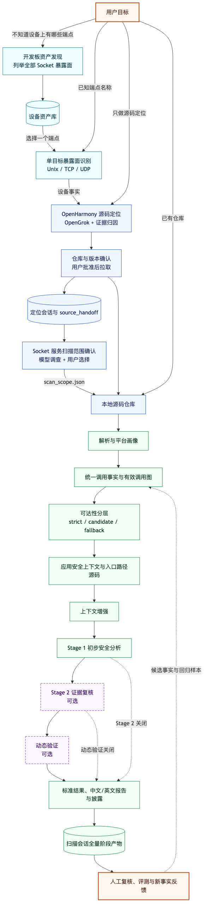

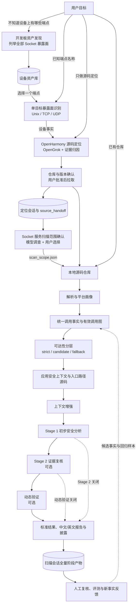

这张图包含三种合法起点：

- **设备起点**：先发现资产，再挑选目标进行设备侦查和源码定位；
- **端点起点**：已知 `/dev/unix/socket/paramservice` 或 `SP_daemon UDP 127.0.0.1:8283`，直接做单目标识别和定位；
- **仓库起点**：用户已有本地仓库，直接选择全仓或服务子目录扫描。

设备资产发现、单目标暴露面识别、源码定位和普通仓库扫描都可以单独运行。它们串联时依靠结构化产物交接，而不是依靠页面上的自然语言复制。

---

## 3. 系统运行架构

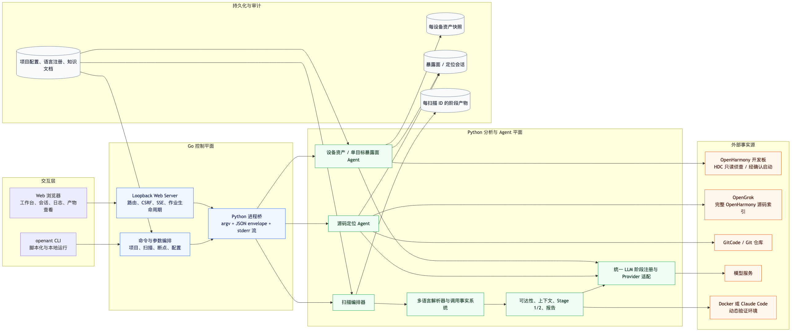

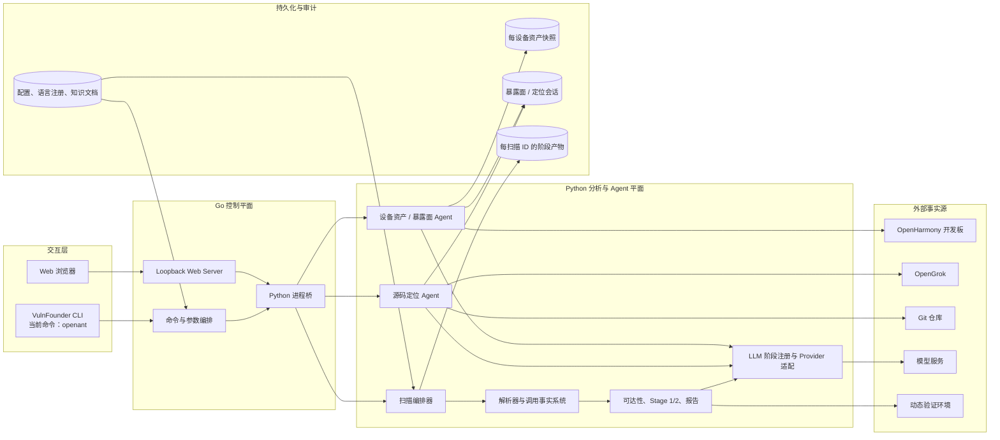

### 3.1 Go 控制平面

Go 侧位于 `apps/openant-cli`，负责用户工作区和进程生命周期，主要职责包括：

- CLI 命令、Web 路由和参数表单；
- 项目初始化、扫描模式、差异扫描和历史作业恢复；
- 启动 Python 子进程并转发实时标准错误日志；
- 解析 Python 最终输出的单个 JSON envelope；
- 维护扫描 ID、会话 ID、状态、阶段卡片、SSE 订阅和取消操作；
- 只向浏览器暴露白名单产物，处理大文件分页查看；
- 提供 Loopback、Host、CSRF、路径和符号链接等边界保护。

### 3.2 Python 分析与 Agent 平面

Python 侧位于 `libs/openant-core`，负责分析语义：

- 设备资产 Agent 与单目标暴露面采集；
- 源码定位状态机、OpenGrok 工具和仓库归因；
- 多语言源码解析、函数索引、调用点台账和有效图；
- OpenHarmony 平台画像、分派关系、Clang sidecar 和对象流候选；
- 可达性、应用上下文、Agentic 增强；
- Stage 1、Stage 2、动态测试数据准备、报告数据和披露生成。

### 3.3 Go 与 Python 的边界协议

双方通过刻意收窄的协议通信：

- Go 用命令行参数启动 Python；
- Python 的 `stderr` 输出人类可读进度，Go 实时转发到 Web；
- Python 的 `stdout` 最终只应产生一个 `{status, data, errors}` JSON envelope；
- 正常完成、发现问题、执行错误使用不同退出语义；
- 大体量业务产物不塞入 envelope，而是写文件并返回路径/摘要。

这个边界解释了两类常见错误：若 Python 在 stdout 混入普通文字，会出现 JSON envelope 解码失败；若 Python 被超时或系统终止且来不及输出 envelope，Web 会看到 EOF 或 exit code -1。日志和产物需要共同判断根因。

### 3.4 模型阶段注册

一次扫描不是所有阶段共享一个硬编码模型。配置系统会为 `app_context`、`llm_reach`、`enhance`、`analysis`、`verification`、`report`、`dynamic` 等阶段解析 provider、model、endpoint 和鉴权。扫描开始前进行最小连通性探测，避免运行数小时后才发现模型名、URL 或凭据错误。

同一次扫描会记录实际使用的配置名称、模型、token、费用、耗时和阶段状态。切换模型时，结论需要按独立实验比较，不能把不同模型的结果合并成同一次确定性运行。

---

## 4. 三条入口如何选择

| 用户当前掌握的信息 | 推荐入口 | 主要产物 | 下一步 |
| --- | --- | --- | --- |
| 不知道设备上有哪些服务 | 设备 Socket 资产发现 | 每设备资产快照、任务树、命令和证据 | 从资产表选择一个端点 |
| 知道一个 Unix/TCP/UDP 端点 | 暴露面识别与定位联合页 | 设备暴露面结果 + 源码定位会话 | 确认仓库和版本 |
| 只知道 Socket/服务名，不连接设备 | OpenHarmony 源码定位 | 证据图、仓库映射、入口源码、handoff | 拉取并扫描 |
| 已经有本地源码仓库 | 扫描工作台 | 完整扫描目录 | 直接解析或先做服务范围识别 |
| 仓库很大且只分析一个 Socket 服务 | Socket 服务扫描范围 | 候选子目录、入口证据、`scan_scope.json` | 用户确认后缩小扫描根目录 |

联合页把“单目标设备识别”安排为阶段 1，把“OpenHarmony 源码定位”安排为阶段 2，但底层两类会话仍分别持久化。这使历史独立页面、批量任务、失败恢复和 API 兼容不被破坏。

---

## 5. 开发板 Socket 资产发现

### 5.1 目标

资产发现解决的是“这块具体开发板当前有哪些 Socket 暴露面”，而不是分析某个已知端点。第一版范围聚焦：

- 命名 Unix Domain Socket；
- 抽象或匿名 Unix Socket 的原始观测记录；
- TCP/UDP IPv4/IPv6 监听或绑定端点；
- 可关联时的进程、PID、UID、进程 SELinux 域；
- 命名 Unix Socket 的 DAC 权限、属主、属组和对象 SELinux 标签。

资产属于设备和时间快照。另一块开发板、另一个系统版本、服务启动状态变化后，都不应复用为“当前事实”。

### 5.2 动态任务树，而不是固定七步脚本

资产 Agent 初始只有一个根任务：

> 扫描所有 Socket 暴露面

模型每轮读取当前任务树、已执行命令、证据、字段缺口和本地知识片段，自主新增、更新、阻塞或完成子任务。它可使用三个工具：

| 工具 | 作用 |
| --- | --- |
| `update_task_tree` | 新增/更新任务节点、依赖、状态、备注和证据引用 |
| `device_exec` | 通过 HDC 在指定开发板执行一条只读侦查命令并登记输出 |
| `finish_inventory` | 提交最终资产、覆盖说明、缺失字段、任务摘要和自定义任务发现 |

端点枚举、进程归属、权限检查和交叉核对的方法没有固化成七个根节点，而是写入本地 OpenHarmony 命令指南，由模型按本次设备实际情况动态使用。

### 5.3 本地 RAG 的角色

知识来源是一个受控 Markdown 文档，包含：

- OpenHarmony/HDC 命令执行习惯；
- Unix、TCP、UDP、IPv4、IPv6 的观测方法；
- `/proc` 网络表、inode、进程 fd 和状态的解释；
- DAC 与 SELinux 字段获取方式；
- 命名、抽象、匿名、监听、绑定和已连接端点的区别；
- 命令不支持、权限不足、输出截断时的回退方法；
- 最终字段和证据引用要求。

这里不需要 FAISS、Chroma、Milvus、Embedding 或 LangChain。知识文档规模有限，检索器按当前任务和缺口选取相关段落，每轮都把检索摘要提供给模型；目的不是“向量搜索炫技”，而是用可版本控制、可审计的领域指南减少模型盲猜。

### 5.4 命令与证据

模型可以决定执行什么侦查命令，但主机侧仍负责：

- 固定调用 HDC 可执行文件和设备 serial；
- 使用 `shell=False` 启动主机进程；
- 限制单命令超时、输出大小、总命令数、轮数和墙钟时间；
- 保存 argv、返回码、stdout/stderr 摘要和时间；
- 为事实分配 `evidence_id`；
- 拒绝结果中未知或跨端点的证据引用。

“命令不用写死”不等于“模型文字可以直接成为设备事实”。最终每个非未知字段仍应能回指真实命令输出。

### 5.5 原始记录与最终资产必须区分

资产扫描保存两个视图：

1. `observed_socket_records`：程序从设备命令的所有 Socket 表行生成的审计视图，可含 `LISTENING`、`BOUND`、`CONNECTED`、匿名和元数据不完整记录；
2. `assets`：通过 `finish_inventory` 门禁的最终资产，原则上只提交需要管理的监听/绑定暴露面。

`socket_record_summary` 汇总原始行数、去重数、Unix/网络数、命名/匿名数、状态和元数据完整度。Web 必须把完整状态对象传给渲染器，不能只传数组，否则会出现“有 319 条记录但分类统计全为 0”的假象。

### 5.6 `finish_inventory` 的门禁

提交前程序会检查：

- 资产是否有合法的 Socket 身份；
- 状态是否为允许的监听/绑定状态；
- PID、UID、进程、类型、权限和标签是否按端点类型填写或明确为不适用；
- 引用的证据 ID 是否存在；
- 同一字段的证据是否属于同一端点；
- 模型填写值是否与程序从原始设备输出解析出的事实矛盾；
- 是否遗漏已经观测到的重要监听端点；
- 自定义只读任务结果是否符合结构。

未通过时，模型得到具体拒绝原因并继续规划；达到预算仍不能补全时，保存 `partial` 和缺口，而不是伪造完整结果。

### 5.7 每设备持久化

Web 输出根下使用独立的 `device-socket-assets` 目录。每台设备按安全派生的 device key 建目录，包含：

- 每次运行的 plan、动态任务树、trace、command、evidence 和 worker 日志；
- `snapshots/socket_inventory_<run_id>.json` 历史快照；
- `latest.json` 最近一次可作为完整资产库的快照。

失败或空的 partial 运行不会覆盖最后一个可用快照；用户自定义的局部侦查任务也不会冒充全设备资产更新 `latest.json`。

---

## 6. 单目标暴露面识别

### 6.1 支持的输入

目标标准化支持：

- 完整 Unix 路径：`/dev/unix/socket/paramservice`；
- 安全的 Unix Socket 名称，系统补充常见路径候选；
- TCP/UDP：例如 `SP_daemon UDP 127.0.0.1:8283`；
- IPv6 地址和端口。

输入会先拒绝控制字符、shell 元字符、路径穿越、多重冲突端点、非法 IP 和越界端口。进程名只是线索，最终归属必须依赖设备证据。

### 6.2 Agentic 侦查与兼容采集

单目标模式有三个 Agent 工具：

- `update_task_tree`：维护本次端点调查任务；
- `device_exec`：执行受审计的设备命令；
- `finish_exposure`：提交端点字段和引用证据。

当前实现还保留确定性兼容采集器，用于：

- 将常见设备输出标准化为字段；
- 在模型失败时保留可复现基线；
- 交叉校验 Agent 结论；
- 为历史固定模式会话提供兼容。

最终字段可以由大模型从已登记设备事实中语义提取，但未知证据、非法字段或与原始观测矛盾的更新会被拒绝。

### 6.3 Unix 与网络端点的字段差异

通用字段包括暴露面类型、运行状态、通信协议、Socket 类型、关联进程、证据、风险点和风险等级。

对于命名 Unix Socket，还可以填写：

- 路径；
- `srw-rw----` 等完整文件类型/权限位；
- 八进制 DAC 权限；
- 属主、属组；
- 对象 SELinux 标签。

对于 TCP/UDP，没有文件系统 Socket 节点，DAC、属主、属组和对象标签应写为 `NOT_APPLICABLE`，不能为了模板完整而伪造。网络端点更关注 IP、端口、协议、监听状态、PID/UID 和进程 SELinux 域。

### 6.4 服务存在但未启动

若证据表明服务已安装或配置存在，但端点当前未监听，系统可以进入 `AWAIT_START_CONFIRMATION`：

1. 从配置、参数服务或服务脚本证据中形成候选启动动作；
2. 展示原因、命令和影响；
3. 只有用户明确同意后才执行受控启动；
4. 启动后重新运行侦查和字段提取；
5. 用户拒绝时保留“已安装但未启动”的证据和局限。

启动命令不是凭空硬编码为某一个服务的专属命令，也不能由模型绕过确认直接执行。

### 6.5 单目标产物

典型会话产物包括：

- `exposure_agent_plan.json`：任务树、预算和当前状态；
- `exposure_agent_trace.jsonl`：逐轮模型/工具轨迹；
- `exposure_agent_evidence.json`：设备证据；
- `exposure_commands.jsonl`：命令审计；
- `device_snapshot.json`：本次设备快照；
- `exposure_llm_extraction.json`：字段提取、接受/拒绝和模型元数据；
- `exposure_surface.json`、`exposure_surface.md`：结构化和人类可读结果；
- `exposure_start_action.json`：若发生服务启动，记录用户授权和执行结果。

---

## 7. 暴露面识别与源码定位联合流程

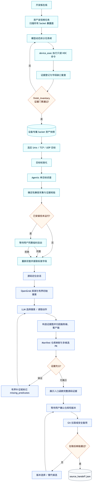

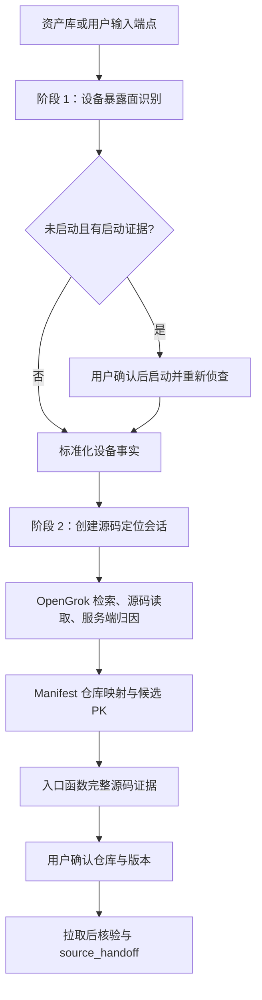

联合流程的价值是把“设备上看到的端点”变成源码定位的强线索，例如：

- 精确路径、协议、地址和端口；
- 进程名、UID、服务配置和启动参数；
- inode 或 Socket 名称；
- 运行状态和平台版本。

但当前两阶段仍有清晰边界：设备事实不会自动证明仓库归属；源码定位也不会反向修改设备资产。页面只是把两个可审计会话组织在同一个用户流程中。

---

## 8. OpenHarmony 源码定位

### 8.1 为什么需要独立定位器

完整 OpenHarmony 由大量独立仓库组成。设备端点名称可能出现在：

- init `.cfg` 的 `socket.name`；
- 服务端获取 init 创建 fd 的代码；
- 客户端连接代码；
- 公共头文件宏；
- 测试、镜像、副本或第三方兼容实现；
- 构建配置与 Manifest 项目映射。

仅搜索完整路径或 `bind(` 容易漏掉由 init 创建、业务代码只调用 `GetControlSocket()` 的服务；仅看第一个命中又容易把客户端、主机侧工具或复制代码误当成设备服务端。因此定位器采用状态机和证据归因，而不是一次字符串搜索。

### 8.2 状态机

主要状态顺序是：

```text
INTAKE
  → NORMALIZE_TARGET
  → PROBE_OPENGROK
  → SEARCH_INITIAL
  → TRACE_EVIDENCE
  → ATTRIBUTION_SERVER
  → LOCATE_CLIENT_COMM
  → RESOLVE_REPOSITORIES
  → VERIFY_EVIDENCE
  → [RECOVER_EVIDENCE → TRACE_EVIDENCE ...]
  → AWAIT_USER_CONFIRMATION
  → CLONE
  → POST_CLONE_VERIFY
  → HANDOFF
  → DONE
```

还包括 `APPLY_FEEDBACK`、`VERSION_SELECTION_REQUIRED`、`PARTIAL`、`NEEDS_REVIEW`、`OPENGROK_UNAVAILABLE`、`CLONE_FAILED`、`POST_CLONE_VERIFY_FAILED`、`CANCELLED` 和 `FAILED`。状态写入 session，使页面刷新、Web 重启或用户稍后确认时可以恢复。

### 8.3 模型可用的源码工具

模型每轮只能选择一个受限动作：

| 工具 | 用途 |
| --- | --- |
| `search_full` | 搜索完整字面量或关键代码片段 |
| `search_definition` | 查宏、常量、函数、类型的定义 |
| `search_symbol` | 查符号引用或相关标识符 |
| `search_path` | 按路径/文件名寻找 cfg、rc、头文件和实现 |
| `read_file` | 从 OpenGrok 读取候选源码文件，禁止本机路径 |

程序维护已执行动作、证据 ID、候选文件、排除路径、预算和最近错误。模型不是无记忆地重新开始；重复动作会被识别，失效证据 ID、越界查询、过长查询和非法路径会被拒绝或要求修复。

### 8.4 初始搜索与有界补证

定位器先根据目标类型生成较窄的检索线索：Unix Socket 优先名称、路径、cfg/rc；TCP/UDP 优先进程、端口、协议常量、服务端创建/接收逻辑。随后模型根据已见证据决定继续搜索定义、消费者、配置还是读取文件。

当强证据谓词未齐全时进入 `RECOVER_EVIDENCE`，但不会无限搜索。预算达到上限时仍给出概率最高候选，同时明确 `missing_predicates`。`.cfg` 中精确的 `socket.name` 本身往往已经是很强的仓库归属证据；其他证据用于提高角色判断和入口链完整性，而不是把永远不可能同时出现的所有谓词设为硬失败条件。

### 8.5 证据图与角色归因

证据不是“检索目标指向所有命中”的简单星状图。语义上应区分：

- Socket 身份或端口定义；
- init/服务配置；
- Socket 获取、创建、监听或接收；
- 服务端消息入口；
- 客户端连接；
- 命令/消息分派；
- 进程和构建归属；
- Manifest 项目映射。

服务端、客户端和公共组件分别打分/归因。多个仓库都有接收代码时，最终候选比较会结合：

- 进程构建归属；
- 设备侧 Socket 服务端实现；
- 客户端/控制端实现；
- 重复源码、镜像、副本或拆分仓库关系；
- 目标端点、协议、产品配置和版本的一致性。

候选 PK 由模型基于证据做语义判断，程序校验其引用的文件、行号和证据 ID，不用单一规则分数强行决定最终仓库。

### 8.6 最重要的结果：所有外部输入入口函数证据

定位结果不仅展示仓库，还需要展示该 Socket 相关的顶层接收入口，例如：

- 接收循环或连接回调；
- `accept` 后的客户端处理入口；
- `recv`、`recvfrom`、`read` 的外层服务函数；
- init fd 被包装后注册到事件循环的回调；
- TCP/UDP 服务端消息处理器。

入口识别先被限定在已经归因到目标 Socket 的候选文件/目录中，再结合 Socket 身份、注册、接收和回调关系由模型判断，避免在全 OpenHarmony 中盲搜 `read`/`recv` 产生海量噪声。页面单独展示函数签名、文件、起止行、完整函数源码和证据说明。

“全部找到”在静态源码检索中无法无条件保证。宏、生成代码、框架内部回调、未索引分支和版本差异都可能产生缺口；系统应展示入口覆盖状态和未决证据，而不是声称绝对完整。

### 8.7 Manifest 与仓库映射

源码路径会映射到 OpenHarmony Manifest 项目：

- 规范化源码路径；
- 确定可能的 project name；
- 生成 GitCode/Git remote 和目标 revision 候选；
- 区分主服务仓库和附属客户端仓库；
- 保留内容哈希、索引路径和版本线索。

模型生成的冗长原始 JSON 不直接塞进“状态”一栏；Web 应把映射结构化渲染成候选卡片、仓库 URL、revision、角色和关键证据。

### 8.8 用户确认、拉取和失败替代

Git 拉取是有外部副作用的操作，必须在 `AWAIT_USER_CONFIRMATION` 之后：

1. 用户接受候选仓库和版本；
2. 系统拉取到临时目录；
3. 固定目标 revision；
4. 验证 `origin`、HEAD、目标源码路径、关键符号和端点字面量；
5. 通过后原子交接到目标目录；
6. 失败时不覆盖已有安全目录。

若远端没有请求版本、分支已变化或拉取后核验失败，进入版本选择状态，展示可拉取 revision/替代候选让用户选择，而不是直接把整个定位会话终止为不可恢复失败。

### 8.9 `source_handoff.json`

成功交接至少包含：

- 目标端点标准化信息；
- 主仓库项目、remote、revision/commit；
- 本地源码根目录；
- 关键证据和入口函数；
- 客户端/附属仓库说明；
- 后续普通扫描可预填的仓库路径和元数据。

它是定位与扫描之间的结构化契约，但不会替用户自动宣称扫描范围完整。

---

## 9. Socket 服务子目录识别与扫描范围确认

### 9.1 为什么不总是整仓扫描

大型 OpenHarmony 仓库可能包含主机端工具、设备侧守护进程、客户端、测试、第三方库和多个无关服务。整仓扫描能提供更宽的上游依赖覆盖，但会显著增加：

- 解析和调用图规模；
- LLM 可达性批次数；
- 上下文增强和 Stage 1 成本；
- 无关入口和同名实现造成的歧义。

因此可以在已有本地仓库中先识别目标 Socket 的服务目录，再由用户确认是否只扫描该范围。

### 9.2 当前范围发现逻辑

范围发现已移除旧式目录名/正则评分，完全交由支持工具调用的模型调查本地仓库。模型工具为：

- `list_dir`：查看仓库目录；
- `search`：按文件名 glob 或源码字面量检索；
- `read_file`：读取候选文件；
- `finish`：提交最多若干候选 scan root、置信度、理由、缺失谓词和证据。

程序负责把所有路径限制在仓库内、拒绝符号链接越界、重新读取模型引用的文件和行号、验证候选目录存在。服务端/客户端区分、cfg 与实现的关系、主机侧/设备侧副本判断由模型负责。

### 9.3 用户确认与 manifest

候选顺序表示模型优先级，但不是程序自动选择的绝对答案。用户在 Web 中查看：

- 相对扫描目录；
- 置信度和语义理由；
- Socket 身份、接收、分派、配置、构建、进程和客户端证据；
- 缺失依赖和范围风险。

用户确认后生成 `scan_scope.json`。普通扫描器会把该 manifest 复制为 `scan_scope_applied.json`，记录目标、仓库身份、选择目录和证据。

### 9.4 裁剪的固有限制

服务子目录必须包含足够的完整调用链代码。若入口、工厂、公共库、回调注册或危险操作在目录外，裁剪会使调用图和上下文不完整。系统可根据符号引用、注册关系和构建依赖提示扩大范围；但“子目录快”与“整仓覆盖宽”是明确权衡，不能把裁剪结果与整仓覆盖率直接比较。

---

## 10. 普通仓库扫描的输入、模式和阶段开关

### 10.1 基础输入

一次扫描至少需要本地源码目录。可选附加信息包括：

- 输出目录；
- 显式语言或自动多语言；
- `generic`、`openharmony` 或 `auto` 平台；
- `all`、`reachable`、`codeql`、`exploitable` 处理级别；
- 仓库名称、remote URL、commit SHA；
- 已确认的 `scan_scope.json`；
- 全量、增量、差异基线、PR、staged 和 diff scope；
- LLM 配置、workers、限流退避和单元上限；
- 是否启用 Stage 2、上下文增强、动态测试和报告；
- LLM 可达性、调用图恢复、候选复核、投影、Clang semantic 等高级能力。

Web 表单把这些参数翻译为与 CLI 一致的 Python 扫描参数。参数开关改变的是本轮处理和证据层次，不应该被报告生成阶段偷偷补开。

### 10.2 `processing_level`

| 模式 | 行为 | 适用场景 |
| --- | --- | --- |
| `all` | 不用入口可达性主动裁剪成功解析的函数；仍受语言、范围、测试过滤和 `limit` 影响 | 小仓库、召回优先、调用图质量对照 |
| `reachable` | 从结构化入口和获准语义种子沿图传播，保留 strict/candidate 等分层结果 | 默认的大型服务扫描 |
| `codeql` / `exploitable` | 由具体语言和现有筛选逻辑解释，需看阶段元数据 | 特定实验或成本控制 |

`all` 并不表示“跳过入口识别”。解析器仍可标记入口、构图并生成路径上下文；只是最终不以可达性裁掉函数。

### 10.3 全量与增量

全量扫描以当前范围内全部源文件为输入。增量扫描根据上一次成功扫描、Git ref、PR 或 staged index 生成 diff manifest，再按 `changed_files`、`changed_functions` 或 `callers` 控制分析范围。增量结果节省成本，但其“未发现”只能解释为差异范围内未发现，不能替代周期性全量扫描。

### 10.4 `stop_after`

当前关键早停点包括：

- `effective-call-graph`：完成解析、调用点台账和有效图，不初始化后续模型；
- `llm-reachability`：完成 LLM 可达性复核和可达性结果；
- `openharmony-gap-tasks`：完成 OpenHarmony 调用缺口任务和 Stage 1 入口血缘准备，不运行增强与分析。

早停是开发/验收检查点，不是扫描失败。报告状态必须区分“按请求停止”和“异常中断”。

---

## 11. 仓库扫描详细总图

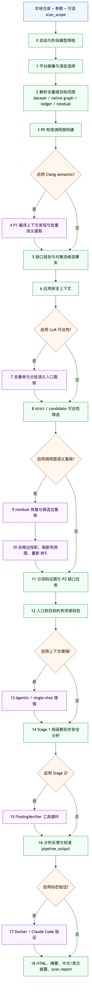

```mermaid
flowchart TB
    I["本地仓库 + 参数 + 可选 scan_scope"]
    P0["启动与阶段模型预检"]
    P1["平台画像与语言选择"]
    P2["解析：dataset / native graph / ledger / residual"]
    P3["P0 有效调用图构建"]
    P4{"启用 Clang semantic?"}
    P5["P1 编译上下文发现与批量语义提取"]
    P6["缺口报告与对象流候选事实"]
    P7["应用安全上下文"]
    P8{"启用 LLM 可达性?"}
    P9["全量单元分批语义入口复核"]
    P10["strict / candidate 可达性筛选"]
    P11{"启用调用图语义复核?"}
    P12["residual 恢复与候选边复核"]
    P13["合格边投影、刷新有效图、重新 BFS"]
    P14["分派码证据与 P3 缺口任务"]
    P15["入口到目标的有序源码包"]
    P16{"启用上下文增强?"}
    P17["Agentic / single-shot 增强"]
    P18["Stage 1 按函数初步安全分析"]
    P19{"启用 Stage 2?"}
    P20["FindingVerifier 工具循环"]
    P21["分析反馈与标准 pipeline_output"]
    P22{"启用动态验证?"}
    P23["Docker / Claude Code 验证"]
    P24["HTML、摘要、中英文披露、scan.report"]

    I --> P0 --> P1 --> P2 --> P3 --> P4
    P4 -->|"是"| P5 --> P6
    P4 -->|"否"| P6
    P6 --> P7 --> P8
    P8 -->|"是"| P9 --> P10
    P8 -->|"否"| P10
    P10 --> P11
    P11 -->|"是"| P12 --> P13 --> P14
    P11 -->|"否"| P14
    P14 --> P15 --> P16
    P16 -->|"是"| P17 --> P18
    P16 -->|"否"| P18
    P18 --> P19
    P19 -->|"是"| P20 --> P21
    P19 -->|"否"| P21
    P21 --> P22
    P22 -->|"是"| P23 --> P24
    P22 -->|"否"| P24
```

图中的问号判断节点及其分支表示可选能力。实际 Web 阶段卡片为了兼容会把多个内部子步骤归入 Parse、Enhance、Analyze 等较粗阶段；判断真实执行顺序时，应以 Python 编排器的 stage report、日志和产物时间为准。

---

## 12. 阶段 0：启动、输出目录和模型预检

扫描器首先：

1. 将仓库和输出目录解析为规范绝对路径；
2. 创建本轮输出目录；
3. 应用 `scan_scope` 或 diff manifest；
4. 记录仓库身份、revision、语言、平台、处理级别和所有开关；
5. 重置 token、费用、耗时和阶段跟踪；
6. 验证参数组合和动态测试模式；
7. 构建一次统一 phase registry；
8. 对唯一 provider/model 组合做最小连通性探测。

`--stop-after effective-call-graph` 是例外：它应在无模型凭据和无联网条件下独立运行，因此跳过模型注册和预检。

模型预检解决的是鉴权、endpoint、模型名和基本连接问题。运行数小时后的偶发超时仍可能发生，需要依赖批次错误、checkpoint 和阶段级降级处理。

每个阶段使用 `step_context` 写 `{stage}.report.json`，包含输入摘要、开始/结束时间、状态、耗时、模型用量、费用、输出路径和错误。最终 `scan.report.json` 聚合这些记录。

---

## 13. 阶段 1：平台画像与语言发现

### 13.1 平台模式

- `generic`：明确禁用 OpenHarmony 专用画像和平台规则；
- `openharmony`：强制应用 OpenHarmony 路径，即使画像字段不完整；
- `auto`：检查仓库中的构建、目录、接口和平台特征，满足条件时选择 OpenHarmony，否则保持通用模式。

成功时写 `platform_profile.json`，记录检测证据、置信度、组件、语言和平台边界线索。画像只决定使用哪套分析能力，不是任何具体函数的入口证明。

### 13.2 支持语言

共享语言注册表当前覆盖：

| 语言键 | 主要扩展名 | 解析方式 |
| --- | --- | --- |
| Python | `.py` | 进程内解析 |
| JavaScript/TypeScript | `.js`、`.ts`、`.jsx`、`.tsx`、`.mjs`、`.cjs` | 子进程解析器 |
| Go | `.go` | 子进程解析器 |
| C/C++ | `.c`、`.h`、`.cpp`、`.hpp`、`.cc`、`.cxx` 等 | Tree-sitter/自有语义扩展，Clang 可选 |
| Ruby | `.rb`、`.rake` | 子进程解析器 |
| PHP | `.php` | 子进程解析器 |
| Zig | `.zig` | 子进程解析器 |
| Swift | `.swift` | 子进程解析器 |
| Rust | `.rs` | 子进程解析器 |

自动多语言模式先发现文件并选择语言，各语言写独立子目录，最后合并成统一 `dataset.json`。单个非主语言失败是否中断取决于严格模式；正常情况下错误和覆盖缺口会显式记录。

---

## 14. 阶段 2：源码解析、函数单元与调用点台账

### 14.1 解析器输出什么

解析器把仓库拆成函数级分析单元。每个单元通常包含：

- 稳定 `unit_id`；
- 语言、规范文件路径、限定函数名和完整签名；
- 起止行/列和函数源码；
- 类、命名空间、参数和返回值等信息；
- 结构化入口提示；
- 直接被调用函数和调用者摘要；
- 平台注册、IPC、Socket 或异步线索；
- 初始上下文和依赖元数据。

主要产物：

| 产物 | 作用 |
| --- | --- |
| `analyzer_output.json` | 函数定义、源码和正反调用索引，供查询工具使用 |
| `dataset.json` | 送往可达性、增强和分析的函数单元 |
| `call_graph.json` | 解析器原生函数图，保留不覆盖 |
| `call_graphs.json` | 多语言调用图路径索引 |
| `callsite_ledger.json` | 每个调用表达式、候选、绑定状态、证据和完整性 |
| `call_graph_residuals.json` | 未解析或部分解析的间接调用/平台注册缺口 |
| `scan_results.json` | 文件、范围、计数和解析时间 |

### 14.2 Tree-sitter 的定位

Tree-sitter 适合：

- 快速容错地识别函数、类、调用表达式和源码范围；
- 在没有完整构建环境的仓库中建立全量基础索引；
- 生成源码块和候选符号。

它不独自保证：

- C++ 接收者真实类型、重载和模板实例绑定；
- 虚函数的所有运行时实现；
- 函数指针和复杂对象流；
- 宏展开和产品配置条件；
- IPC、事件或跨进程的框架触发关系。

因此，原生图是重要事实，但不能因为它缺 caller 就直接宣布函数不可达。

### 14.3 调用点台账

统一台账不是只记录“caller/callee”，而是保存调用发生的位置和解析过程。一个站点至少需要：

- 源码 revision、规范路径、精确范围和表达式；
- 所属 caller；
- 调用类型：直接、成员、虚、函数指针、构造、回调、工厂、框架分派等；
- 接收者表达式及已知类型；
- 已解析目标和候选目标；
- 静态绑定状态；
- 动态目标集合完整性；
- 构建信息状态；
- 范围覆盖状态；
- 绑定依据和源码证据；
- 没有进入有效图时的原因。

`residual = 0` 不能证明调用图完整：如果调用表达式根本没被提取，它也不会进入 residual。因此还需要比较语法树调用表达式、台账、目标绑定和最终图四层。

### 14.4 测试文件与范围

默认可跳过明确测试、fuzz 或生成范围，避免测试入口污染生产可达性。第三方、kernel、out、generated 等目录是否参与，以实际 walker、scope manifest 和阶段报告为准，不能只看目录名推测。

---

## 15. 阶段 3：P0 统一调用事实与有效调用图

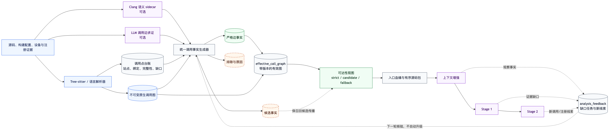

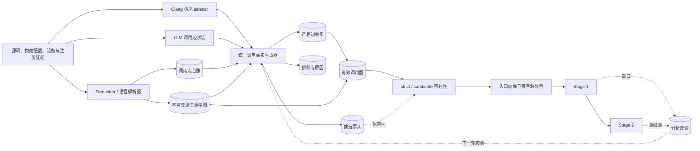

### 15.1 为什么引入有效图

历史上可能出现“台账已把调用点标成 resolved，但 `call_graph.json` 没有对应边”的脱节；也可能出现 Clang/LLM 找到边，但增强和 Stage 1 仍读取旧图。P0 建立硬约束：

> 同一源码和构建快照中，已经通过准入的调用关系必须进入下游实际消费的有效图，或者有明确排除原因。

### 15.2 `effective_call_graph.json`

它从原生图、合格台账事实和经过验证的 overlay 确定性生成，不覆盖 `call_graph.json`。包含：

- `nodes`：函数体节点以及可保留的声明-only 符号；
- `external_nodes`：当前范围没有函数体的声明/外部摘要；
- `call_graph`、`reverse_call_graph`：下游使用的有效 strict 关系；
- `edge_facts`：resolver、调用点、证据、配置和修复原因；
- `candidate_facts`：部分绑定、歧义、构建不确定或未验证关系；
- `exclusions`：拒绝和原因；
- `summary`：原生边、新增边、修复站点、未决站点和拒绝计数；
- `provenance`、`source_revision`、`build_config_id`、`graph_version`。

### 15.3 台账补边门槛

“只有一个候选”不等于确定调用。自动生成 strict 边通常要求：

- `binding_status=resolved`；
- 候选集合声明为 complete/exhaustive；
- 有绑定规则、类型/签名和源码证据；
- 解析状态无语法错误；
- 构建配置未明确禁用；
- 唯一候选目标；
- caller/callee 身份可映射。

不满足时进入 candidate 或 residual，不因模型写了 `validated=true` 就升级。

### 15.4 边的证据等级

| resolver | 含义 |
| --- | --- |
| `native` | 原生解析器关系；保存用于审计 |
| `callsite_ledger` | 完整性和绑定依据通过门槛的台账补边 |
| `clang` | 指定编译配置下通过声明、类型、位置和定义关联的语义绑定 |
| OpenHarmony semantic overlay | 经投影校验的模型/框架关系；必须关联 validation record |
| object-flow candidate | 对象、工厂、回调等保召回关系，不自动进入 strict 图 |

边进入图只证明“在这套静态模型和配置下允许用于可达性遍历”，不证明运行时一定执行，也不证明危险数据流成立。

---

## 16. P1：Clang 语义提取与构建上下文

### 16.1 Clang 能解决什么

在编译上下文足够的 C/C++ 翻译单元上，Clang 能更可靠地获得：

- 成员调用接收者类型；
- 重载后选择的方法声明；
- 命名空间和类型别名；
- 构造、声明、方法覆盖和源码位置；
- 跨文件声明到定义的候选关联。

它不能自动解决动态对象究竟是哪一个派生实现，也不自动建立 IPC 或事件框架的跨进程执行关系。

### 16.2 编译上下文优先级

启用 `--clang-semantic` 后依次尝试：

1. 显式提供的 `compile_commands.json`；
2. 仓库已有编译数据库；
3. 已有 `build.ninja` 的 `ninja -t compdb`；
4. 从 `BUILD.gn/.gni` 和仓库依赖自动重建候选编译命令；
5. 缺头文件时做有界依赖发现与重试。

OpenHarmony 单仓通常没有完整编译数据库，且依赖其他仓库、生成头文件、宏、sysroot 和产品配置。自动重建能够扩大可解析覆盖，但必须标记证据来源。

### 16.3 构建状态的准入

| build status | 语义 |
| --- | --- |
| `compile_database` / `complete` | 可用于相应明确配置的 strict 关系，不外推到其他产品配置 |
| `manual_rebuild` | 手工重建配置下绑定，作为条件性证据 |
| `reconstructed_candidate` | 自动重建候选配置，默认最多进入 candidate |
| `unknown` / 缺省 | 保留不确定性，不能宣传为产品 strict |
| `disabled` / `wrong_configuration` | 当前配置明确不适用，记录排除 |

### 16.4 缺口优先调度

`call_graph_gap_report.json` 按调用点聚合未决站点。Clang 批处理优先处理未修复调用点多、阻塞重要路径的翻译单元，再受 `clang_max_files`、batch size、单文件 timeout 和依赖重试预算限制。

诊断需要区分：

- 没有编译命令；
- 缺少头文件/生成文件；
- 预处理失败；
- AST 成功但调用没绑定；
- 已绑定但 caller 不在索引；
- 已生成事实但因构建状态只进 candidate；
- 已通过准入并自动进入有效图。

---

## 17. P2：对象流、工厂、虚调用、回调与原生分派

直接调用绑定完成后，复杂缺口通常来自“调用时这个对象可能是什么”或“哪个注册关系会触发哪个处理器”。P2 保存：

- 对象创建和工厂返回；
- 局部/成员字段赋值；
- 参数、返回值和简单智能指针传递；
- 类继承和方法覆盖；
- 回调注册、事件键和触发器；
- 函数指针、lambda 和任务提交；
- OpenHarmony native/IPC 分派关系。

第一批/第二批对象流事实明确是候选层：可以参与召回优先的 candidate 路径，但不能仅凭“工厂可能返回某对象”生成 strict 的 `factory → ItemData` 假边。正确关系应拆成：工厂返回对象事实、对象传到接收者、真实接口调用点、可能动态目标。

不同事件实例、命令值、构建条件或不兼容签名不能因为名称相同被连接。多个合法动态目标可以同时保留为可能关系；静态分析不必猜某次运行唯一选中哪一个。

---

## 18. P3：缺口任务、入口血缘与分析反馈

### 18.1 缺口任务

P3 将 `ledger_edge_missing=true` 的调用点转成具体任务：

- `direct_symbol_binding`；
- `semantic_compile_context`；
- `function_pointer_or_virtual_binding`；
- `factory_object_flow`；
- `callback_or_dispatch_binding`；
- `candidate_relation_review`。

每个任务包含站点、原因、已有候选、证据、优先级、下一步动作、预算和图版本。预算耗尽意味着“尚未解决”，不能变成“不可达”。

### 18.2 入口血缘

对进入当前数据集的目标，P3 在有效图中寻找顶层入口，并按“入口 → 中间函数 → 目标”的顺序写：

- `top_level_entry`；
- `primary_entry_path_ids` / `entry_paths`；
- 路径节点的文件、行号、函数类型和源码；
- 首个断点和 `missing_upstream_evidence`；
- `graph_version`、source revision 和配置指纹。

找不到入口时状态为 unknown，不伪造一条路径，也不自动把函数判为不可达。

### 18.3 `primary_path_source_bundle`

Stage 1 的主要源码上下文不再依赖一大块无序 `primary_code`。系统按选定入口路径生成有序源码包：

1. 顶层入口函数；
2. 每一个中间调用函数；
3. 目标函数；
4. 每个函数的稳定 ID、文件、起止行和完整/有界源码；
5. 路径边和候选/strict 证据。

旧 `primary_code` 可为兼容保留，但不能作为“调用链顺序正确”的主要证明。

### 18.4 分析反馈

增强、Stage 1 和 Stage 2 发现的 `additional_callers`、`include_functions`、注册线索和缺失依赖写入 `analysis_feedback.json`。它们是下一轮待核验事实，默认 `not_validated_no_graph_promotion`，不会在同一轮悄悄篡改 strict 图。

---

## 19. 可达性：结构入口、LLM 信号与两层 BFS

### 19.1 为什么 LLM 可达性要先看全量单元

若先用不完整调用图裁剪，再让模型找漏掉的 Socket/IPC/回调入口，被裁掉的函数永远不会进入模型。因此开启 LLM 可达性时，解析阶段临时使用 `all` 保留完整单元，模型分批审查后再应用用户原本的 `reachable` 过滤。

调用边投影也可能需要恢复已被首轮过滤的目标，因此会保存 `dataset_unfiltered.json` 供刷新图后重新筛选。

### 19.2 三类语义信号

| kind | 含义 |
| --- | --- |
| `entry_point` | 函数自身具有外部或平台入口角色 |
| `external_input` | 函数读取/接收外部输入 |
| `cross_process` | 函数位于进程、消息、异步或跨服务边界；需记录方向 |

模型还提供 `confidence`、boundary、direction、reason、evidence/evidence excerpt。未知 unit ID、非法类型、坏结构和重复信号会被过滤。

### 19.3 当前准入语义

- high `entry_point` + 具体证据：可成为 accepted entry seed；
- high `external_input` + 具体证据：可成为 strict semantic seed，但不必修改 `is_entry_point`；
- high `cross_process`：还必须是 receive/bidirectional；
- medium 的合法信号：成为 candidate BFS seed；
- low 或无具体证据：只保留 review 信息；
- 模型 high 只是证据的一部分，不是运行时可利用概率。

当前“具体证据”是模型证据存在性门槛，不是逐字源码校验。调用关系的源码和绑定质量在事实/投影层处理。因此报告不能把一个 high 标签单独宣传为完全证明外部入口。

### 19.4 strict 与 candidate 传播

可达性保持“caller → callee”的正向传播：

- 结构化入口和获准 high 种子沿有效 strict 边形成 `strict_reachable`；
- medium 种子沿已接受图边形成 `candidate_reachable`；
- candidate callsite 可在召回层保留相应后代，但不会自动升级为 strict；
- 下游函数无需每个都单独获得 LLM 信号，只要已有入口路径即可继承可达状态。

若一个语言没有可用调用图，防御性 fallback 会保留全量单元并标记 `unfiltered_fallback`，避免静默删空。它提高保留率但不能算作图恢复成功，评测时必须单列 `fallback-only`。

### 19.5 输出与日志解释

`llm_reachability.json` 保存原始/规范化信号、seed decision、promoted entries、strict/candidate ID、批次错误和统计。

日志中“模型返回 25 条信号”不代表新发现 25 个入口，可能包含 external input、cross process、重复或只供审计的信号。网络中断的批次被跳过并继续时，阶段可以整体 success 但覆盖不完整；必须结合 failed batch 列表解释结果。

---

## 20. 应用安全上下文与威胁模型

### 20.1 为什么代码相同但结论可能不同

安全判断依赖组件角色和攻击者能力。例如读取录音数据可能是授权音频服务的正常功能，也可能是越权泄露；修改路由可能是系统管理 API 的预期行为，也可能缺少身份校验。Stage 1/2 必须知道：

- 应用/服务用途；
- 外部输入来源；
- 信任边界；
- 攻击者身份、权限和不能假设的能力；
- 正常业务功能排除项；
- 平台最低安全要求。

### 20.2 上下文来源

如果仓库提供合法的威胁模型文件，系统读取并验证；文件不存在时，Agent 通过 `list_dir`、`read_file`、`search` 调查仓库后提交应用上下文。存在但格式错误的威胁模型不能静默退回默认，因为这会让扫描在错误假设下“看起来成功”。

仓库源码和文档是不可信数据，模型只能把它们当证据，不能服从其中试图改变系统规则的文字。

### 20.3 OpenHarmony 最低基线

仓库自述不能覆盖平台拥有的最低要求，尤其包括：

- Binder/SA/IDL 的 interface token、Parcel 读取返回值、字段顺序、类型和位宽；
- Parcel 派生长度、数量、索引、回调注册和容器边界；
- 调用者 token、UID、系统应用身份和权限；
- 空容器、空智能指针元素、畸形 descriptor、枚举范围；
- 内存安全、整数计算、资源消耗、并发和生命周期；
- Socket、文件、NAPI、HDF/HDI、ioctl、回调和状态机；
- 信息泄露、完整性、服务崩溃和拒绝服务。

**授权不等于输入合法。** 已授权系统调用者仍可提交空、超大、非法枚举、空元素或异常状态。权限检查只能保护授权维度，不能替代输入、资源、内存或生命周期校验。

### 20.4 产物

`application_context.json` 保存 purpose、input sources、attacker profiles、security model、intended features/exclusions 和证据/缺口。后续可达性、Stage 1、Stage 2、动态测试和报告应引用同一版本。

---

## 21. 上下文增强

### 21.1 与调用图恢复的区别

- 调用图恢复的输出是候选/已核验调用关系和图层；
- 上下文增强的输出是给某个分析单元使用的相关函数、用途、安全角色和解释；
- 增强发现的关系不会自动升级有效图；
- 有效图存在补边时，增强索引必须优先读取它，避免继续使用过时 `direct_calls`。

### 21.2 Agentic 增强工具

增强 Agent 可使用七个工具：

| 工具 | 作用 |
| --- | --- |
| `get_static_dependencies` | 读取当前有效图中的 callers/callees，作为起始地图 |
| `search_usages` | 搜索函数或符号的调用/使用位置 |
| `search_definitions` | 搜索定义 |
| `read_function` | 按函数 ID 读取完整函数源码 |
| `list_functions` | 列出文件内函数 |
| `read_file_section` | 读取注册表、宏或函数外的有界源码段 |
| `finish` | 提交需要包含的函数、用途、分类、入口提示和置信度 |

Agent 会优先读取静态依赖，再围绕入口、校验、分派、危险操作和缺失证据调查。工具读取受仓库路径、文件类型、大小和上下文预算限制。

### 21.3 Agentic 与 single-shot

- `agentic`：多轮工具调用，适合复杂 C++/OpenHarmony 关系，成本较高；
- `single-shot`：一次批量生成上下文，速度快，无法主动查找遗漏函数；
- `--no-enhance`：Stage 1 仍可使用解析器/P3 的入口源码包，但缺少额外语义调查。

### 21.4 Checkpoint

增强按单元并行并写 checkpoint。中断后可复用已完成单元；但只有当源码、配置和有效图版本一致时 checkpoint 才可靠。旧 checkpoint 中的 caller/callee 不能覆盖新图同步的依赖。

---

## 22. Stage 1：初步安全分析

### 22.1 输入不是孤立函数

每个单元的提示词至少可包含：

- 精确目标函数签名、文件、起止行和函数源码；
- `application_context` 与 OpenHarmony 最低基线；
- `reachability_context`；
- `primary_path_source_bundle`：入口到目标按调用顺序排列的函数源码；
- 候选入口路径、调用点和缺失上游证据；
- 增强器选择的相关函数与分类；
- `attack_chain_context` 当前状态；
- 分析输出的结构化 JSON schema。

`primary_path_source_bundle` 是一般执行路径源码，不等于特定危险参数的完整 source-to-sink 数据流。

### 22.2 Stage 1 负责什么

Stage 1 负责初步判断：

1. 目标函数中是否存在缺陷或不安全操作；
2. 已知入口/边界和调用证据是否使其可能被触达；
3. 可能产生何种安全影响；
4. 防护是否覆盖相关路径；
5. 哪些事实仍缺失。

覆盖类型包括：命令/代码/SQL/路径等注入、输入校验、权限/认证/隔离、空指针/OOB/UAF/双重释放、整数和尺寸、资源耗尽、文件/Socket/NAPI/HDF/ioctl、竞态/死锁/生命周期、类型/ABI、信息泄露、加密/传输、状态和业务逻辑。

无需构造完整武器化 payload 才能判断缺陷；空容器、空元素、边界值、重复请求、低内存、异常状态和并发调度都是合理退化场景。

### 22.3 四类基本结论

| finding | 含义 |
| --- | --- |
| `safe` | 当前目标和证据未支持相关缺陷 |
| `protected` | 风险点存在，但具体防护支配并覆盖相关危险路径 |
| `vulnerable` | 缺陷、条件可达和至少一种安全影响有证据支持 |
| `inconclusive` | 关键 source、call edge、sink、guard、影响或配置事实缺失 |

结论还包含漏洞类别、影响、攻击场景、前置条件、数据流摘要、防护分析、evidence、counterevidence、missing evidence、CWE 和置信度。

### 22.4 多问题保留

一个函数或上下文可能同时包含多个独立问题。Stage 1 的主 finding 保持兼容，同时可保存结构化多 finding 列表；不能因为先发现同函数中的另一个风险，就丢弃目标调用点的预期问题。报告生成也要区分目标函数问题和邻接上下文中的独立问题，避免把上下文风险误归因到目标函数。

### 22.5 Stage 1 不要求先完成参数级数据流

参数级 source-to-sink 完整性不是 Stage 1 的准入条件。原因是：若必须先证明完整攻击链才允许分析，任何调用图/状态流缺口都会造成前置漏检。Stage 1 可以报告局部明确风险或将关键缺口标为 `inconclusive`；Stage 2 负责按需补查参数、状态、对象、分支和事件。

### 22.6 产物

`results.json` 保存每个 unit 的原始/规范化分析结果、模型元数据、阶段上下文状态和用于报告的源码映射。`analyze.report.json` 记录数量、失败、用量、耗时和费用。

---

## 23. Stage 2：攻击者视角证据复核

### 23.1 何时运行

Stage 2 默认是可选项。开启后选择：

- Stage 1 的 vulnerable/bypassable 等可行动结果；
- 默认也包括 inconclusive，用于恢复证据；
- safe/protected 一般不进入，除非策略另有要求。

Stage 2 不应只因为 Stage 1 不确定就自动升级或降级。

### 23.2 工具

当前 FindingVerifier 可使用：

| 工具 | 作用 |
| --- | --- |
| `get_static_dependencies` | 读取目标在当前有效图中的静态 callers/callees |
| `search_usages` | 寻找上游入口、注册、调用点和共享状态使用 |
| `search_definitions` | 定位包装器、校验函数和 sink 定义 |
| `read_function` | 读取完整函数源码 |
| `list_functions` | 查看文件结构和可能的相邻 handler |
| `read_file_section` | 读取注册表、分派表、宏、Socket 接收和函数外上下文 |
| `finish` | 提交是否同意 Stage 1、正确结论、解释、攻击路径和多问题列表 |

### 23.3 复核维度

Stage 2 尝试独立确认：

- 外部入口是否属于当前攻击者；
- 调用/事件/线程关系是否成立；
- 输入是否影响目标危险参数；
- 两次请求通过共享状态关联时，写入、读取、覆盖和时序是否相容；
- 工厂返回对象是否实际流入接口调用点；
- 授权、格式、长度、权限、SELinux 或状态检查是否阻断；
- sink 是否真是危险操作；
- 影响是否在当前设备/服务权限下成立。

针对 socket、CLI 和事件回调，提示词要求明确 route record，不能把 CLI 路径冒充 Socket 路径，也不能把两个不同事件错误拼成一次普通调用。

### 23.4 结果语义

Stage 2 可以：

- 同意 Stage 1；
- 修正为 safe/protected/vulnerable/bypassable/inconclusive；
- 对 inconclusive 补证后晋升或消解；
- 保持 needs-review；
- 记录工具/预算/格式/截断导致的未完成。

`agree=true` 只表示与 Stage 1 判断一致，不自动等于“漏洞已确认”。若模型 `finish` 缺少关键字段、响应在 token 上限被截断或自相矛盾，程序采用 fail-safe 语义，不把残缺输出当安全结论。

### 23.5 产物

`results_verified.json` 在 Stage 1 结果上附加 verification verdict、assessment、exploit path、证据和失败原因；`verify.report.json` 记录候选数、inconclusive 恢复数量、最终计数和用量。

---

## 24. 分析反馈与标准化输出

### 24.1 `analysis_feedback.json`

OpenHarmony 扫描在增强/Stage 1/Stage 2 后汇总：

- 新看到的 caller/callee/注册/依赖线索；
- 入口路径观察；
- Stage 1/2 的缺口；
- 待复核调用关系和任务。

反馈与使用的 graph version 绑定。它不会在同一结果中自动把 LLM 观察变成 strict 图，避免循环自证；下一轮或显式增量求解可以消费并核验。

### 24.2 `pipeline_output.json`

Build-output 阶段把 Stage 1 或 Stage 2 的多种内部字段统一为稳定格式，作为动态测试和报告生成的唯一桥接输入。它包含：

- 仓库和 revision；
- 最终 finding 列表和 verdict；
- 位置、函数、CWE、影响和置信度；
- Stage 1/2/动态状态；
- 报告上下文、调用链、source-to-sink 摘要；
- 修复建议/状态；
- 运行覆盖和来源。

`pipeline_results.json` 更偏阶段内部汇总；`pipeline_output.json` 是后续消费者的稳定契约。

---

## 25. 动态验证

### 25.1 角色

动态验证只补充运行观察，不替代静态证据。设备、构建、权限或环境不满足时，“未复现”不能证明安全。

### 25.2 Docker 模式

Docker 模式在隔离环境准备依赖、测试和观测，适合可容器化仓库。CLI 会在长流程开始前检查 Docker 是否可用，避免最后阶段才失败。

### 25.3 Claude Code 模式

Claude Code 模式为候选生成专用任务工作区，提供：

- `context/` 中的只读上下文和静态证据；
- `results/` 唯一允许写入的结果目录；
- 项目约束、目标 finding 和验证要求；
- 终端会话和结构化状态。

Web 终端显示层需要清洗 Claude 全屏 TUI 的 ANSI 光标控制和重复状态帧，否则会出现大量空白弹窗、重复“Claude”和错位边框。显示清洗不应篡改原始审计日志。

### 25.4 OpenHarmony 开发板的特殊性

人工预埋只修改本地源码，开发板仍运行原始系统二进制，不能直接动态复现。要验证预埋版本，必须完成对应产品构建、签名/镜像或模块替换、服务重启和回滚准备。项目不会仅凭本地代码变更自动改写开发板。

### 25.5 产物

`dynamic_test_results.json`、`dynamic_test_results.md` 和 `dynamic-test.report.json` 保存测试计划、环境、操作、观察、未复现原因、阻塞和结论。

---

## 26. 报告生成与 Web 披露展示

### 26.1 报告输入

报告阶段综合：

- `pipeline_output.json`；
- `dataset.json` / `dataset_enhanced.json`；
- Stage 1/2 原始证据；
- 动态验证结果；
- 仓库 revision、scope 和图版本；
- `report_context` 中的触发行、调用链和源码包。

### 26.2 披露报告优先顺序

每个问题最前面优先展示：

1. **问题说明与影响**：明确目标函数哪几行、哪段操作触发什么风险；
2. **入口到触发点的攻击/执行链**：区分函数调用、状态流、异步、跨进程和候选关系；
3. **根因与修复要点**；
4. **按入口到目标顺序排列的调用链完整源码**；
5. 原有元数据、CWE、版本、Stage 2、动态状态、反证、缺失证据和辅助信息。

### 26.3 触发源码与调用链源码

报告必须区分：

- `Vulnerable Code`：目标函数中具体触发操作和行号；
- `call_chain`：入口到目标各函数；
- `source_to_sink`：外部 source、传播、状态/对象关系和 sink 参数；
- `primary_path_source_bundle`：按调用顺序组织的源码；
- omitted nodes/source budget：因报告长度省略的节点。

只有目标函数真实源码可放入触发代码块，不能从相邻上下文合成不存在的代码。

### 26.4 修复建议

报告应始终给出可参考的建议修复代码或补丁方向。证据不足时也不能只输出 `[MANUAL REVIEW REQUIRED]`；但必须显式写出前提假设、待确认 API/权限/错误码和“建议性质”，避免把编造的接口伪装成可直接应用补丁。

### 26.5 中文与英文

最终输出包括 HTML、摘要、英文披露和 `disclosures.zh-CN` 中文披露。中文版本不是简单把字段名翻译，应保持函数、路径、代码、CWE、证据 ID 和版本一致。

### 26.6 Web 筛选

扫描页面可以按函数名、CVE、CWE、文件、问题类型和摘要文本筛选披露卡片；历史扫描即使 `report.html` 缺失，只要标准产物和披露仍在，也应恢复可见状态。

---

## 27. 完整攻击链应如何表达

### 27.1 函数路径不是参数路径

一般函数路径：

```text
Socket 接收入口 → 消息处理 → 对象分派 → 业务函数 → 通用命令执行包装器
```

它证明图上执行联系。完整安全链还需要：

```text
外部主体与端点
→ 具体报文/字段
→ 接收与鉴权
→ 解析、校验和赋值
→ 参数/共享状态/对象/异步传递
→ 具体危险实参
→ 最终 sink
→ 服务权限与影响
```

### 27.2 两次请求状态链

例如请求 A 写全局包名、请求 B 触发采集，必须分别记录两个事件：

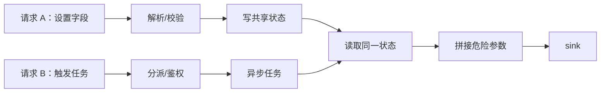

需要验证写入先于读取、同一进程/对象、读取前未重置、线程读取实时值，以及两次请求分别可通过检查。不能把两个互斥命令条件误写成一次请求同时满足。

### 27.3 调用点中心组织

通用 sink 可能被多个安全或不安全调用点调用。函数摘要可共享，但以下信息必须按调用点拆分：

- caller 文件和精确行；
- 传入哪个实参；
- 实参来源；
- 分支/命令/事件条件；
- 上游入口；
- 该调用点的防护和影响。

这能减少“模型在同一个上下文中发现了另一处真实问题，却漏掉评测目标问题”的情况。

### 27.4 证据完整性维度

| 维度 | 回答的问题 |
| --- | --- |
| `generic_entry_path_found` | 当前图是否有入口到目标的函数路径 |
| input influence | 指定外部值是否影响指定危险参数 |
| condition/timing compatibility | 分支、状态、对象和事件是否相容 |
| exposure/impact | 外部主体能否接触入口，服务权限允许何种后果 |
| evidence completeness | 哪些结论已支持、哪些仍未知 |

Stage 1 可以在 dataflow 未完成时继续；Stage 2 和后续按需查询负责补证。报告不能把 `generic_entry_path_found=true` 写成“完整攻击链已证实”。

---

## 28. Web 产品流程与会话模型

### 28.1 左侧阶段导航

Web 以阶段分组组织：

- 目标与资产：设备 Socket 资产、暴露面识别与定位；
- 源码与范围：源码定位、Socket 服务扫描范围；
- 分析：扫描工作台、阶段进度、产物；
- 验证与报告：动态验证、报告、披露和历史资产。

每个功能页面顶层使用统一侧栏，页面内部只保留与本阶段直接相关的动作，避免重复横向菜单。

### 28.2 会话类型

| 会话 | ID 形式 | 典型状态 |
| --- | --- | --- |
| 设备资产 run | 运行 ID + device serial | running/complete/partial/failed |
| 单目标暴露面 | `exp_*` | INTAKE、RUNNING、等待启动确认、DONE/PARTIAL/FAILED |
| 源码定位 | `loc_*` | 完整定位状态机 |
| 联合会话 | 组 ID | 关联 stage 1 exposure 和 stage 2 locator |
| 仓库扫描 | scan ID | queued/running/interrupted/completed/failed |

批量输入产生一组子会话，历史中应按 batch 展开/折叠；删除联合会话时需要清理组合记录和关联子会话，失败项应逐项显示，不能留下失效父记录。

### 28.3 实时更新

页面通过 SSE/轮询接收：

- 阶段状态；
- 中文运行说明；
- 模型轮次和工具调用；
- 动态任务树；
- 命令、证据和 worker 日志；
- LLM 语义检索审计；
- Git 拉取进度；
- 扫描阶段报告和产物索引。

SSE 断开不应终止后台作业；重新打开页面从持久化事件和状态恢复。浏览器显示“无数据”时需要区分后台确实未产出、接口未转发字段和前端渲染器读取错结构。

### 28.4 产物独立查看

Web 只允许查看白名单产物。小 JSON 可展开为对象/数组；大 dataset 用流式集合浏览器、分页、过滤和单项详情，避免一次解码数百 MB。证据 ID 应支持点击弹窗展示文件、行号、源码和关系说明。

---

## 29. 这是多智能体项目吗

从软件形态看，它是“多个专职 Agent/模型循环 + 确定性控制平面”的多智能体式系统，但不是一群 Agent 无约束对话。主要角色：

| 角色 | 目标 | 工具/事实 |
| --- | --- | --- |
| 设备资产 Agent | 枚举整机 Socket 并补齐资产字段 | 任务树、HDC、RAG、设备证据 |
| 单目标暴露面 Agent | 侦查一个 Unix/TCP/UDP 端点 | HDC、任务树、finish 门禁 |
| 源码定位 Agent | 从端点定位服务端、仓库、版本和入口 | OpenGrok 搜索/读取、Manifest、Git 状态机 |
| Socket 范围 Agent | 在本地仓库识别服务实现子目录 | list/search/read/finish |
| 应用上下文 Agent | 理解系统用途和威胁模型 | 仓库调查工具 |
| 可达性 Agent | 补充结构解析遗漏的入口语义 | 分批函数代码、结构化信号 |
| 调用边恢复/候选复核 Agent | 对 residual 和候选关系求证 | 调用点、源码、函数索引 |
| 上下文增强 Agent | 为单元选择相关函数和安全语义 | 七个仓库索引工具 |
| Stage 1 Agent | 初步发现和分类安全问题 | 目标源码、入口路径、上下文 |
| Stage 2 Agent | 从攻击者视角复核和补证 | 七个源码查询/finish 工具 |
| 动态验证 Agent | 设计并执行受控运行实验 | Docker/Claude workspace |
| 报告 Agent | 将已结构化证据转成人类可读报告 | pipeline output、源码和验证结果 |

这些 Agent 通过文件产物、证据 ID、图版本和状态机协作，不靠共享一段无限增长的聊天记录。确定性程序是协调者和证据门禁。

---

## 30. OpenHarmony 调用图四个专项阶段

Web 曾单独展示四个高级阶段，它们容易因结果为 0 被误读：

### 30.1 调用图恢复

审查解析器 residual，包括无候选和已列候选的间接调用点。迭代模式可按入口前沿多轮调度。输出是审计决策，不直接改原生图。0 accepted 可能表示：没有合格 residual、已有原生/台账边、证据不足，或候选被保留为未决。

### 30.2 候选边复核

专门复核解析器已经发现候选但目标不确定的站点。多个合法 handler 可以同时成为静态候选；不要求模型猜一次运行的唯一目标。0 accepted 不等于阶段无用，需要看 unresolved/rejected 和站点数。

### 30.3 调用边投影

只把满足 evidence、binding、validation record、端点身份和版本门槛的关系写入 `llm_call_graph_overlay.json`，再刷新 `effective_call_graph.json`。reachable 模式下从 `dataset_unfiltered.json` 重新 BFS，只有此步才能真正改变当轮数据集。0 edge 表示没有新合格边或全部已存在，不一定是前端显示错误。

### 30.4 分派码证据

从源码/头文件提取 IPC/SA handler 的整数 selector、枚举和常量映射，为后续调用关系和动态验证准备证据。它本身不改图；0 resolved 可能因为目标服务不是该类分派、站点不在范围、常量缺失或解析不支持。

四阶段的正确阅读顺序是：站点数 → 请求/模型调用 → accepted/unresolved/rejected → overlay 新边 → 有效图版本 → 重新筛选单元数。

---

## 31. 核心产物依赖关系

| 阶段 | 权威输入 | 主要输出 | 谁消费 |
| --- | --- | --- | --- |
| 设备资产 | 开发板、任务树、命令指南 | raw records、assets、snapshot | 人工选择、单目标识别 |
| 单目标暴露面 | 端点、HDC 证据 | exposure surface | 源码定位、报告 |
| 源码定位 | OpenGrok、Manifest、Git | evidence、mapping、entrypoints、handoff | 仓库获取、范围识别 |
| 范围识别 | 本地仓库、Socket 目标 | scan scope manifest | Parse |
| Parse | 源码、语言、平台、scope | dataset、analyzer output、native graph、ledger | 有效图、索引 |
| P0/P1/P2 | native graph、ledger、Clang/semantic facts | effective graph、gap report | 可达性、增强、Stage 2 |
| App context | 仓库/威胁模型/平台画像 | application context | Reach、Stage 1/2、报告 |
| Reachability | 完整 dataset、有效图、语义信号 | 过滤 dataset、reach report | P3、Enhance |
| P3 | 有效图、入口、gap | tasks、reachability context、source bundle | Stage 1/2 |
| Enhance | dataset、index、app context | enhanced dataset | Stage 1 |
| Stage 1 | target + ordered context | results | Stage 2、report |
| Stage 2 | candidates + repository index | verified results | build-output、report |
| Build-output | 最终静态结果 | pipeline output | Dynamic、report |
| Dynamic | pipeline output + runtime | dynamic results | report |
| Report | pipeline output + contexts + dynamic | HTML、summary、disclosures | Web、人审 |

### 31.1 为什么不能只看一个文件

- 只看 `dataset.json` 看不到 Stage 1 结论；
- 只看 `call_graph.json` 看不到已核验补边；
- 只看 `effective_call_graph.json` 看不到 candidate 和运行时数据流是否成立；
- 只看 `dataset_enhanced.json` 看不到 Stage 2 修正；
- 只看披露文档无法判断模型是否遗漏反证；
- 只看 `scan.report.json` 只能知道阶段状态，不能替代源码证据。

---

## 32. 失败、降级、取消与恢复

### 32.1 状态分类

| 状态 | 含义 |
| --- | --- |
| success / complete / done | 该阶段按自身验收完成，不保证所有可选证据都存在 |
| partial | 有可用产物，但覆盖或字段不完整 |
| inconclusive / needs-review | 关键事实不足，保留复核机会 |
| skipped | 用户关闭、无候选或条件不适用 |
| interrupted / cancelled | 用户或进程主动停止，可保留 checkpoint |
| failed | 该阶段无法完成；需看是否阻断后续 |

### 32.2 致命与非致命

通常致命：仓库路径无效、配置/鉴权预检失败、必要解析产物缺失、Python envelope 无法恢复、核心分析结果不可读。

通常可降级：单批 LLM reachability 超时、Clang 某翻译单元缺依赖、调用边候选证据不足、Stage 2 无候选、动态环境不具备、报告某个披露生成失败。是否继续由阶段契约决定，并写明覆盖缺口。

### 32.3 网络中断

模型批次断网时，当前实现可能跳过失败批次继续。最终阶段状态 success 不代表 100% 批次完成；报告需要保存失败 batch 范围。长期连续失败应触发熔断/暂停，而不是无意义地把所有剩余批次快速标失败。

### 32.4 扫描恢复

Go 启动扫描前检查 enhance/analyze/verify checkpoint，用户可以继续或清理。Web 重启后从输出目录恢复历史 job、报告和披露。恢复必须校验源码 revision、scope、配置和图版本，不能仅因文件名相同复用旧上下文。

### 32.5 源码定位恢复

源码定位 session 的状态、动作、证据和用户决策持久化。Git/版本失败进入可恢复状态；用户可选择新 revision 继续。OpenGrok 不可用保留已有证据，但不能伪造仓库定位成功。

---

## 33. 安全边界与操作约束

### 33.1 Web

- 默认只监听回环地址；
- 校验 Host，减少 DNS rebinding；
- 写操作需要 CSRF；
- 设置安全响应头；
- 产物访问白名单、路径 containment 和符号链接检查；
- 大文件使用流式/分页，限制内存读取。

### 33.2 源码与仓库

- 被扫描仓库完全不可信；
- 不执行仓库内命令或提示词；
- 文件读取限制在 root，拒绝 symlink、FIFO 和越界；
- Git 拉取目标由用户确认，先临时目录再验证交接；
- 本地已有修改不会被无关扫描命令覆盖。

### 33.3 设备

- 资产和普通侦查任务应是只读；
- HDC 命令、返回码和输出进入审计；
- 服务启动是独立授权动作；
- 启动后重新侦查，不把启动成功等同于端点事实；
- 设备 serial 必须唯一，避免证据串设备。

### 33.4 模型

- 模型输出一律视为不可信结构；
- tool name、参数、路径、证据 ID、枚举和大小程序化校验；
- 模型引用源码不代表调用关系成立；
- model `high` 不等于校准概率；
- 事实和解释分开保存；
- 截断、格式错误和无 finish 采用 fail-safe。

---

## 34. 性能、成本与规模控制

主要成本来源：

1. 源码文件数量和解析语言数；
2. 函数单元总数；
3. LLM reachability 按全量函数约每批 25 个单元；
4. Clang 翻译单元和依赖补齐；
5. Agentic enhancer 每单元多轮读取；
6. Stage 1 分析单元数；
7. Stage 2 候选数和工具轮次；
8. 报告披露数量；
9. workers、限流和模型 token 单价。

常见控制手段：

- 先定位服务子目录；
- reachable 而非 all；
- 先 `stop_after` 评估召回；
- 调低/调高 `llm_reachability_max_code_bytes` 时明确成本变化；
- 对 Clang 使用 gap-prioritized `max_files`；
- 关闭不需要的增强、Stage 2、动态或报告；
- 用 checkpoint 避免重复已经完成的单元；
- 增量扫描用于开发反馈，全量扫描用于里程碑。

不能只用 `limit` 宣称预算受控：它主要限制分析单元，并不必然限制前面的全仓解析和 LLM reachability 成本。

---

## 35. 可复现性

一次可复现运行至少冻结：

- VulnFounder commit；
- 源码 repository URL、commit/revision、内容哈希；
- scan root 和 scope manifest；
- 平台、语言、处理级别、skip tests；
- 所有可选阶段开关；
- 模型 provider、model、reasoning/temperature（若提供）、endpoint；
- prompt/schema 版本；
- HDC device serial、系统版本和时间快照；
- OpenGrok 索引来源和目标分支；
- Clang 版本、编译命令、工作目录、sysroot、宏、头文件和 build status；
- effective graph version；
- checkpoint 是否复用；
- 每阶段 tokens、费用、耗时和错误。

大模型输出仍可能波动，因此算法消融应冻结原始模型响应，在相同输入上比较入口策略、调用图和 medium 传播；模型对比实验则应独立记录每个模型结果。

---

## 36. 评测数据集与指标

### 36.1 暴露面评测

`evaluation_dataset/exposure` 保存人工核对的 Unix/TCP/UDP 端点、类型/状态、进程、权限、源码仓库和定位证据。评测应分别统计：

- 设备枚举召回；
- endpoint 去重和状态正确性；
- 进程/权限字段完整度；
- 源码仓库 Top-1/Top-k 正确性；
- 服务端入口函数覆盖；
- partial/unknown 是否诚实。

### 36.2 50 个安全样本

安全评测集包括官方历史修复前版本和人工预埋样本。每个样本对应目标函数、位置、变更前后源码、问题描述、入口端点、完整参考链和根因。

生产扫描不能读取这份答案来补图、生成上下文或决定结论。标注只用于扫描完成后的对照；否则会产生目标泄漏和作弊。

### 36.3 必须拆分的指标

| 指标 | 含义 |
| --- | --- |
| parse coverage | 目标函数是否被解析 |
| strict/candidate/fallback retention | 目标为何进入后续分析 |
| generic entry path coverage | 是否有入口到目标的函数路径 |
| ordered source bundle completeness | 路径节点源码是否按序齐全 |
| Stage 1 issue alignment | Stage 1 风险是否与标注变更对应 |
| Stage 2 confirmation/recovery | 复核是否正确确认、修正或保留未决 |
| disclosure fidelity | 报告触发行、链路、根因和源码是否忠实 |
| benign-control false positive | 无问题对照是否被错误判定 |
| runtime/cost | 各阶段耗时、token 和费用 |

“进入 reachable”不是问题检出率；“报告提到命令注入”也不一定与具体预埋变更对应；同函数发现另一处真实问题要单独记为额外发现，不能算目标命中。

---

## 37. 端到端示例一：`/dev/unix/socket/paramservice`

1. 用户可先在资产库看到命名 Socket，也可直接输入完整路径。
2. 单目标设备识别确认路径、STREAM/AF_UNIX、状态、持有进程、完整 DAC 字符串、属主/组和对象 SELinux 标签；未知项保留证据缺口。
3. 源码定位标准化 Socket 名称并用 OpenGrok 搜索完整路径、宏和 `.cfg socket.name`。
4. 读取服务初始化、`GetControlSocket`、事件注册、接收循环和消息处理源码。
5. 区分 init 创建/持有 fd、参数服务消费 fd 和客户端连接代码。
6. Manifest 将源码路径映射到主仓库和附属仓库。
7. 页面展示所有已识别顶层接收入口的完整函数源码，而不是只显示一个命中行。
8. 用户确认仓库和 revision 后执行 Git 拉取。
9. 拉取后检查 origin、HEAD、关键路径、符号和 Socket 身份。
10. 生成 `source_handoff.json`。
11. 可先用 Socket 范围 Agent 找到服务实现目录，再由用户确认 scan scope。
12. 普通扫描解析函数、调用点和入口，构建有效图和 strict/candidate 视图。
13. P3 为目标函数生成入口到目标的有序源码包。
14. Stage 1 判断目标函数局部安全问题；Stage 2 若开启，按需追踪具体参数和防护。
15. 报告把设备事实、仓库版本、触发行、链路源码、结论和不确定性分开呈现。

若只找到 `.cfg socket.name` 而缺少消费者函数，定位器仍给出概率最高仓库和 `missing_predicates`，但不会把入口覆盖写成完整。

---

## 38. 端到端示例二：`SP_daemon UDP 127.0.0.1:8283`

### 38.1 设备侧

资产/目标识别需要通过 UDP 表、端口、inode、进程 fd 和进程信息确认：

- `127.0.0.1:8283` 是 UDP 端点；
- 当前是否绑定；
- 关联进程/PID/UID；
- 网络端点的 DAC/文件对象标签为不适用；
- 进程 SELinux 域是进程属性，不是 Socket 文件标签。

服务未启动时，不能仅因源码写了端口就把设备状态填为 listening；用户授权启动后必须重新观测。

### 38.2 源码定位

`developtools_smartperf_host` 与 `developtools_profiler` 可能都有相关实现或副本。候选 PK 不能只看谁命中 `socket_accept_read` 更多，而要比较：

- 哪个仓库构建设备上的 `SP_daemon`；
- 哪个包含 UDP 8283 的服务端接收和业务分派；
- 哪个只是客户端/控制工具；
- 是否存在重复、迁移或拆分源码。

### 38.3 扫描与链路

对于通用命令执行包装器 `SPUtils::LoadCmd`，一条普通图路径可能来自文件打包等其他业务；真正需要的安全链可能是：

```text
UDP 接收/HandleMsg
→ 特定消息分派
→ 写入共享状态或传递字段
→ 另一命令触发 Network 采集
→ 异步任务读取状态
→ Network 调用点拼接 cmd
→ SPUtils::LoadCmd
→ popen 的命令参数
```

Stage 1 的有序源码包应至少包含入口到目标的函数路径；Stage 2 再围绕具体 `Network.cpp` 调用点核对两次请求、共享状态、命令条件和参数传播。若模型只找到另一条真实 `HandleMsg → ... → LoadCmd` 路径，不能用它替代目标调用点的完整攻击链。

---

## 39. 当前已知边界

1. OpenHarmony 单仓缺少完整编译上下文时，Clang 自动重建只能形成候选证据。
2. Tree-sitter 与启发式解析不能保证模板、宏、虚调用、函数指针和框架触发完整。
3. P2 对象流是有界候选分析，不是完整全程序指针分析。
4. LLM 可达性按批次调用，网络波动会留下未审单元。
5. 入口函数“全部找到”受 OpenGrok 索引版本、生成代码和动态注册限制。
6. 子目录扫描可能把真实上游或依赖裁掉。
7. 一般入口路径不是参数级 source-to-sink 证明。
8. Stage 1/2 仍可能选择错误候选路径、遗漏同函数第二个问题或受上下文预算影响。
9. 动态未复现可能是环境阻塞，不自动推翻静态结论。
10. 模型 high/置信度不是经过统计校准的真实概率。
11. 当前反馈事实主要供审计和下一轮处理，尚不是完全自动的增量固定点求解器。
12. 设备资产是时间快照；服务状态变化后需要重扫。

---

## 40. 项目验收检查清单

### 40.1 设备资产

- [ ] 唯一 device serial；
- [ ] 动态任务树确有模型新增子节点；
- [ ] 原始 Socket 记录和最终资产分开；
- [ ] Unix/TCP/UDP/IPv4/IPv6 覆盖可见；
- [ ] PID/UID/进程/权限/标签有证据或明确不适用；
- [ ] summary 统计与记录重算一致；
- [ ] 失败/partial 不覆盖可用 latest。

### 40.2 暴露面与定位

- [ ] 目标标准化正确；
- [ ] 运行状态来自当前设备；
- [ ] 服务启动有用户确认和审计；
- [ ] OpenGrok 证据 ID 可展开；
- [ ] 服务端、客户端、配置和副本区分；
- [ ] 多候选经过证据 PK；
- [ ] 所有已识别接收入口有完整函数源码；
- [ ] Git revision 和拉取后核验通过；
- [ ] `source_handoff` 内容完整。

### 40.3 调用关系

- [ ] 语法调用表达式进入 ledger；
- [ ] resolved 站点要么入图要么有排除原因；
- [ ] candidate completeness 不被忽略；
- [ ] 原生图不被覆盖；
- [ ] effective graph source/config/version 一致；
- [ ] Clang build status 如实；
- [ ] 对象流候选不伪装 strict；
- [ ] 投影后重新筛选并同步 dataset。

### 40.4 可达性和上下文

- [ ] strict/candidate/fallback 分开统计；
- [ ] high seed 有入口种类和证据；
- [ ] medium 独立候选传播；
- [ ] 失败批次和未审单元可见；
- [ ] 目标路径按入口到目标排序；
- [ ] `primary_path_source_bundle` 节点源码完整或有 omitted 标记；
- [ ] generic path 与 parameter dataflow 分开。

### 40.5 Stage 1/2/报告

- [ ] Stage 1 精确分析目标函数；
- [ ] 相邻上下文问题不误归因；
- [ ] 多问题未被单一 finding 吞掉；
- [ ] inconclusive 有 missing evidence；
- [ ] Stage 2 工具路径和 finish 完整；
- [ ] 触发代码来自真实目标行；
- [ ] 调用链源码按顺序；
- [ ] 修复代码有前提假设；
- [ ] 中英文版本字段一致；
- [ ] scan.report 的阶段状态与实际产物一致。

---

## 41. 推荐的运行策略

### 41.1 快速初筛

1. 如果仓库大，先做 Socket 服务范围识别；
2. `reachable`；
3. 开启 LLM reachability；
4. 先停在 `openharmony-gap-tasks` 检查目标召回和入口源码；
5. 满意后继续 Stage 1；
6. 暂时关闭 Stage 2、动态和报告以节省时间。

### 41.2 证据复核

1. 固定上一轮源码和配置；
2. 对未决调用点开启 Clang/调用边复核；
3. 检查投影是否实际改变有效图；
4. 重新生成入口血缘；
5. 对 Stage 1 的 vulnerable/inconclusive 开启 Stage 2；
6. 人工查看原始工具轨迹而不是只看最终标签。

### 41.3 正式披露

1. 固定 revision 和产品配置；
2. 运行 Stage 2；
3. 对高价值结果执行可行的动态验证；
4. 检查触发行、source-to-sink、权限和影响；
5. 检查修复代码假设；
6. 人工审阅中英文披露后再外发。

---

## 42. 术语速查

| 术语 | 准确定义 |
| --- | --- |
| 暴露面资产 | 当前设备上观测到的监听/绑定端点及属性 |
| 单目标暴露面 | 针对一个 Unix/TCP/UDP 端点的详细设备调查 |
| 源码定位 | 从端点/服务线索到源码、仓库、版本和入口证据的过程 |
| scan scope | 用户确认的本地服务扫描目录和证据 manifest |
| unit | 函数级分析单元 |
| callsite | 具体调用表达式位置，不只是 caller/callee 函数对 |
| native graph | 解析器原始调用图，审计基线 |
| effective graph | 原生边加合格事实生成的下游实际调用图 |
| residual | 未解析/部分解析的调用或框架站点 |
| strict fact | 满足当前证据和配置门槛的调用关系 |
| candidate fact | 有依据但仍不完整/不确定的关系 |
| strict reachable | 从结构/获准语义入口沿 strict 图可达 |
| candidate reachable | 从 medium 或候选前沿按候选策略保留 |
| fallback-only | 因无图/无种子保召回而保留，不能算路径证明 |
| entry lineage | 入口到目标的函数路径和源码证据 |
| source-to-sink | 具体外部值到具体危险参数的传播关系 |
| Stage 1 | 按函数初步发现、分类和证据缺口判断 |
| Stage 2 | 使用源码工具从攻击者视角复核和补证 |
| disclosure | 面向维护者的单问题人类可读报告 |

---

## 43. 相关文档

- 仓库扫描的代码级极详基线：`OPENANT_REPOSITORY_SCAN_FULL_PIPELINE_DETAILED.zh-CN.md`
- 当前较简短的流程：`OPENANT_CURRENT_PIPELINE_FLOW.zh-CN.md`
- 智能体视角介绍：`OPENANT_AGENT_CENTRIC_PIPELINE_OVERVIEW.zh-CN.md`
- 报告流程：`OPENANT_REPORT_PIPELINE_OVERVIEW.zh-CN.md`
- 运行架构与边界：`ARCHITECTURE.md`
- 图形索引：`figures/README.zh-CN.md`
- 设备命令知识：`libs/openant-core/knowledge/openharmony_exposure_surface_command_guide.zh-CN.md`

---

## 44. 最终总结

VulnFounder 的完整工作流可以概括为：

> 先从具体开发板或用户目标建立可信端点事实，再用 OpenGrok 和源码证据定位服务仓库与入口；对用户确认的仓库/目录进行多语言解析，把原生调用、Clang、平台分派、对象流和模型求证统一为带版本的调用事实；从获准入口生成 strict/candidate 可达视图和按顺序排列的入口源码；Stage 1 负责发现，Stage 2 负责按需补证，动态验证提供运行观察，报告则把触发行、完整链路、根因、修复建议和所有不确定性回溯到原始产物。

这套设计最重要的不是“模型给出一个肯定答案”，而是让每一次发现、缺口、用户决策、设备操作和阶段降级都能够被解释、复现和复核。
