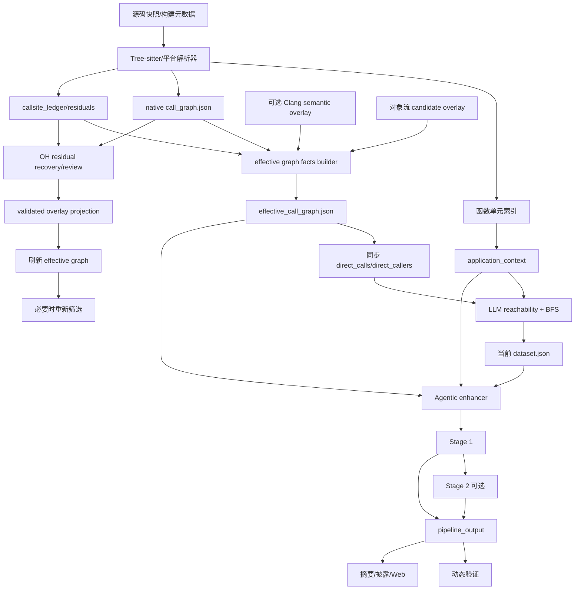

# OpenAnt 当前仓库扫描全流程（极致详细版）

> 文档状态：当前实现快照，供项目评审和专家复核使用。  
> 适用范围：open-ant scan <repository> 普通仓库扫描流程，重点覆盖 OpenHarmony/C/C++ 场景。  
> 目标：说明一次扫描从源码进入到最终报告之间每一步实际做什么、谁做、输入输出是什么、什么情况下会跳过，以及最终数字应该怎样解释。  
> 说明：本文描述当前代码的执行逻辑，不把计划中的能力写成已经自动化的能力。
>
> 本次更新特别冻结了“调用关系处理”重构前的事实基线：有效调用图、调用点台账、语义 overlay、可达性上下文、攻击链上下文和后续 Stage 1/Stage 2 之间的真实依赖关系，均以当前扫描编排器和产物为准。文末新增的第 32～45 节是重构前的详细审计说明，不代表已经采用了新的架构。

---

## 1. 先看完整主线

OpenAnt 不是一次模型调用，而是确定性程序、源码解析器、调用图处理、多个可选 LLM 阶段、动态测试和报告生成器组成的流水线。

    源码目录 / 已拉取仓库
            │
            ▼
    运行参数、模型注册和连通性预检
            │
            ▼
    平台画像：generic / OpenHarmony
            │
            ▼
    源码解析：函数单元 + 入口标记 + 原生调用图 + residual/ledger
            │
            ▼
    有效调用图构建（确定性 facts）+ 可选 Clang sidecar + 缺口汇总
            │        └── effective_call_graph.json（原生图不被覆盖）
            ▼
    应用上下文：攻击者、边界、预期功能、平台安全基线
            │
            ├── 可选：LLM 可达性复核（先看完整单元集合）
            │       ├── high 语义种子 → strict 可达 BFS
            │       └── medium 信号 → candidate 可达 BFS
            │
            ├── 可选：OpenHarmony residual 调用图恢复
            ├── 可选：候选边语义复核
            ├── 可选：调用边语义投影（写 overlay，必要时重新 BFS）
            ├── 可选：IPC/SA 分派码证据提取
            └── OpenHarmony 缺口任务队列（按最终有效图刷新）
            │
            ▼
    Agentic 上下文增强：按单元补充调用者、被调用者、调用点和源码证据
            │
            ▼
    Stage 1 漏洞分析：每个单元独立输出结构化判断
            │
            ├── 可选：Stage 2 FindingVerifier 攻击者视角复核
            │
            ▼
    OpenHarmony 分析反馈（候选事实和下一轮缺口，不自动改图）
            │
            ▼
    pipeline_output.json（统一桥接产物）
            │
            ├── 可选：Docker / Claude Code 动态验证
            │
            ▼
    摘要、英文披露、中文披露、Web 展示、scan.report.json

必须区分三个概念：

1. **解析到**：解析器在源码中识别出函数或调用表达式。
2. **可达**：按照当前入口、调用图、语义信号和筛选策略，该单元被送入后续阶段。
3. **存在安全问题**：Stage 1/Stage 2 根据源码、上下文和威胁模型作出的安全判断。

因此，解析到不等于可达，可达不等于有安全问题，模型提到一个函数也不等于已经证明攻击者能触发该函数。

---

## 2. 本文覆盖的三个入口

### 2.1 普通仓库扫描

输入是本地源码目录，例如：

    /Users/.../OpenAnt/evaluation_dataset/vulnerability/vulnerable_source_code_base/developtools_profiler

输出写入独立扫描目录：

    /Users/.../.openant/webui/<scan_id>/

普通静态扫描不要求开发板在线，也不会自动修改开发板代码或服务。

### 2.2 OpenHarmony 源码定位后的扫描

源码定位是普通扫描的前置入口，而不是解析器内部步骤。它负责：

1. 标准化命名 Unix Socket、TCP/UDP 端点或服务标识；
2. 用 OpenGrok 做受限搜索；
3. 读取源码片段，区分服务端、客户端和控制端；
4. 从 Manifest 映射候选仓库；
5. 让用户确认仓库；
6. 拉取/复用源码并验证路径、origin、revision 和符号；
7. 生成源码交接信息，然后进入本文普通仓库扫描主线。

定位阶段中，模型选择下一步检索动作；源码片段由 OpenGrok/读取工具返回。模型不能把未经工具返回的内容伪造成证据。

### 2.3 设备暴露面识别

设备暴露面识别是可以单独执行的入口，面向开发板上的真实端点，例如：

    /dev/unix/socket/paramservice
    SP_daemon UDP 127.0.0.1:8283

它在设备上收集类型、状态、权限、SELinux 标签、关联进程等信息，再解析为统一结果。它可以和源码定位、普通扫描串联，但不是普通仓库扫描的必经阶段。

---

## 3. 运行参数和处理范围

当前核心编排函数的重要参数如下：

| 参数 | 作用 |
|---|---|
| repo_path | 源码目录，扫描器转为绝对路径。 |
| output_dir | 所有阶段产物目录。 |
| language / languages | 单语言或多语言解析。 |
| platform | auto、generic、openharmony。 |
| processing_level | all、reachable、codeql、exploitable 等。 |
| verify | 是否运行 Stage 2。 |
| generate_context | 是否加载/生成应用上下文。 |
| enhance / enhance_mode | 是否增强，以及 agentic 或 single-shot。 |
| skip_tests | 是否过滤测试代码，默认开启。 |
| limit | 限制后续分析单元数，不等同于限制源码解析。 |
| llm_reachability | 是否运行 LLM 可达性复核。 |
| llm_reachability_max_code_bytes | 可达性提示词中每单元代码上限。 |
| stop_after | 当前支持 effective-call-graph、llm-reachability、openharmony-gap-tasks。 |
| llm_call_graph_recovery | OpenHarmony residual 调用图恢复。 |
| llm_call_graph_iterative_recovery | 入口驱动的多轮恢复。 |
| llm_call_graph_candidate_review | 解析器候选边复核。 |
| llm_call_graph_projection | 把验证后的边写入独立 overlay 并重筛。 |
| openharmony_dispatch_code_evidence | 提取 IPC/SA 分派码常量证据。 |
| dynamic_test / dynamic_test_mode | Docker 或 Claude Code 动态验证。 |
| workers / backoff_seconds | 并发和限流退避。 |
| repo_name / repo_url / commit_sha | 报告元数据。 |
| diff_manifest | 可选差异过滤清单。 |

### 3.1 processing_level

* **all**：不依据可达性主动裁剪，所有成功解析单元都有机会进入增强和分析（仍受 limit、文件过滤、语言失败和阶段错误影响）。
* **reachable**：使用结构化入口、原生调用图和可选语义种子筛选，减少后续成本。
* **codeql/exploitable**：由语言/解析器实现具体语义，不能假设所有语言完全一致；最终以 parse 阶段报告和数据集元数据为准。

### 3.2 为什么解析数不等于分析数

1. reachable 会先解析，再按图筛选；
2. 开启 LLM 可达性时，首轮临时按 all 解析，等模型信号合并后再筛；
3. 开启 OpenHarmony 调用边投影时，会保留 dataset_unfiltered.json，供投影后重新 BFS；
4. limit 约束后续处理规模；
5. 多语言先分别解析，再合并；非严格模式下某语言失败不会必然中断；
6. 没有 call_graph.json 的语言为防止误删会不筛选地传给下游，并标记降级。

---

## 4. 阶段 0：启动、模型注册和预检

### 4.1 基础初始化

扫描器首先：

1. 转换源码和输出目录为绝对路径；
2. 创建输出目录；
3. 重置 token、耗时、费用和阶段追踪；
4. 记录平台、语言、处理级别和开关；
5. 校验 stop_after、动态测试模式等参数组合。

此时尚未进行漏洞判断。

### 4.2 Phase registry

统一配置会解析 provider、模型、URL、鉴权方式和阶段绑定，例如：

    app_context  → 应用上下文模型
    llm_reach    → 可达性模型
    enhance      → 上下文增强模型
    analysis     → Stage 1 模型
    verification → Stage 2 模型
    report       → 报告模型

这样，llm-config 等配置不会被子模块静默替换。

### 4.3 最小连通性探测

在源码解析前，对每个唯一的 provider/model 组合执行一次最小 token 探测，用于尽早发现：

* API key、auth token 或 credentials 缺失；
* endpoint、模型名或 provider 错误；
* 网络不可达；
* 鉴权方式不匹配。

预检失败通常是致命配置错误；运行中的普通超时则由各阶段按降级策略处理。阶段日志和最终 scan.report.json 保存实际状态。

---

## 5. 阶段 1：平台画像

### 5.1 三种平台模式

* generic：不读取 OpenHarmony 专用元数据，也不套用 OpenHarmony 入口规则；
* openharmony：即使画像不完整，仍强制使用 OpenHarmony 解析路径；
* auto：尝试生成画像，达到条件才提升到 OpenHarmony，否则保留通用路径。

平台画像失败不会把普通扫描悄悄改成错误的平台扫描。

### 5.2 platform_profile.json

成功时写入：

    <output_dir>/platform_profile.json

它记录平台判定、置信度、组件/语言覆盖等事实，供应用上下文、可达性提示词、OpenHarmony 调用图阶段和报告解释使用。

### 5.3 画像不是入口证明

画像只能说明应该使用哪一套分析规则，不能证明任意函数都能被 Binder、Socket、System Ability 或命令入口调用。入口仍需依赖源码注册、调用图和语义证据。

---

## 6. 阶段 2：源码解析、函数单元和原生调用图

这是所有后续阶段的事实底座。

### 6.1 文件范围

解析器遍历仓库并识别语言，记录发现/选中/跳过的文件和解析错误。当前测试过滤策略针对明确的 test/fuzz 范围；kernel、third_party、generated、out、build 不能只因为目录名就被本文假定为必然排除，是否排除以实际 scope 配置和报告为准。

### 6.2 C/C++ 解析分层

当前 C/C++ 主干仍以 Tree-sitter/自有提取器做快速语法级解析，主要工作是：

1. 识别函数、方法、类、命名空间和源码范围；
2. 提取签名和主体；
3. 识别直接调用、成员调用、构造调用以及部分注册/回调线索；
4. 建立函数 ID、源码位置和调用关系；
5. 标记结构化入口与平台注册线索。

近期已补充字段类型/限定类型和跨文件方法匹配，使 controlCallCmd.GetResult(vec)、taskMgr_.InitDataCsv() 等直接成员调用可以更稳定地入图。它仍不是完整 C++ 语义解析器，宏、模板、虚调用、函数指针、工厂对象流和跨进程分派可能留下 residual。

可选 Clang sidecar 在有完整编译上下文的翻译单元上提供语义绑定证据。它写独立 overlay，不自动覆盖 native call_graph.json。

### 6.3 函数分析单元

一个单元通常包括：

    稳定 unit_id
    限定函数名和完整签名
    规范源码路径
    起止行/列
    目标函数源码
    语言/平台元数据
    结构化入口标记
    直接 caller/callee 摘要
    有限层数的上下文代码

各语言解析器默认依赖上下文深度通常为 3 层；实际值以 dependency_metadata.depth、语言解析器配置和当前单元为准。这是提示词上下文范围，不是最终 BFS 的全局遍历深度。

### 6.4 原生产物

| 产物 | 含义 |
|---|---|
| dataset.json | 当前函数单元集合；后续可达性阶段可能写回筛选视图。 |
| analyzer_output.json | 解析统计、文件/函数信息和诊断。 |
| call_graph.json | 原生调用图及反向关系/边属性。 |
| call_graphs.json | 多语言模式下各语言图目录索引。 |
| call_graph_residuals.json | 未解析或部分解析的间接/成员/回调站点。 |
| callsite_ledger.json | 调用点、候选目标和解析状态台账（由支持的解析器提供）。 |
| parse.report.json | 阶段输入、统计、输出、失败和耗时。 |

### 6.5 多语言合并

多语言模式下先在 output_dir/language/ 分别解析，再合并根目录 dataset.json、analyzer_output.json 和调用图索引；后续上下文、可达性、增强、分析和验证针对合并数据集只运行一次。

### 6.6 原生调用图的边界

静态边表示“当前分析模型认为可能存在调用关系”，不是：

* 进程间消息一定实际发送到某个接收者；
* 虚函数运行时一定选择某个派生类；
* 注册回调一定已经执行；
* 外部输入一定能满足所有路径条件。

这些结论需要更高层的注册、数据流或动态证据。

---

## 7. 阶段 3：应用上下文和 OpenHarmony 安全基线

### 7.1 上下文作用

应用上下文描述仓库类型、输入源、信任边界、攻击者画像、预期功能、权限假设和平台最低安全规则，供后续模型减少误报并避免漏查 IPC/Socket/文件边界。它不是漏洞结论。

### 7.2 仓库威胁模型优先

如果源码根目录有 OPENANT.THREATMODEL.md，扫描器优先加载它，然后确定性合并 OpenHarmony 平台最低基线。仓库模型可以补充业务语义，但不能删除这些要求：

* IPC/Parcel 接口 token、读取返回值、字段类型和顺序必须检查；
* Parcel 派生长度、计数、索引和回调注册必须有界；
* 身份/权限检查必须支配敏感操作；
* 权限校验不能替代空指针、长度、生命周期、并发和资源校验。

### 7.3 无威胁模型时

调用上下文生成器生成并保存：

    <output_dir>/application_context.json

生成失败时记录失败/跳过并尽量继续，不能伪造完整上下文。结果必须带来源、哈希和合并 provenance，便于专家判断模型是在什么安全模型下工作。

### 7.4 上下文不是执行指令

仓库 README、源码字符串和 JSON 元数据都作为静态证据处理，不能通过其中的命令改变扫描器行为。上下文影响提示词，不直接给函数打标签。

---

## 8. Step 2.5（可选）：LLM 可达性复核

### 8.1 目标

结构解析容易漏掉框架注册、Socket 消息处理、插件回调、命令分派、文件/网络读取和跨进程接收。因此该阶段让模型在完整函数集合上寻找“结构化入口没有捕获的语义入口信号”。

它不直接做漏洞分析，也不直接证明攻击链完整；输出是可达性种子和审计证据。

### 8.2 为什么首轮看全量单元

如果先按 reachable 过滤，被结构化规则漏掉的 Socket 接收函数会在模型看到它之前消失。开启 llm-reachability 后，扫描器会把首轮解析临时提升为 all，模型信号合并后再按原始处理级别重新筛选。

### 8.3 提示词输入

模型按批次接收单元，当前默认：

* 每批最多约 25 个单元；
* 每单元代码默认约 1500 字节，可通过参数调整；
* 包含 unit_id、函数代码、源文件和行号；
* 包含已有 is_entry_point 和结构化可达标记，仅作参考；
* 包含有限直接 caller/callee 邻居；
* OpenHarmony 单元附带平台上下文；
* 包含应用上下文和威胁模型（若成功生成）。

模型只返回结构化信号，逻辑形状如下：

    {
      "signals": [
        {
          "unit_id": "...",
          "kind": "entry_point|external_input|cross_process",
          "confidence": "high|medium|low",
          "boundary": "socket|binder|file|network|...",
          "direction": "receive|send|bidirectional|unknown",
          "evidence": "事实性说明",
          "evidence_excerpt": "源码或行为片段",
          "evidence_line_start": 100,
          "evidence_line_end": 108,
          "reason": "简短理由"
        }
      ]
    }

### 8.4 三类信号

* entry_point：函数本身像外部 actor、命令、Socket、IPC、框架生命周期或消息处理入口。
* external_input：函数读取/接受外部数据，语义上天然是入站，不要求额外 direction。
* cross_process：函数参与异步/跨进程/消息队列边界，必须说明 receive、send、bidirectional 或 unknown。

cross_process=send 不能自动当成攻击者入口；只有 receive 或 bidirectional 才能进入 high 语义种子准入。

### 8.5 响应校验

程序化校验：

1. JSON 是否能解析；
2. signals 是否为数组；
3. unit_id 是否属于本批次真实数据集；
4. kind、confidence、boundary、direction 是否属于允许枚举；
5. 行号是否为整数或 null；
6. 字段是否超过长度上限。

未知 unit、错误枚举和畸形结构会被丢弃并计入日志，不会向数据集写入虚假单元。

### 8.6 当前准入规则

| 信号 | 条件 | 结果 |
|---|---|---|
| high entry_point | unit_id 有效，evidence 或 evidence_excerpt 非空 | 设置/保持 is_entry_point=true，作为 strict BFS 根。 |
| high external_input | high 且有证据 | semantic_reachability_seed=true，作为 strict 语义 BFS 根。 |
| high cross_process | high、有证据，direction 为 receive 或 bidirectional | 作为 strict 语义 BFS 根。 |
| medium 任意合法信号 | unit/kind/结构有效 | semantic_reachability_candidate_seed=true，进入 candidate BFS；不升级为 strict 入口。 |
| low 或没有证据的 high | 任意 kind | 保留 review-only，不作为 BFS 根。 |

“有证据”目前指模型返回了非空 evidence 字段，不是本地硬编码的字符串搜索，也不等于调用关系已经被证明。源码行真实存在、符号/类型兼容和注册关系核验属于调用图恢复/投影层。

### 8.7 BFS 和状态标签

* strict 根可按普通 reachable 路径保留；
* medium 根及其沿已接受边到达的单元标记 candidate_reachable；
* 已被结构化入口保留的单元不会被 LLM 降级；
* 没有 call_graph.json 时，为避免静默漏检，该语言单元不筛选地传给下游，并标记 unfiltered_no_call_graph。

日志中的“模型返回 700 条信号”不等于“700 个入口”，更不等于“700 个安全问题”。

### 8.8 产物

    llm_reachability.json
    llm-reachability.report.json（或阶段报告命名）
    dataset.json（写回信号和最终可达视图）

dataset.metadata.reachability_filter 应关注：原始单元、strict 入口/语义种子、candidate seed、strict path coverage、candidate reachable、fallback-only、是否触发无调用图降级、最终送入下游的单元。

### 8.9 网络中断和 stop_after

非鉴权型连接错误和超时通常跳过当前批次并继续后续批次，报告中保留失败批次。鉴权错误可能是致命错误，不能与普通批次超时混淆。

stop_after=llm-reachability 时：

1. 完成解析、上下文和可达性；
2. 写入可达性产物和阶段报告；
3. 将调用图恢复、增强、Stage 1、Stage 2、pipeline 输出、动态测试和报告标记为 stop_after_llm_reachability；
4. 返回可审计的 ScanResult，而不是直接杀死进程。

这不表示漏洞分析已经完成。

当前还有两个更早的独立检查点：

* `stop_after=effective-call-graph`：完成解析、调用点台账、有效调用图、可选 Clang 批处理和调用图缺口报告后停止。它跳过模型初始化/联网预检，适合在没有模型凭据的机器上单独验收构图链路。
* `stop_after=openharmony-gap-tasks`：在 OpenHarmony 调用图恢复、候选边复核、投影、分派码证据和缺口任务队列完成后停止，跳过上下文增强、Stage 1、Stage 2、汇总输出、动态测试和报告。

因此，`stop_after` 不是“跳过前面所有阶段”的通用开关，而是一个**在完整前置条件执行完后，于指定检查点主动返回**的控制点。每个被跳过的后续阶段都会写入 `skipped_steps` 及对应原因；不能把阶段报告缺失解释成阶段成功。

---

## 9. Step 2.75（可选）：OpenHarmony 调用图恢复

### 9.1 解决的问题

原生解析图可能留下：

* 成员调用未绑定目标；
* 虚函数/基类指针目标不完整；
* 工厂返回对象后的接口调用缺边；
* 函数指针、lambda、回调注册和异步任务缺边；
* 命令表/枚举分派未连接到处理函数；
* 已有候选目标但边没有写入最终图。

恢复阶段提出带证据的候选边，不重写原生 call_graph.json。

### 9.2 输入

分别读取每种语言的 call_graph.json、call_graph_residuals.json、函数索引、入口提示、当前可达摘要、调用点台账和 OpenHarmony 平台上下文。缺 residual 的语言明确记录“未复核”，不假装 residual=0。

### 9.3 单轮与迭代

* **单轮**：把站点批量交给模型，一次性输出候选关系。
* **迭代**：从当前入口和边界开始，接受证据充分的边后重新寻找下一轮站点；新目标可进入下一轮入口驱动 BFS，但受轮数、站点和模型调用预算限制。

迭代模式既可复核无确定候选的 residual，也可复核解析器已经列出的候选站点，但不应无限追踪全仓库。

### 9.4 合格候选边

至少应包含：

* caller_id；
* 精确 callsite_id 或源码范围；
* callee_id 或候选目标集合；
* direct/member/virtual/callback/dispatch 等调用类型；
* 接收者类型或注册对象证据；
* 源码文件、行号和片段；
* 构建/宏条件；
* 尚未验证的前提。

“函数 A 可能调用函数 B”但没有调用站点，不能作为合格恢复边。

### 9.5 产物和解释

    llm_call_graph_recovery.json
    llm_call_graph_recovery_rounds.json（迭代模式）
    llm-call-graph-recovery.report.json

accepted 表示恢复阶段接受了模型候选决策，不代表已经成为 native graph 确定边，也不代表运行时必然发生。没有 projection 时，恢复报告只是独立审计结果。

---

## 10. Step 2.76（可选）：候选边复核

调用图恢复关注“解析器没建出的关系是否可能存在”；候选边复核关注“解析器已经给出的候选是否与调用点、类型和注册证据相符”。

输入包括 residual 站点、解析器候选目标、注册源码、调用点源码、有界调用图邻居、函数索引和构建条件。

产物：

    llm_call_graph_candidate_review.json
    llm-call-graph-candidate-review.report.json

它默认不修改 native graph、dataset.json 或普通可达性结果。accepted、undecided、rejected 只有在投影阶段才可能影响独立 overlay。

解析器候选集合如果只是“目前找到的候选”，不能当成完整白名单。只有完整性有独立证据时，才能用它排除新目标；否则有源码证据的新目标应允许进入独立候选集合。

---

## 11. Step 2.765（可选）：调用边语义投影和重新筛选

### 11.1 独立 overlay

投影把通过证据门槛的边写入：

    llm_call_graph_overlay.json
    llm-call-graph-projection.report.json

native call_graph.json 永远保持解析器原始版本，便于对比原图和语义增强图。

### 11.2 投影前校验

程序检查：

1. caller/callee/callsite 是否属于当前数据集；
2. 源码位置和片段是否与当前快照相符；
3. 决策状态、置信度、调用类型和证据字段；
4. accepted/validated 边；
5. 缺失、低质量和未决边的原因。

“引用片段存在”只说明位置有效，不能单独证明类型绑定、注册关系或动态分派成立。

### 11.3 对 reachable 的影响

当 processing_level=reachable 且投影开启：

1. 解析阶段保留 dataset_unfiltered.json；
2. 用原始图和验证 overlay 计算 strict 路径；
3. 用 candidate 策略计算候选路径；
4. 重新标记 candidate_reachable 等状态；
5. 写回当前 dataset.json；
6. 将重筛结果交给增强和分析。

没有通过门槛的边不会被当作新增调用边。

### 11.4 结果为 0 的多种含义

* 没有 residual；
* 有 residual，但模型没接受候选；
* 有 accepted 候选但没开启 projection；
* projection 开启但所有候选被证据门槛拒绝；
* 投影成功但没有改变 reachable 集合；
* Web 只显示新增边，而没显示待复核边。

因此不能只看 Web 上一个“0”，应同时看阶段报告、overlay 和 reachability_filter。

---

## 12. Step 2.77（可选）：OpenHarmony 分派码证据

该阶段从源码和头文件提取 IPC/System Ability 分派码、枚举常量、宏和命令值关系，为动态验证或人工复核提供证据。

特点：

* 不调用模型；
* 不修改调用图；
* 不自动把分派值当成安全问题；
* 未解析符号、冲突值和未解析站点单独记录。

产物：

    openharmony_dispatch_code_evidence.json
    openharmony-dispatch-code-evidence.report.json

partial 或候选分派码为 0 只能表示当前静态证据不足，不能说明没有 IPC dispatch，也不能说明动态验证必然不可行。

---

## 13. Step 3：Agentic 上下文增强

### 13.1 与调用图恢复的区别

调用图恢复关注边是否存在；上下文增强关注每个分析单元要看到哪些源码和依赖。增强不改写 native call graph，也不是漏洞结论阶段。

### 13.2 Agentic 模式

默认 enhance_mode=agentic。模型为每个单元循环选择工具：

* search_usages；
* search_definitions；
* read_function；
* list_functions；
* read_file_section；
* get_dependencies。

循环形式：

    载入目标单元
       ↓
    判断证据缺口
       ↓
    选择工具
       ↓
    读取源码、符号、调用者或被调用者
       ↓
    更新临时上下文
       ↓
    判断是否足够，或继续下一轮
       ↓
    写入该单元增强上下文

工具返回的文件内容是真实源码证据；模型决定查什么、怎样组织和解释。找不到下游实现时应保留未知，而不是补写不存在的函数。

### 13.3 single-shot 模式

single-shot 将一批单元和已有上下文一次性发给模型，不进行逐单元工具循环。速度/成本较低，但更容易遗漏精确的 caller、callee 和注册源码。

### 13.4 Checkpoint 和回退

Agentic 增强通常在输出目录下写 enhance_checkpoints。单元失败不会自动让全仓扫描归零；必要时回退到未增强 dataset.json。是否真正使用增强，应从 dataset_enhanced.json 和 enhance 阶段报告判断。

### 13.5 产物

    dataset_enhanced.json
    enhance_checkpoints/
    enhance.report.json

dataset_enhanced.json 是 Stage 1 的主要上下文输入，但不替代原始 dataset.json。

---

## 14. Step 4：Stage 1 漏洞分析

### 14.1 输入

每个 active dataset 单元独立调用分析模型。提示词通常包含：

1. 目标函数签名和源码；
2. 上下文增强提供的 caller/callee、依赖和源码片段；
3. application_context.json 的威胁模型；
4. OpenHarmony 平台最低安全基线；
5. 当前单元可达状态、入口信号和调用图摘要；
6. 仓库、平台、文件角色和 revision；
7. 上下文函数只能作为输入来源/保护条件证据，不能作为独立漏洞对象。

### 14.2 覆盖的安全类别

当前提示词不是只查命令执行或越界，还独立检查：

* IPC/Parcel/IDL 输入校验；
* 认证、授权、能力和隔离边界；
* 空指针、越界、UAF、double free、泄漏、未初始化读取；
* 整数溢出、截断、符号转换、尺寸乘法；
* 解析器、文件、网络、JSON、解压和资源上限；
* 竞态、锁顺序、死锁、异步回调和生命周期；
* 类型转换、下转型、枚举/ABI/结构宽度；
* 文件、Socket、NAPI、HDF/HDI、ioctl 和 user-copy；
* 日志、密码和传输中的秘密或指针泄露；
* 状态机、重放、重复请求、业务逻辑和错误路径；
* 命令、路径、脚本、模板、SQL 等注入。

### 14.3 finding 标签

* safe：当前目标代码和证据没有支持相关缺陷；
* protected：风险模式存在，但具体 guard 支配所有相关路径；
* vulnerable：缺陷、可达条件和至少一个安全影响有证据支持；
* inconclusive：关键 source、sink、guard、边或 impact 证据缺失。

没有完整武器化 payload 不能自动判 safe；空容器、空指针元素、边界值、重复请求、低内存和生命周期竞态也可能是安全影响。反过来，参数看起来不可信也不能自动判 vulnerable，必须说明传播和影响。

### 14.4 典型输出

    function_analyzed
    finding
    reasoning
    vulnerability_categories
    impact
    attack_scenario
    preconditions
    dataflow_summary
    guard_analysis
    evidence
    counterevidence
    missing_evidence
    attack_vector
    confidence
    cwe_id / cwe_name

字符串字段必须保持字符串类型，不能嵌套对象，否则会破坏验证和报告管道。

### 14.5 Stage 1 边界

Stage 1 是提示词和当前上下文下的初步安全审查，不是自动修复器，也不是动态可利用性证明。下游实现缺失时可以返回 inconclusive，报告不能把它伪装成安全或确认问题。

---

## 15. Step 5：Stage 2 FindingVerifier

### 15.1 触发

verify=true 且 Stage 1 有 vulnerable、可绕过/高风险或 inconclusive 条目时运行。没有候选记录 no_candidates 跳过，不是失败。

### 15.2 为什么复核 inconclusive

Stage 2 尝试补齐：

* 上游 caller；
* 下游 sink；
* guard 的支配关系；
* source 到 sink 的参数/数据流；
* 外部边界可达性；
* 初步判断中的关键假设。

### 15.3 工具循环

工具包括：

* search_usages；
* search_definitions；
* read_function；
* list_functions；
* read_file_section；
* get_dependencies；
* finish。

典型循环：

    读取 Stage 1 条目
       ↓
    找缺失 source/caller/sink/guard/impact
       ↓
    调用仓库检索工具
       ↓
    核对源码和调用关系
       ↓
    确认、反驳、保持待定或工具失败
       ↓
    finish 提交结构化结果

### 15.4 结果解释

Stage 2 可以确认、降级、升级 inconclusive、保持待定或因工具错误回退 Stage 1。验证失败不能静默删除候选；verified_results.json 和阶段报告必须区分已验证与未完成。

---

## 16. Step 6：pipeline_output.json

Stage 1/Stage 2 的 JSON 适合程序内部使用；动态测试、报告和 Web 使用统一桥接文件：

    <output_dir>/pipeline_output.json

主要合并：

* 仓库名称、URL、revision；
* 平台、语言和 processing level；
* 当前最终结果路径；
* Stage 1/Stage 2 摘要；
* 上下文来源、哈希和警告；
* 平台画像；
* 阶段报告和跳过原因；
* 可达性/调用图元数据；
* 动态测试和报告可读取的候选列表。

如果 Stage 2 失败，必须记录使用 Stage 1 回退；上下文失败也要进入 skipped/failure。该文件是桥接事实，不负责重新分析源码。

---

## 17. Step 7：动态验证

### 17.1 触发条件

dynamic_test=true 且有 vulnerable/可绕过候选时运行。无候选是 no_candidates，未开启是 not_requested。

### 17.2 Docker 模式

读取 pipeline_output.json 和候选清单，在隔离环境执行测试。先检查 Docker；不可用时跳过并说明原因。运行结果只说明给定环境和载荷能否复现，不能反向证明绝对安全。

### 17.3 Claude Code 模式

准备任务工作目录、候选清单、源码上下文、工具库和说明，等待用户在 Web 对话驱动验证。工具执行、任务清单和结果文件应留在动态验证工作区。

### 17.4 产物

    dynamic-test/results.json
    dynamic-test/results.md
    dynamic-test/task_manifest.json
    dynamic-test/task_workspace/

精确文件名以动态测试器返回为准，但阶段报告必须记录模式、测试数、确认/未复现/阻塞/待定/错误计数和路径。

---

## 18. Step 8：摘要、披露和中文报告

### 18.1 输入和输出

以 pipeline_output.json 为统一输入，结合动态结果生成：

    <output_dir>/report/
    ├── SUMMARY_REPORT.md
    ├── disclosures/
    └── disclosures.zh-CN/

报告生成器不应绕过 pipeline_output.json 自行猜测旧 results.json 的状态。

### 18.2 披露条目应回溯的事实

* 标题和安全类别；
* 仓库、revision 和受影响文件；
* 目标函数及起止行；
* source → propagation → sink 数据流；
* 调用链和相关函数源码证据；
* 权限、身份、设备状态和触发条件；
* 影响；
* 反证和缺失证据；
* 修复建议或有证据支持的直接修复代码；
* Stage 1、Stage 2、动态验证各自状态。

如果无法安全生成直接补丁，报告应说明缺少的 API、下游实现或构建信息，不能用泛化的 MANUAL REVIEW REQUIRED 冒充修复代码。

英文和中文报告应共享同一结构化事实，翻译不应新增文件、行号、调用关系或结论。

---

## 19. 最终聚合：scan.report.json

最终记录至少应能回答：

1. 仓库目录、URL、commit 是什么；
2. 语言、平台和处理级别是什么；
3. 解析、筛选、增强、分析和验证各有多少单元；
4. 可达性、恢复、投影和分派码是否开启；
5. 每阶段成功、失败、跳过还是降级；
6. Stage 1/Stage 2 的 finding 数量；
7. 动态验证是否执行、确认/阻塞/待定多少；
8. token、费用、耗时、失败批次；
9. 每个产物路径；
10. 是否存在 fallback 或 coverage gap。

在 OpenHarmony 扫描中，还应额外核对：

11. `effective_call_graph.json` 的 `graph_version`、`source_revision` 和 `build_config_id`；
12. 调用点台账中已解析但未入有效图的站点数量及排除原因；
13. Clang overlay、LLM overlay、对象流候选事实是否被消费，还是仅作为独立诊断；
14. `call_graph_gap_tasks.json` 和 `analysis_feedback.json` 是否来自同一份最终有效图；
15. `reachability_context` 和 `attack_chain_context` 是否被实际传给 Stage 1，而不是只存在于旁路产物。

阶段成功只说明阶段完成，不表示所有样本都被发现或所有结论正确。

---

## 20. 产物阅读顺序

专家复核时建议：

    1. scan.report.json
    2. parse.report.json + dataset.json + analyzer_output.json
    3. call_graph.json + effective_call_graph.json + call_graph_residuals.json + callsite_ledger.json
    4. call_graph_gap_report.json + call_graph_gap_tasks.json（OpenHarmony）
    5. platform_profile.json
    6. application_context.json
    7. llm_reachability.json 和 reachability report
    8. recovery、candidate review、overlay、projection report
    9. openharmony_dispatch_code_evidence.json（如开启）
    10. dataset_pre_reachability_context.json、reachability_context.json
    11. dataset_enhanced.json 和 enhance checkpoints
    12. results.json（Stage 1）
    13. verified_results.json（Stage 2，如有）
    14. analysis_feedback.json（OpenHarmony，如有）
    15. pipeline_output.json
    16. dynamic-test 产物
    17. report/ 摘要和披露

### 20.1 为什么不能只看 dataset_enhanced.json

它不能单独说明解析器是否漏边、信号属于 high/medium/low、单元是 strict/candidate/fallback、调用图是否恢复、Stage 2 是否改变结论。

### 20.2 为什么不能只看分析单元总数

总数可能来自 strict 路径、medium candidate、无图 fallback、all 模式、limit、语言失败后的剩余集合。必须结合 reachability_filter、阶段状态和语言统计解释。

---

## 21. 数据来源和证据层级

### 21.1 信息由谁产生

| 信息 | 主要来源 | 是否由模型生成 |
|---|---|---|
| 文件、函数、行号 | 解析器/源码读取工具 | 否 |
| 原生调用边 | 解析器 | 否 |
| residual/ledger | 解析器 | 否，但完整性受解析器影响 |
| 平台画像 | 程序规则/仓库元数据 | 否 |
| 应用上下文 | 仓库威胁模型或上下文模型 | 可能 |
| LLM 可达信号 | LLM 响应，经 schema 校验 | 是 |
| 调用图候选边 | LLM 提议 + 工具证据 + 程序校验 | 混合 |
| overlay 边 | 程序投影 validated 报告 | 否，但输入含模型判断 |
| 增强上下文 | 工具读取 + Agentic 组织 | 混合 |
| Stage 1 finding | 分析模型 | 是 |
| Stage 2 finding | 工具循环 + 模型 | 混合 |
| 动态结果 | 设备/Docker/Claude 工具执行 | 主要是运行事实 |
| 报告文字 | 报告生成器/模型 | 可能 |

### 21.2 证据层级

1. **源码存在性**：路径、行号和片段真实存在。
2. **语法/符号绑定**：调用表达式、符号、签名或类型能够关联。
3. **注册/边界关系**：Socket 接收、IPC dispatch、回调注册等真实连接。
4. **调用图路径**：已接受边组成入口到目标的路径。
5. **数据流/路径条件**：外部值能流向危险操作且条件可满足。
6. **运行时复现**：给定设备/容器和前置条件下实际触发。

低层证据不能自动替代高层证据；例如某行出现 bind 不等于该仓库就是目标服务端，函数在图中也不等于外部输入能到达危险参数。

---

## 22. 完整示例：Socket 服务到 Stage 1

假设一个 C++ 服务存在“Socket/IPC 接收函数 → 业务目标 → 敏感操作”的路径：

    设备端点或 IPC dispatch
      ↓ 解析器识别接收/注册函数
    接收函数 Handler
      ↓ 原生成员调用边
    业务函数 Target
      ↓ Agentic 增强读取下游
    敏感操作 Sink

解析阶段先把 Handler、Target、Sink 作为单元并记录确定边。若 Handler → Target 成员调用未绑定，站点进入 residual/ledger。

开启 LLM 可达性后：

1. 模型可能给 Handler 一个 high + external_input + socket 信号；
2. evidence 非空时，Handler 成为 strict semantic seed；
3. 原生边存在时，BFS 保留 Target；
4. 边缺失时，调用图恢复提出 Handler → Target 候选；
5. 候选通过证据校验后写入 overlay；
6. projection 重新 BFS，Target 可能成为 candidate_reachable 或 strict 路径覆盖；
7. Agentic enhancer 读取 Handler、Target、Sink 和注册源码；
8. Stage 1 判断输入能否到达 Sink，并检查认证、长度、空指针、权限和生命周期；
9. Stage 2（如开启）补充 caller、sink、guard 和数据流；
10. 报告回溯入口、目标、sink、行号和证据等级。

只有信号而没有可接受边/工具证据时，Target 最多是 candidate/inconclusive，不能宣称“已验证 reachable”。

---

## 23. C++ 成员调用示例：解析器、Clang 和增强分别做什么

假设源码中存在：

    void SmartPerfCommand::ExecCommand(const std::string &cmd)
    {
        taskMgr_.InitDataCsv();
    }

各层职责：

1. Tree-sitter/提取器识别成员调用；
2. 类型提取器从字段声明推断 taskMgr_ 类型；
3. 调用图构建器按限定名、参数个数和跨文件定义关联到 TaskManager::InitDataCsv；
4. 完整编译上下文下，Clang sidecar 提供接收者类型、声明和定义位置；
5. native graph 或 overlay 负责把边纳入可达 BFS；
6. Agentic enhancer 读取 ExecCommand 的 caller、InitDataCsv 实现和注册关系；
7. Stage 1 判断 InitDataCsv 是否有安全影响。

Clang 绑定成功不能自动说明 ExecCommand 是 Socket 服务入口；还要确认上游是否来自 Socket handler、TCP/UDP handler、命令行或其他边界。因此“语义绑定成功”和“入口路径成立”必须分开验收。

---

## 24. 失败、跳过、降级和停止

### 24.1 致命失败

常见包括参数非法、LLM 预检鉴权失败、仓库不可读、仓库威胁模型格式错误、必要解析阶段完全失败。此时可能直接终止，不应产生“看起来完整”的最终报告。

### 24.2 可选阶段失败

* 上下文生成失败：记录 skipped/failed，继续但标注缺失；
* LLM 可达性单批超时：跳过该批，其他批继续；
* 调用图恢复/候选复核失败：保留 native graph，不假装新增边；
* 增强失败：回退未增强数据集；
* Stage 2 失败：回退 Stage 1；
* Docker 不可用：跳过动态测试；
* 动态测试异常：保留静态结果；
* 报告失败：保留前面 JSON 产物。

### 24.3 没有调用图的保召回降级

某语言缺 call_graph.json 时，不把全部单元当作不可达；将其不筛选地传给下游并记录 unfiltered_no_call_graph。成本会增加，但避免把解析器缺产物误报成没有入口。

### 24.4 用户主动停止

Web 停止或进程终止不等于阶段完成。只有已写入的阶段报告、checkpoint 和中间 JSON 可以复用；未写出的阶段不能从进度条推断为成功。

---

## 25. 覆盖率、准确性和成本

### 25.1 可达性

至少区分：

* 解析单元总数；
* 结构化入口数量；
* 有效 LLM 信号；
* high strict seeds；
* medium candidate seeds；
* strict path coverage；
* candidate path coverage；
* fallback-only；
* 实际送入 Stage 1 数量。

模型返回信号数不是入口数，入口数不是安全问题数。

### 25.2 漏洞分析

分别报告 Stage 1 和 Stage 2 的 vulnerable、protected、safe、inconclusive、errors，以及 Stage 2 同意、反驳、升级和仍待定。Stage 2 未开时，不能把 Stage 1 safe 宣传为最终安全证明。

### 25.3 成本

记录每阶段模型调用、token、费用、并发、失败/重试、耗时和处理单元数。Agentic 增强和全量 LLM 可达性通常是成本大头；调用图恢复可能模型调用较少但对 OpenHarmony 召回有影响。

---

## 26. 可复现性要求

复现一次扫描至少保存：

1. 源码 commit、分支和工作树状态；
2. 扫描命令和全部开关；
3. Python/Node/解析器版本；
4. 平台画像和构建配置；
5. application_context.json 及来源哈希；
6. provider、模型和提示词版本；
7. LLM 原始/脱敏响应；
8. dataset、调用图、residual 和 ledger；
9. 可达性、恢复、投影和增强产物；
10. Stage 1/Stage 2 输入输出；
11. 动态环境、设备版本和工具命令；
12. token、费用、耗时、失败批次。

只保存最终报告不足以复现；报告无法说明函数是 strict、candidate 还是 fallback-only 进入分析的。

---

## 27. 程序与大模型的分工

### 27.1 程序确定性负责

* 路径、参数和阶段顺序；
* LLM 配置预检和 phase registry；
* 文件遍历、解析、函数 ID 和行号；
* native call graph 和反向图；
* schema、枚举、未知 unit 校验；
* high/medium/low 状态映射；
* strict/candidate BFS；
* overlay 投影和不覆盖 native graph；
* 阶段跳过、回退和结果聚合；
* pipeline 输出、路径和指标。

### 27.2 大模型负责

* 没有仓库威胁模型时的上下文归纳；
* LLM 可达性信号；
* 调用图缺边候选；
* 候选边语义复核；
* Agentic 检索计划和上下文组织；
* Stage 1 安全推理；
* Stage 2 证据补充；
* 摘要和披露文字组织。

### 27.3 不能直接信模型的原因

模型可能漏报入口、混淆客户端和服务端、错连同名函数或设备副本、把候选边当确定边、把授权检查当输入验证、对缺失下游实现过度自信。因此未知 ID 不准入，未验证候选不进入 native graph，证据不足保留 inconclusive。

---

## 28. Web 展示建议

一条扫描应按以下顺序展示：

1. 概况：仓库、revision、平台、处理级别、开关；
2. 时间线：解析、上下文、可达性、恢复、增强、分析、验证、动态、报告；
3. 关键数字：解析、strict/candidate/fallback、Stage 1/2；
4. 覆盖缺口：失败批次、缺调用图、缺编译上下文、未复核 residual；
5. 调用图：native edge、recovered candidate、projected edge 分层；
6. 独立查看：文件、函数、证据 ID 弹窗源码；
7. 报告：按函数名、CVE、类别和 finding 搜索；
8. 下载：原始 JSON、Markdown、阶段报告。

前端的“0 条边”应说明是没有发现、没有开启、未通过门槛还是未执行，不能只显示裸数字。

---

## 29. 当前已知限制

1. Tree-sitter/自有提取器不是完整 C++ 类型、模板、宏和动态分派解析器。
2. Clang sidecar 需要匹配源码版本、编译参数、宏、include、sysroot 和生成头文件。
3. LLM high 不是校准概率；当前还需非空 evidence，cross_process 还需入站方向。
4. medium candidate 用于保召回，不能直接宣传为 strict 已证实入口。
5. 调用图路径不替代数据流、路径条件和运行时复现。
6. Agentic 增强补充源码，不自动修复 native graph。
7. Stage 1 是初步审查；Stage 2 未开时不是攻击者视角复核。
8. 动态测试受设备、权限、构建版本、网络和工具影响；blocked/inconclusive 不是 safe。
9. 修复建议可能因缺少权限 API、下游实现或构建信息而不能自动生成补丁。
10. all 扩大成本但不保证运行时图完整；reachable 降低成本但受入口和边缺失影响。

---

## 30. 专家复核一轮扫描的检查清单

### 输入与版本

- [ ] 仓库路径、commit、分支和工作树一致。
- [ ] 扫描命令、处理级别和所有开关已保存。
- [ ] provider、模型、提示词版本和成本可追溯。

### 解析和调用图

- [ ] dataset 单元数与 parse.report 一致。
- [ ] call graph、反向图、residual 和 ledger 是否生成。
- [ ] 目标成员调用是未提取、未绑定还是已绑定但未入图。
- [ ] 多语言合并是否丢失某种语言。

### 可达性

- [ ] 是否开启 LLM 可达性，失败批次是否可见。
- [ ] high、medium、low 数量。
- [ ] high 是否有 evidence，cross-process 是否入站。
- [ ] strict、candidate、fallback-only 是否分开。
- [ ] 无调用图语言是否触发 unfiltered fallback。

### 调用图恢复

- [ ] recovery、candidate review、projection 是否分别开启。
- [ ] accepted 候选是否有 caller/callsite/callee 和源码证据。
- [ ] overlay 是否独立，native call_graph 是否保持不变。
- [ ] 投影后是否重新 reachable 筛选。

### 上下文和分析

- [ ] 是否使用仓库威胁模型或生成上下文，来源哈希是否记录。
- [ ] dataset_enhanced 是否生成，失败是否回退。
- [ ] Stage 1 目标函数和上下文函数是否区分。
- [ ] inconclusive 是否保留缺失证据。

### Stage 2、动态和报告

- [ ] Stage 2 是否开启，是否包含 inconclusive。
- [ ] verified_results 是否存在，是否回退。
- [ ] 动态环境、阻塞原因和结果路径是否记录。
- [ ] 披露是否包含文件、行号、调用链、数据流和证据来源。
- [ ] 中英文报告是否来自同一结构化事实。

---

## 31. 一句话总结

OpenAnt 当前的核心策略是：**先尽可能完整地把源码、函数、调用站点和入口证据结构化，再用分层语义信号扩大候选范围；随后用 Agentic 上下文补足源码证据，用 Stage 1/Stage 2 分开完成安全推理，最后把所有阶段状态和证据路径汇总到统一产物中。**

任一阶段的“成功”只表示该阶段完成了自己的工作；只有把源码版本、入口、调用边、数据流、保护条件、验证结果和运行时证据串起来，才能对最终安全结论负责。

第 32～45 节进一步把这条主线展开为“当前代码真实执行顺序、调用关系事实如何流转、为什么调用链处理会变重、哪些状态不能混用，以及彻底重构前必须保留的验收契约”。

---

## 32. 重构前必须冻结的当前实现基线

### 32.1 权威编排入口

普通仓库扫描的实际编排入口是：

```text
libs/openant-core/core/scanner.py::scan_repository
```

Web、命令行和批量任务可以通过不同适配层调用它，但进入该函数后，后续阶段的顺序、开关和产物由同一个 Python 编排器控制。文档、Web 时间线和日志中显示的“阶段编号”是展示编号，不一定等同于内部函数名；内部阶段名称以 `step_context(...)` 写出的 `*.report.json` 为准。

### 32.2 当前真实顺序（按实际代码，而不是旧 docstring）

扫描器文件头部的历史 docstring 仍然使用“Parse → App Context → Enhance → Detect → Verify”的简化描述；当前实现已经加入有效调用图、Clang、LLM 可达性、OpenHarmony 恢复和 P3 反馈，因此真实顺序如下：

| 顺序 | 阶段 | 是否必经 | 主要输入 | 主要输出 | 下游影响 |
|---:|---|---|---|---|---|
| 0 | 参数、目录、追踪器初始化 | 是 | CLI/Web 参数 | 输出目录、运行元数据、tracking 状态 | 决定后续所有开关和产物位置 |
| 1 | Phase registry 和模型预检 | 除 `effective-call-graph` 检查点外通常是 | 配置文件、provider、模型、鉴权 | 阶段绑定和预检结果 | 失败可能在源码解析前终止；各阶段复用同一绑定 |
| 2 | 平台画像 | `auto`/OpenHarmony 相关时 | 仓库结构、Manifest、构建标记 | `platform_profile.json` | 选择通用或 OpenHarmony 解析规则 |
| 3 | 源码解析 | 是 | 源码目录、语言、processing_level | `dataset.json`、`analyzer_output.json`、native graph、residual、ledger | 提供函数全集和初始入口/调用事实 |
| 4 | 有效调用图构建 | 有调用图时执行 | native graph、ledger、已有确定性 facts | `effective_call_graph.json`、依赖同步 | 可达性、增强和报告优先读取有效图 |
| 5 | Clang semantic batch | `clang_semantic=true` 且为 OpenHarmony 时 | 编译数据库/Ninja/BUILD.gn 候选上下文 | Clang overlay、定义加载报告、P1 对照报告 | 通过配置和证据门槛的事实重新生成有效图 |
| 6 | 调用图缺口汇总 | 有有效图时执行 | 有效图、ledger、源码版本 | `call_graph_gap_report.json` | 为诊断和 Clang 优先级提供按站点聚合结果 |
| 7 | 完整 dataset 保护 | LLM 投影需要时 | 解析后的完整数据集 | `dataset_unfiltered.json` | 投影后可恢复被早期筛选掉的单元 |
| 8 | 应用上下文 | `generate_context=true` 且上下文模块可用时 | 威胁模型、平台画像、仓库源码 | `application_context.json` | 影响可达性提示词、增强和 Stage 1/2 的安全语义 |
| 9 | LLM 可达性 | `llm_reachability=true` 时 | 完整/合并 dataset、图摘要、应用上下文 | `llm_reachability.json`、改写后的 `dataset.json` | high 进入 strict seed，medium 进入 candidate seed |
| 10 | OpenHarmony residual 恢复 | 恢复开关开启时 | native graph、residual、ledger、入口提示 | recovery 报告 | 默认只审计；不自动改变有效图 |
| 11 | OpenHarmony 候选边复核 | candidate-review 开启时 | 已有候选站点、注册/类型证据 | candidate review 报告 | 默认只审计；投影阶段才可能被消费 |
| 12 | 语义边投影 | projection 开启时 | recovery/review 报告、源码版本、构建指纹 | `llm_call_graph_overlay.json`、投影报告 | 重新生成有效图，reachable 重新 BFS |
| 13 | 分派码证据 | 对应开关开启时 | 源码、头文件、注册点 | `openharmony_dispatch_code_evidence.json` | 为动态验证和人工复核提供 selector/枚举证据 |
| 14 | OpenHarmony 缺口任务 | 有效平台为 OpenHarmony 时 | 最终有效图、缺口报告 | `call_graph_gap_tasks.json` | 形成下一轮补证任务，不自动改 strict 图 |
| 15 | Agentic 上下文增强 | `enhance=true` 时 | 当前 active dataset、有效图、工具索引 | `dataset_enhanced.json`、checkpoint | Stage 1 优先使用增强数据集 |
| 16 | Stage 1 | 解析有单元且分析未关闭时 | active dataset、上下文、图摘要、提示词 | `results.json` | 产生初步 finding |
| 17 | Stage 2 | `verify=true` 且存在候选时 | Stage 1 结果、源码工具索引 | `verified_results.json` 或回退记录 | 可能确认、降级、补证或保持 inconclusive |
| 18 | 分析反馈 | OpenHarmony 时 | Stage 1/2、缺口任务、入口路径 | `analysis_feedback.json` | 只用于后续调度和诊断，不隐式改图 |
| 19 | pipeline 汇总 | 只要进入完整扫描主线 | 当前结果、阶段报告、上下文 provenance | `pipeline_output.json` | 动态验证、Web、报告的统一输入 |
| 20 | 动态验证 | `dynamic_test=true` 且有候选时 | pipeline_output、候选清单、Docker/设备 | 动态 JSON/Markdown/任务目录 | 补充运行时证据，不改写静态 finding |
| 21 | 摘要与披露 | `generate_report=true` 时 | pipeline_output、动态结果 | `report/` | 生成摘要、英文和中文披露 |
| 22 | 最终聚合 | 完整扫描收尾时 | 所有阶段报告、usage、路径 | `scan.report.json`、ScanResult | 提供整次运行的最终审计入口 |

### 32.3 两个容易误读的顺序事实

1. **有效调用图在上下文增强之前生成。** 因此增强阶段通常能够读取 `effective_call_graph.json` 同步后的 `direct_calls`/`direct_callers`；如果增强 checkpoint 是旧扫描产生的，不能因为它有同名字段就认定它反映当前图版本。
2. **LLM 可达性在调用图恢复之前执行。** 这意味着第一次 reachable 筛选可能已经删掉部分单元；只有开启 projection 并成功保存 `dataset_unfiltered.json` 时，后续投影才有机会把恢复边涉及的单元重新纳入。不开 projection 的 recovery/review 只是审计，不会改变 Stage 1 输入集合。

### 32.4 早停点的精确含义

| 早停值 | 已完成内容 | 明确未完成内容 | 适用目的 |
|---|---|---|---|
| `effective-call-graph` | 解析、native graph、ledger、有效图、可选 Clang、缺口报告 | 所有模型阶段、增强、Stage 1/2、pipeline、动态、报告 | 无模型凭据时验收构图链路 |
| `llm-reachability` | 解析、应用上下文、LLM 可达性和筛选 | 恢复、投影、增强、Stage 1/2、pipeline、动态、报告 | 评估入口召回和成本 |
| `openharmony-gap-tasks` | OpenHarmony 恢复/复核/投影/分派码/缺口任务 | 增强、Stage 1/2、pipeline、动态、报告 | 评估调用图补证调度 |

每个早停点都返回一个可序列化 `ScanResult`，并把后续阶段写入跳过原因。进程正常退出不等于被跳过的阶段已运行。

---

## 33. 产物依赖图：一个阶段到底消费哪一份事实

### 33.1 事实与视图的区别

当前扫描目录同时保存原始事实、派生事实和面向模型的视图。三者不能混为一谈：

* **原始事实**：源码、解析器函数索引、native `call_graph.json`、原始 ledger、原始 LLM 响应；原则上保留，不因后续阶段重写。
* **派生事实**：`effective_call_graph.json`、Clang overlay、验证后的 LLM overlay、对象流候选事实、调用图缺口报告；由固定输入重新计算，可以带版本和来源。
* **分析视图**：当前 `dataset.json`、`dataset_enhanced.json`、`reachability_context`、Stage 1/2 提示词；它们可能因处理级别和筛选策略变化，不应作为唯一事实源。

### 33.2 当前数据流图



### 33.3 各类文件的权威性和可重建性

| 文件/目录 | 权威内容 | 能否从其它产物重建 | 常见误读 |
|---|---|---|---|
| `dataset.json` | 当前传给后续阶段的函数集合和单元元数据 | 可以从解析结果和筛选状态重建，但筛选策略必须相同 | 认为它永远是全量函数全集 |
| `dataset_unfiltered.json` | projection 前保留的完整单元集合 | 只有投影模式提前保存时才有 | 认为所有扫描都有该文件 |
| `call_graph.json` | 解析器原生图 | 需要重新解析才能严格重建 | 认为它已含 LLM/Clang 补边 |
| `effective_call_graph.json` | native + 合格确定性事实 +合格 overlay 的派生图 | 可由 native、ledger、overlay、版本指纹重建 | 认为它是另一套独立解析器输出 |
| `callsite_ledger.json` | 调用点级候选、绑定和缺口 | 通常由解析器重新生成 | `resolved` 被误读为一定已入图 |
| `llm_call_graph_recovery.json` | 模型对 residual 的建议/复核 | 不能直接当图 | `accepted` 被误读为 strict 边 |
| `llm_call_graph_overlay.json` | 经投影门槛允许消费的语义边 | 可以重新投影 | 认为它覆盖 native 图而不是 additive view |
| `reachability_context.json` | 函数级入口路径、候选路径和图版本 | 依赖有效图和入口规则 | 认为它就是完整攻击链 |
| `dataset_enhanced.json` | 模型补充的上下文视图 | 依赖模型和工具检索，不能简单重建 | 认为里面所有 caller 都已被图证明 |
| `results.json` | Stage 1 初步安全判断 | 不能只靠报告文字重建 | 认为 finding 已经过 Stage 2 |
| `pipeline_output.json` | 当前扫描各阶段的桥接快照 | 可由阶段产物重建一部分 | 认为它会重新读取源码并校正旧结论 |

### 33.4 版本对齐要求

有效图的 provenance 至少包含：

* `source_revision`：请求的 commit，或本地 Git HEAD，非 Git 目录为 `unknown`；
* `build_config_id`：扫描平台、语言、processing level、测试过滤和库模式的指纹；
* `input_fingerprint`：native graph、ledger、overlay 等输入的规范化指纹；
* `graph_version`：由上述输入派生的图版本。

如果 `dataset_enhanced.json`、Stage 1 结果和有效图的版本不一致，只能把它们当作历史/旁路证据，不能直接拼成一条当前路径。当前 Web 展示应优先显示这些版本字段，而不是只显示“调用图已生成”。

---

## 34. 调用关系处理的完整生命周期

当前系统对“调用链”的处理并不是一个单一算法，而是多层关系依次叠加。每一层解决的问题不同，越靠后的层越不能反向证明前一层没有缺陷。

### 34.1 第 1 层：语法节点发现

解析器首先回答：“源码中有没有一个可识别的调用表达式或注册表达式？”

可能识别的对象包括：

* 普通函数调用：`foo(arg)`；
* 成员调用：`object.Method(arg)`、`ptr->Method(arg)`；
* 构造、析构和部分运算符调用；
* 函数指针、lambda、回调注册的语法线索；
* 线程创建、任务提交、IPC dispatch、Socket handler 的框架模式；
* 工厂返回对象和命令表/枚举分派的静态线索。

这一层若漏掉调用表达式，后面的 ledger、Clang、LLM recovery 都可能没有站点可挂载。`call_graph_residuals.json` 为 0 不能证明这一层完整，因为完全没有被提取的表达式不会自动出现在 residual 中。

### 34.2 第 2 层：静态绑定

对已发现的站点，系统尝试回答：“这个表达式对应哪个声明、定义或候选目标？”

直接成员调用通常需要组合：

1. 局部变量、成员字段或参数的静态类型；
2. 命名空间、类名和限定名；
3. 参数个数/类型、重载关系；
4. 头文件声明和跨文件定义；
5. 宏、模板和构建条件；
6. 外部依赖中只有声明、没有函数体的符号。

Tree-sitter/自有解析器主要负责语法和有限规则绑定；Clang 在有编译上下文的区域提供更强的声明、接收者类型和方法匹配证据。Clang 绑定到虚方法声明仍不等于完成运行时动态目标解析。

### 34.3 第 3 层：目标集合和动态分派

对基类指针、接口、工厂、函数指针、回调和命令分派，静态绑定只产生一个或多个**可能目标**。系统需要额外记录：

* 接收者或函数指针的来源；
* 工厂分支和返回类型；
* 继承/覆盖关系；
* 注册对象、事件标识、命令值或 selector；
* 对象传递、成员写入、参数传递和返回值流；
* 当前构建/产品配置是否启用该分支；
* 目标集合是完整、部分完整还是未知。

“当前只找到一个候选”不等于“目标唯一”。只有候选完整性已知且绑定依据充分时，才可能进入确定性边；否则进入 `candidate_facts` 或 residual。

### 34.4 第 4 层：有效图生成

`call_graph_facts.py` 将 native graph、ledger、Clang overlay、LLM overlay 和对象流候选事实汇总为有效图：

* 原生图边保留为 native facts；
* ledger 中绑定依据足够、端点存在、版本匹配的关系可成为 confirmed facts；
* 解析状态/构建状态/候选完整性不足的关系进入 `candidate_facts`；
* 端点不在符号索引、版本不匹配、overlay 缺构建指纹等情况进入 `exclusions`；
* effective graph 的 `call_graph`/`reverse_call_graph` 只包含可以参与 strict BFS 的边；
* candidate facts 仍可被 candidate BFS 或上下文诊断读取，但不自动成为 strict 图边。

这一层是当前 P0 的核心：**已核验事实要么进入有效图，要么有明确排除原因。** 但有效图仍是函数级执行关系，不是 source-to-sink 数据流图。

### 34.5 第 5 层：可达性传播

可达性使用有效图或 legacy native graph 回退，按入口和信号分层：

* structural/explicit/high semantic root：strict BFS；
* high `external_input`/入站 `cross_process`：strict semantic seed；
* medium semantic seed：candidate BFS；
* 无图语言：unfiltered fallback；
* 已投影的新边：只有刷新有效图并重新筛选后才影响 dataset。

可达性传播并不再次判断每个边的运行时条件，也不会沿 `candidate_facts` 自动升级 strict。它回答的是“当前图/策略下是否保留这个函数”，不是“这个函数一定能接收攻击者数据”。

### 34.6 第 6 层：上下文路径组织

`reachability_context.py` 对目标函数做反向路径组织，输出：

* strict `entry_paths`；
* candidate 路径及每条边的 native/candidate 状态；
* `top_level_entry`、入口类型和图版本；
* caller/callee 的有限源码节点信息；
* 调用点台账、对象流、状态流和跨边界关系的有限投影。

它会优先选择结构化/外部边界根，避免把异步 worker 自身当作最上层入口；当没有更上游根时，仍可能退回 LLM 直接标记的执行节点。这个行为是“路径展示策略”，不改变可达性 BFS 的根集合。

### 34.7 第 7 层：攻击链上下文

`attack_chain_context.py` 明确把更强的安全链证据与函数级路径分开：

```text
generic_entry_path_found  = 图上存在某条入口路径
attack_chain_context      = 是否围绕具体调用点、危险参数和 source-to-sink 完成证据组织
```

当前如果没有专门的调用点/数据流求证结果，默认状态是 `not_evaluated`，而不是 `complete`。Agentic 或 single-shot 提供的 `data_flow` 只能作为 `incomplete` 候选上下文，不能替代精确的危险参数和路径条件。

### 34.8 第 8 层：Stage 1/2 使用

Stage 1 会同时看到目标函数、上下文增强、`reachability_context` 和（如果存在）`attack_chain_context`，但提示词必须知道各字段的证据等级。Stage 2 可以使用检索工具进一步追踪 caller、sink、guard、数据流和状态关系，但它的补证结果默认只改变验证结果，不回写图。

因此，当前调用链事实的完整生命周期是：

```text
语法节点
  → 调用点台账
  → 静态/动态目标
  → effective graph
  → strict/candidate BFS
  → 函数级 reachability_context
  → 可选 attack_chain_context
  → Stage 1
  → Stage 2
  → pipeline/report
```

其中任一箭头断裂，都不应由下一层用“看起来相似的函数名”静默补上。

---

## 35. 调用点台账和状态模型的精确解释

### 35.1 一个调用点至少要记录什么

一个稳定的调用点记录应至少包含以下维度（实际旧产物字段可能不全，缺失要明确标记）：

| 维度 | 示例 | 含义 |
|---|---|---|
| 身份 | `site_id`、源码版本、规范路径、byte/range | 区分同一行上的多个调用和不同宏/配置实例 |
| 所属函数 | `caller_id` | 调用者的稳定函数 ID |
| 表达式 | `expression`、`callee_spelling` | 源码中实际写法 |
| 静态候选 | `candidate_target_ids` | 当前索引发现的可能目标 |
| 绑定状态 | `resolved`、`partially_resolved`、`unresolved` | 语法/符号层是否能关联 |
| 动态目标状态 | `complete`、`partial`、`unknown`、`not_applicable` | 目标集合是否可能还有遗漏 |
| 图状态 | `present`、`edge_missing`、`not_projected` | 关系是否已进入有效图 |
| 构建状态 | `complete`、`manual_rebuild`、`unknown`、`disabled` | 事实适用的构建配置 |
| 证据依据 | `binding_basis`、`binding_evidence` | 为什么认为目标匹配 |
| 来源 | parser、clang、llm、registration、object_flow | 谁产生了这条事实 |
| 版本 | `source_revision`、`build_config_id`、`graph_version` | 能否与当前扫描对齐 |
| 缺口 | `missing_evidence`、`repair_reason` | 下一步需要查什么 |

### 35.2 状态不能互相替代

以下组合都是可能的，不能用一个字段推断另一个字段：

* `binding_status=resolved` + `graph_status=edge_missing`：已经绑定，但图写入或同步失败/尚未修复；
* `binding_status=resolved` + `candidate_completeness=unknown`：找到一个目标，但不证明目标集合完整；
* `graph_status=present` + `build_status=manual_rebuild`：在手工配置下入图，不代表产品配置必然启用；
* `candidate_facts` + `reachability_tier=candidate`：关系可用于保召回，不是 strict 执行边；
* `residual_count=0` + 台账覆盖未知：可能是提取器没有发现站点，而不是所有站点都已解析；
* `is_entry_point=true` + `generic_entry_path_found=false`：该单元被标为根，但当前有效图没有连接到它或它不在当前图版本；
* `generic_entry_path_found=true` + `attack_chain_context.status=not_evaluated`：函数有路径，但危险参数和外部输入传播尚未核对。

### 35.3 边去重和证据保留

函数级 BFS 可以按 `(caller_id, callee_id)` 去重；审计和攻击链上下文不能丢弃调用点证据。对于同一函数对，必须保留：

* 所有 `site_id`；
* 不同分支/命令值/selector；
* 不同构建配置；
* 每个站点的源码范围和证据质量；
* 哪个站点最终用于入口路径展示。

否则两个不同请求都调用同一业务函数时，报告无法解释究竟是哪一个请求构成 source，容易把无关路径拼成攻击链。

### 35.4 稳定身份要求

函数展示名（例如 `Filter`、`Init`、`operator()`）不能作为唯一身份。推荐身份组合为：

```text
源码快照 + 规范相对路径 + 精确行/列或 byte range + 限定名 + 完整签名 + 单元类型
```

宏展开位置、模板实例和不同产品构建应额外记录 expansion/spelling location 和 build configuration。历史上只按短函数名匹配造成的同名误连（例如不同目录下的 `Filter`）必须被视为评测缺陷，而不是有效召回。

---

## 36. 可达性结果的完整语义

### 36.1 `all`、`reachable` 和候选状态

| 状态 | 进入集合的条件 | 是否表示外部可触发 | 典型用途 |
|---|---|---|---|
| all | 解析成功且未被其它阶段限制 | 否 | 解析覆盖、调用图开发、召回诊断 |
| strict reachable | 从结构/显式/high seed 沿有效 strict 边可达 | 仅表示图上路径，仍需边界/数据流核对 | 生产成本控制和高置信候选 |
| candidate reachable | 从 medium seed 沿已接受边或候选事实到达 | 否，表示保召回候选 | 评测、后续补证和低置信路径 |
| fallback-only | 因没有图或空种子保护而保留 | 否 | 防止解析器缺产物造成静默漏检 |
| outside/omitted | 不在当前扫描范围、语言失败或显式排除 | 未知 | 覆盖缺口，不应写成不可达 |

### 36.2 `high` 不等于外部边界已经完成证明

当前 high-only 准入规则解决的是“模型信号是否可以作为 BFS 种子”的工程问题。它不自动证明：

* 函数是最上层接收函数，而不是异步 worker；
* `external_input` 影响了危险参数；
* `cross_process` 的方向真的是入站；
* 权限、状态和时序条件可以同时满足；
* 该路径属于目标服务而不是同名客户端/设备副本。

因此报告中应该同时保存 `seed_reason`、`path_evidence`、`boundary_evidence` 和 `dataflow_status`，而不是只保存 `is_entry_point`。

### 36.3 medium 的当前处理

medium 信号不升级为 strict root，但可以进入 candidate BFS。若 medium 之后有已接受的 strict 边，后续单元可能被标成 `candidate_reachable`。这对召回实验有价值，但不能把 candidate 路径写成“已确认入口”，也不能让 Stage 1 误以为候选边已经具备 strict 证据。

### 36.4 无图 fallback 的真实代价

当某语言没有 `call_graph.json` 或有效图不存在时，过滤器为保召回会把该语言单元不筛选地传给下游。此时：

* `reachable_units` 可能等于原始单元数；
* `filtered_out=0` 不代表所有单元都可达；
* 模型成本和 Stage 1 数量会上升；
* 报告必须标记 `unfiltered_no_call_graph`；
* 不能把该结果与真正经过 BFS 的 reachable 结果直接横向比较。

---

## 37. 上下文增强、一般路径和完整攻击链不是一回事

### 37.1 三种“上下文”

1. **函数上下文**：目标函数源码、邻近代码、依赖函数和有限调用者/被调用者。
2. **一般入口路径上下文**：有效图上从某个入口到目标的函数级路径，写入 `reachability_context`。
3. **调用点级攻击链上下文**：针对具体危险操作和参数，说明外部 source、状态/对象/进程边界、条件和 sink 的证据，写入 `attack_chain_context`。

三者都可能同时存在，但只有第三种才接近安全专家所写的“完整攻击链”。

### 37.2 当前 `reachability_context` 的完整程度

当前构建器会优先寻找结构化/外部边界根的反向路径，并保留有限数量的 strict/candidate 路径。它能改善“目标函数被当作孤立片段”的问题，但它主要是函数图路径：

```text
入口函数 → 中间函数 → 目标函数
```

它通常不会自动包含：

* 具体消息字段如何从 Parcel/Socket buffer 解析出来；
* 某个请求 A 设置的全局状态如何被请求 B 读取；
* 异步线程何时读取值、是否发生覆盖/重置；
* 字符串拼接、包装函数和 `popen` 的实参级传播；
* 权限检查是否覆盖同一个敏感调用点；
* 多进程/设备端口的身份、权限和构建条件。

这些关系必须作为数据流、state flow、process output、cross-process 或调用点证据单独记录。

### 37.3 `attack_chain_context` 当前默认状态

规范化模块的默认状态是：

```json
{
  "status": "not_evaluated",
  "complete": null,
  "missing_evidence": [
    "target_callsite_not_selected",
    "dangerous_parameter_not_identified",
    "source_to_sink_dataflow_not_traced"
  ]
}
```

如果 single-shot/Agentic 上下文中只有宽泛的 `data_flow`，系统会把它降为 `incomplete` 候选，而不会伪装成 `complete`。这正是当前一些函数“已经 reachable，但 Stage 1 入口上下文仍不完整”的直接原因。

### 37.4 完整攻击链的严格验收标准

对一个具体危险调用点，至少要同时回答：

| 维度 | 必须说明 |
|---|---|
| 外部 source | 哪个 Socket/IPC/文件/网络/CLI/回调接收函数接受输入，输入参数或消息字段是什么 |
| 入口证据 | 端点、注册/绑定、接收调用、进程/线程和方向证据 |
| 结构路径 | 从入口到目标调用点的每一层函数或调度关系 |
| 参数映射 | 上游参数、成员字段、全局状态、返回值如何映射到危险实参 |
| 条件 | 命令值、分支、权限、设备状态、构建条件和时序 |
| 边界 | 线程、进程、IPC、子进程、回调/任务队列如何跨越 |
| sink | 具体危险 API 和传入的实际参数 |
| 反证 | 校验、白名单、长度限制、权限或清洗是否切断路径 |
| 缺口 | 哪一层尚未被源码或运行时证据支持 |

只要 source-to-sink 参数传播尚未核对，`attack_chain_context.complete` 就不应为 true，即使 `generic_entry_path_found=true`。

### 37.5 典型命令注入链为何容易被截断

以一个 UDP 服务把包名写入全局变量、后续网络采集线程拼接到命令为例，函数图可能只得到：

```text
SpThreadSocket::HandleMsg
  → Network::ItemData
  → Network::ThreadFunctions
  → Network::ThreadGetHapNetwork
  → SPUtils::LoadCmd
```

但安全专家需要的是调用点级链：

```text
外部应用
  → UDP 127.0.0.1:8283
  → 收包/校验 token 的 HandleMsg
  → SET_PKG_NAME 解析与全局状态写入
  → 第二次 catch_network_traffic 请求
  → Network.cpp 的命令字符串拼接
  → SPUtils::LoadCmd
  → 包装函数 / popen / shell
```

两者不是并列关系：后四个是同一条异步业务调用/任务执行链；但“设置包名的请求”和“触发采集的请求”是两个事件，需要用 state flow 和时序关系连接，而不是强行当成一次普通函数调用。当前系统容易只恢复第一条函数图路径，没把请求间状态和危险参数记录到 Stage 1。

---

## 38. Stage 1、Stage 2 和报告如何消费调用链

### 38.1 Stage 1 实际看到的内容

Stage 1 的输入不是原始仓库，而是当前 `active_dataset_path` 中的单元。通常包括：

* 目标函数签名、文件和源码范围；
* `metadata.direct_calls`、`metadata.direct_callers`；
* Agentic/single-shot 产生的 `agent_context` 或 `llm_context`；
* `reachability_context` 的入口路径和图 provenance；
* `attack_chain_context`（若已有，且明确 status/complete）；
* application context 和 OpenHarmony 平台基线；
* 当前 unit 的 strict/candidate/fallback 状态；
* 解析器、overlay 和调用图版本信息。

Stage 1 不会自动读取输出目录中所有文件。一个产物存在，并不代表它已经进入提示词。验收时必须检查实际发送的 prompt 或可审计的 prompt snapshot。

### 38.2 Stage 1 的判断边界

Stage 1 可以在上下文不完整时返回 `inconclusive`，也可以指出潜在 source/sink 和缺失证据；它不应该因为函数进入 reachable 就直接把它当作外部可利用路径。相反，调用图不完整也不应自动判 safe。

### 38.3 Stage 2 的角色

Stage 2 `FindingVerifier` 通过 search usages/definitions、read function/file、list functions、dependencies 和 finish，围绕现有 finding 做定向补证。它更适合解决：

* Stage 1 已指出但缺少的上游/下游；
* guard 是否支配同一危险操作；
* source 到危险参数的实际映射；
* 下游实现是否存在或位于当前范围外。

Stage 2 不是调用图主构建器。它发现关系后，当前实现主要把关系写进验证结果/审计产物，不能默认让下一次 Stage 1 或当前 BFS 自动使用。要将其变成共享事实，必须经过独立的事实库写入、版本更新和受控增量重算。

### 38.4 报告为什么可能比 Stage 1 看起来更丰富

报告生成阶段可以根据 `pipeline_output.json`、`report_context.py` 和报告模型重新组织路径、边证据和源码片段。因此最终披露中出现一段调用链，不一定表示原始 Stage 1 prompt 里已经有完整链路。必须区分：

* **模型实际看到的上下文**；
* **Stage 2 之后新增的验证证据**；
* **报告阶段从产物派生出的展示路径**。

这也是为什么“最终报告里有调用链”不能单独证明“Stage 1 当时已经完成攻击链判断”。

---

## 39. 当前失败、回退和不确定状态的统一解释

### 39.1 阶段级状态

阶段报告中常见：

* `complete`：阶段按自身任务完成，但不代表输入事实完整；
* `partial`：部分语言、批次或站点完成；
* `skipped`：根据开关、无候选、缺产物或早停主动跳过；
* `failed`：阶段发生错误，可能保留前序产物并回退；
* `fallback`：继续使用较弱的输入/旧结果，例如 Stage 2 回退 Stage 1、无图全量传递；
* `blocked`/`inconclusive`：需要外部环境、源码、权限或进一步证据。

### 39.2 调用关系级状态

调用点可能同时满足“阶段完成”和“关系未完成”：

```text
stage_status = complete
site.binding_status = resolved
site.graph_status = edge_missing
site.attack_chain_status = not_evaluated
```

这不是矛盾，而是说明恢复器完成了复核任务，却没有把该站点提升为已确认的安全路径。

### 39.3 常见日志的正确含义

| 日志/数字 | 不能直接推出 | 正确解释 |
|---|---|---|
| “模型返回 N 条信号” | N 个入口或 N 个 finding | N 条通过结构校验的模型信号，可能多个信号属于同一 unit |
| “accepted=0” | 没有调用关系或恢复失败 | 本轮没有边通过投影门槛；可能已有 native 边或证据不足 |
| “residual=0” | 调用图完整 | 当前解析器没有产出 residual；未发现的表达式仍可能不存在于台账 |
| “reachable 单元数高” | 入口和攻击链完整 | 可能是 all、fallback、candidate 或结构入口过宽 |
| “Stage 1 分析成功” | 每个函数都有完整上游 | 模型完成 JSON 输出；上下文缺口仍可能被记录 |
| “动态测试 blocked” | 不存在安全问题 | 当前设备/权限/构建/工具条件无法完成运行时验证 |

---

## 40. 为什么调用链处理会变得沉重

下面是当前实现的结构性成本来源，也是后续彻底重构时需要优先处理的对象。

### 40.1 同一关系存在多套表示

同一个 `caller → callee` 可能同时存在于：

* native `call_graph.json`；
* reverse graph；
* `call_graph_residuals.json`；
* `callsite_ledger.json`；
* `effective_call_graph.json`；
* Clang overlay；
* LLM recovery/review artifact；
* LLM semantic overlay；
* object-flow candidate overlay；
* dataset metadata `direct_calls/direct_callers`；
* `reachability_context.entry_paths`；
* Agentic repository index；
* Stage 1/Stage 2 prompt 内的字符串化调用链；
* report_context 重新加载后的报告索引。

这些表示的粒度、证据等级和版本字段不完全相同。只要其中一个阶段读取了旧文件或短名称匹配结果，就会出现“产物看起来有边，但下游没有使用”的问题。

### 40.2 为了不同目的重复遍历全仓库

解析器做一次函数/调用提取；LLM reachability 按全量 unit 分批；recovery 再按 residual 站点循环；candidate review 再复核候选站点；enhancer 对每个 unit 独立检索；Stage 2 再按 finding 查询；报告阶段还会重新建立上下文索引。它们通常没有共享可增量的事实缓存，只能重复读取同一工厂、注册器、消息处理函数和包装函数。

### 40.3 函数图被用于回答数据流问题

函数级 BFS 只回答执行联系，却被迫承担“最上游入口”“危险参数来源”“全局状态时序”“跨进程方向”“子进程输出”等数据流/事件关系。为弥补这一点，系统又引入 state flow、object flow、cross-process 和 attack chain 字段，导致边类型增加但仍共享一套 BFS 直觉，复杂度继续上升。

### 40.4 全量保护和重新筛选增加内存/磁盘成本

LLM reachability 或 projection 为避免早期裁剪，需要同时保存全量 dataset、当前筛选 dataset、图快照和 overlay。投影后还要刷新 effective graph、同步依赖、重算 BFS、重新组织 reachability context。对于多语言仓库，这些操作会在多个图目录和合并数据集之间重复发生。

### 40.5 模型循环容易重复回答同一个缺口

调用图恢复的模型轮次通常只看到有界证据。若站点身份不稳定、已有候选集合被误当成白名单、调用站点和目标定义不在同一批次，模型会重复提出相同候选或在相邻轮次重新解释同一注册关系。当前虽有 action key、预算和去重，但它们是调度层补丁，不是共享事实库。

### 40.6 入口和目标匹配容易产生两类相反错误

* **漏报**：真正的接收 handler 没被结构入口识别，目标函数因没有 caller 或 medium 不扩展而被裁剪；
* **误连**：按短函数名、文件后缀或宽泛字符串把同名函数、客户端副本、设备副本连接到错误服务。

“扩大 BFS”只能缓解第一类，可能放大第二类；“只保留 high”只能降低第二类的一部分，可能再次放大第一类。因此入口、边、数据流和服务归属必须分开建模。

### 40.7 目前最重的不是某一个模型调用

真正沉重的是全流程的乘积：

```text
函数数量
 × 每个函数的上下文检索轮数
 × 调用关系的多份物化
 × 每次图变化后的重新筛选
 × Stage 1/Stage 2 的重复源码读取
```

这解释了为什么简单增加 recovery 轮数或把所有单元设为 all，不能从根本上解决“链路不完整且成本高”的矛盾。

---

## 41. 近期 50 个评测样本审计暴露出的基线问题

以下是一次冻结的 50 样本上下文审计得到的诊断口径，用来说明当前系统的覆盖结构，不是对所有仓库的永久性能承诺：

| 指标 | 观察值 | 解释 |
|---|---:|---|
| 目标样本总数 | 50 | 人工标注的评测函数集合 |
| strict 图路径覆盖 | 47 | 当前有效图和入口规则下存在 strict 路径 |
| candidate-only | 3 | 只有候选路径/medium 或未完全确认的图关系 |
| 直接 receive 边界 | 11 | 目标或上游能直接对应接收边界 |
| callback/异步边界 | 5 | 需要注册/任务/回调关系解释 |
| CLI-only | 1 | 更接近命令行入口，不应强行解释为 Socket |
| internal/target-root | 27 | 图上从目标/内部根开始，但缺少外部入口证据 |
| synthetic identity | 2 | 需要合成入口或跨语言/嵌套标识，不能与真实函数根混同 |
| strict 完整 source-to-sink 攻击链 | 0/50（未单独求证） | 当前仅有函数路径，不能把它写成完整攻击链覆盖 |

该审计还发现：此前用宽泛短名称匹配函数的统计会把同名 `Filter` 等函数误认成目标路径，造成“46/50”之类的乐观结论。修正为稳定 unit identity 后，评测应区分 strict、candidate、fallback 和“路径存在但攻击链未评估”。

### 41.1 这些数字能说明什么

* 47 个 strict 路径说明有效图/入口筛选已经能保留大部分评测目标；
* 3 个 candidate-only 说明调用图完整性和 medium 传播仍影响召回；
* 27 个 internal/target-root 说明“函数保留”与“最上层外部入口已恢复”之间存在明显缺口；
* 0/50 的完整攻击链覆盖不是“没有漏洞”，而是当前没有为 50 个目标逐一完成危险参数级 source-to-sink 求证；
* 这些统计不能单独说明 Stage 1 的漏洞检出率或误报率。

### 41.2 评测结果应拆成四张表

后续任何重构对比都至少需要同时报告：

1. **解析覆盖表**：目标函数是否被解析、调用站点是否进台账、定义是否在范围内；
2. **图覆盖表**：native/effective/candidate/排除、入口到目标的路径；
3. **攻击链上下文表**：外部 source、危险实参、状态/条件、sink、缺口；
4. **安全分析表**：Stage 1/2 finding、证据等级、动态状态和报告状态。

把四张表合成一个“reachable 数字”会掩盖真正改进或回归的位置。

---

## 42. 彻底重构前应保留的架构要求（不是当前实现承诺）

本节不是方案批准书，而是根据当前基线整理出的不可丢失约束。后续如果从流程开始重构，必须明确哪些是保留的语义契约，哪些是可以删掉的实现细节。

### 42.1 用统一事实库替代多份互不相认的图

建议把以下对象作为同一事实库中的不同关系类型：

* `call`：同步函数/成员/构造调用；
* `dispatch`：命令值、枚举、IPC transaction 到 handler；
* `register`：回调、Socket、SA、事件和任务注册；
* `schedule`：线程、任务队列、异步执行关系；
* `object_flow`：对象创建、返回、字段、参数和智能指针传递；
* `state_flow`：全局/成员状态的写入、读取、覆盖和时序；
* `data_flow`：参数/字段/字符串/容器到危险实参的传播；
* `process_boundary`：跨进程、子进程、Parcel、Socket、popen 等边界。

每条关系都应有统一的 `fact_id`、来源、源码范围、证据质量、构建条件和版本；查询时按关系类型组合，而不是把所有关系直接塞进普通 call graph。

### 42.2 图视图与事实库分离

同一事实库可以生成不同视图：

* `strict_execution_view`：只含当前配置下经过核验的执行边；
* `candidate_execution_view`：含部分确认的候选边；
* `entry_view`：外部边界、结构入口和语义种子；
* `attack_chain_view`：围绕指定 sink 的 source/condition/state/data path；
* `audit_view`：所有事实、排除和未决任务。

这样，Stage 1 不必为了得到一条攻击链而把全仓 candidate 边提升到 strict；Web 也可以展示“存在候选关系但未用于 strict BFS”。

### 42.3 目标中心的按需查询替代全局链路物化

建议未来以一个具体目标调用点为中心，按需执行：

```text
选择 sink/callsite
  → 解析危险参数
  → 追踪参数/字段/状态来源
  → 反向查找注册、调度和入口
  → 验证路径条件与权限
  → 只加载相关函数和证据
  → 形成 bounded attack_chain_context
```

共享的函数索引、符号索引和注册索引仍可全仓建立，但完整源码和模型上下文只在目标相关区域加载。这会比“对每个 reachable 函数先构造完整上游调用链”轻很多。

### 42.4 增量而非全量重算

事实发生变化时，根据依赖关系只重算受影响对象：

* 新增一条 direct call：影响 caller 的后继和目标的反向路径；
* 新增一个 entry/register fact：影响该入口覆盖的子图；
* 新增对象流事实：只重新求解引用该对象/类型的调用点；
* 新增数据流事实：只重新组织相关 sink 的攻击链上下文；
* 图版本变化：使依赖它的 context/Stage 1 结果失效或标记为 stale。

当前“投影后刷新整张有效图并重做筛选”可以作为安全回退，但不应是长期唯一路径。

### 42.5 模型任务改为证据任务

模型不应每轮重新回答“整个调用链是什么”，而应领取有界任务：

* `resolve_callsite_type`；
* `find_definition`；
* `verify_registration_to_handler`；
* `resolve_factory_target`；
* `trace_state_write_read`；
* `trace_parameter_to_sink`；
* `verify_cross_process_direction`；
* `explain_missing_build_context`。

每个任务有输入事实、证据要求、成功/失败状态和下一步任务。模型输出不能直接改变 strict 图，必须由程序校验后写回事实库。

### 42.6 Stage 1/2 与事实库的反馈边界

未来可以允许 Stage 2 发现的新事实进入“待审核 facts”，但必须：

1. 标记发现阶段和原始 finding；
2. 记录源码证据和版本；
3. 经过事实校验；
4. 生成新 graph/context version；
5. 只重跑受影响的目标；
6. 旧结论标记 stale，而不是悄悄覆盖。

否则“Stage 2 发现一条边”会造成下一次扫描和本次报告之间无法复现的隐式状态。

---

## 43. 重构前冻结的验收清单

在真正改写调用链流程前，建议先把下面的当前行为保存为基线。重构后至少要能解释每一项是保持、改善还是有意删除。

### 43.1 输入和版本

- [ ] 记录源码绝对路径、Git commit/HEAD、工作树状态。
- [ ] 记录语言、平台、处理级别、测试过滤、库模式和所有阶段开关。
- [ ] 记录 provider/model、提示词版本、重试和并发参数。
- [ ] 有效图、ledger、dataset、增强 checkpoint 的 revision/config/graph version 可互相核对。

### 43.2 调用关系

- [ ] 每个调用表达式是否进入台账可统计。
- [ ] 台账中 `resolved`、candidate、edge_missing、excluded 和 outside-scope 分开统计。
- [ ] native、effective、candidate 和 overlay 边可以分别列出。
- [ ] 同一 caller/callee 的多个 callsite、分支和构建条件未被去重丢失。
- [ ] residual=0 时仍有语法调用台账覆盖率或解析诊断，避免把“未发现”误当成“已解决”。
- [ ] 任何已核验关系若未入有效图，都有可检索排除原因。

### 43.3 可达性

- [ ] structural roots、LLM high seeds、medium candidate seeds 和 fallback-only 分开。
- [ ] strict/candidate 路径分别计算，不把 candidate 边混进 strict。
- [ ] projection 是否开启、是否使用完整 dataset、是否重新 BFS 有明确证据。
- [ ] target-root、internal、callback、CLI、direct receive 等入口类型分开保存。

### 43.4 上下文和攻击链

- [ ] Stage 1 实际 prompt 中包含的 `reachability_context` 可追溯。
- [ ] `attack_chain_context` 的 status/complete/missing_evidence 明确，不以 generic path 冒充完整攻击链。
- [ ] 每个具体 sink 至少能列出危险实参、source、传播步骤和首个断点，或明确尚未评估。
- [ ] 多请求共享状态、异步任务、跨进程和子进程输出关系不被压成普通同步调用。
- [ ] 目标函数上游没有路径时，结果是 `inconclusive/coverage_gap`，而不是默认 safe。

### 43.5 Stage 1/2、动态和报告

- [ ] Stage 1、Stage 2、动态和报告引用的图/数据集版本一致。
- [ ] Stage 2 新增事实与验证结论分开保存。
- [ ] 报告中“图路径”“攻击链”“运行时复现”三个层次不混写。
- [ ] 修复建议引用的文件、行号和代码版本与 finding 一致。
- [ ] 中英文报告来自同一结构化事实，没有翻译阶段新增证据。

### 43.6 重构完成的最低验收

彻底重构后，不应只看“Stage 1 分析单元数增加”或“50/50 reachable”。最低验收应包含：

1. 同一快照下，已核验调用事实能自动进入统一有效图或有明确排除原因；
2. 目标函数的函数级路径与调用点级攻击链状态分开；
3. 不依赖目标清单也能发现入口、调用点和缺口；
4. 新增事实只使受影响目标增量重算，且旧结果可识别为 stale；
5. candidate/fallback 不被宣传为 strict 或已证实安全结论；
6. 无论模型、Clang、设备或网络失败，产物都能说明“已知、未知、未执行和不适用”的区别；
7. 通过一个真实 Socket/IPC 到危险 sink 的样例，展示从外部输入、参数传播、状态/调度、条件、sink 到 Stage 1 实际输入的完整证据链；
8. 对 50 个评测样本同时报告解析覆盖、图覆盖、攻击链上下文覆盖和安全分析结果，而不是只报一个总召回率。

---

## 44. 术语速查

| 术语 | 本项目中的严格含义 |
|---|---|
| unit | 送入数据集/分析的函数级单元，不一定是运行时独立任务 |
| native graph | 解析器直接生成的原始函数调用图 |
| effective graph | 由 native graph、调用点事实和合格 overlay 派生的当前有效图 |
| residual | 解析器发现但未能完整绑定/入图的调用点或关系 |
| ledger | 比 graph 更细的调用点级证据和候选目标台账 |
| strict edge | 当前配置和证据门槛下可参与 strict BFS 的边 |
| candidate fact/edge | 有一定证据但完整性或绑定仍不足的候选关系 |
| strict reachable | 从结构/显式/high seed 经 strict edge 到达的单元 |
| candidate reachable | 从 medium/candidate seed 或候选关系得到的保召回单元 |
| fallback-only | 因无图、无种子或保护性策略而保留的单元 |
| generic entry path | 函数级图上存在入口到目标的路径 |
| attack-chain context | 围绕具体调用点、危险参数和 source-to-sink 的证据上下文 |
| source-to-sink | 外部输入到具体敏感操作参数的传播关系，不是简单函数连通 |
| state flow | 全局/成员状态的写入、读取、覆盖和时序关系 |
| process boundary | IPC、Socket、线程/任务、子进程和设备边界等非普通同步调用关系 |
| overlay | 不覆盖 native graph 的独立补充关系层 |
| graph version | 由源码版本、构建配置和图输入事实指纹确定的派生图身份 |

这份文档的用途是让后续重构有一个可核对的“当前系统是什么”。它不要求下一版继续保留当前所有文件或阶段；但任何删除、合并或改名，都必须给出等价的证据、状态和可复现性替代方案。

---

## 45. 两个独立前置入口：源码定位和设备暴露面识别

普通仓库扫描之外，项目还有“源码定位”和“设备暴露面识别”两个可以独立运行的 Web 入口。它们不应被误读为普通扫描内部自动执行的前置阶段；只有用户显式串联，才会把前一个阶段的交接产物交给后一个阶段。

### 45.1 OpenHarmony 源码定位状态机

源码定位的编排入口位于 `core/source_locator/orchestrator.py`，状态约束位于 `state_machine.py`，具体检索/归因/拉取动作由 worker 和 OpenGrok/Manifest 适配器完成。当前主状态链为：

```text
INTAKE
  → NORMALIZE_TARGET
  → PROBE_OPENGROK
  → SEARCH_INITIAL
  → TRACE_EVIDENCE
  → ATTRIBUTION_SERVER
  → LOCATE_CLIENT_COMM
  → RESOLVE_REPOSITORIES
  → VERIFY_EVIDENCE
       ├─ evidence 不足 → RECOVER_EVIDENCE → TRACE_EVIDENCE/VERIFY_EVIDENCE
       └─ 映射可确认 → AWAIT_USER_CONFIRMATION
             ├─ 用户反馈 → APPLY_FEEDBACK → SEARCH_INITIAL
             ├─ 接受 → CLONE
             └─ 拒绝/取消 → 终止或 NEEDS_REVIEW
  → POST_CLONE_VERIFY
       ├─ 版本/目录不匹配 → VERSION_SELECTION_REQUIRED 或失败
       └─ 验证通过 → HANDOFF → DONE
```

每一阶段的职责如下：

1. **INTAKE**：保存用户原始描述和定位 session，不把自然语言直接当成路径或仓库。
2. **NORMALIZE_TARGET**：识别命名 Unix socket、TCP/UDP `IP:port`、进程+端点和服务标识，生成受限目标规格。
3. **PROBE_OPENGROK**：确认远端检索服务可用；不可用时记录状态，不把本地源码目录伪装成远端证据。
4. **SEARCH_INITIAL**：模型在有界查询预算内选择定义、引用、完整文本和文件读取动作；工具返回的结果才进入证据集合。
5. **TRACE_EVIDENCE**：读取候选文件和源码片段，按证据 ID 建立关系图；证据不是“检索目标指向所有命中位置”的无差别集合，而应携带 relation、角色和来源。
6. **ATTRIBUTION_SERVER**：区分服务端注册/绑定、客户端连接/发送、公共库和生成文件，避免把客户端或设备侧副本当成服务端。
7. **LOCATE_CLIENT_COMM**：补充客户端或控制端通信边界，用来证明端点确实和某个候选服务交互；它不会自动把客户端归为服务端。
8. **RESOLVE_REPOSITORIES**：将组件/Manifest/路径映射到候选 GitCode/Gitee 仓库、分支和 revision。
9. **VERIFY_EVIDENCE**：检查服务端角色、socket identity、获取/绑定/注册、消费者和 Manifest 映射等强制谓词；缺一个谓词可以进入有界补证，不应伪造结论。
10. **RECOVER_EVIDENCE**：在缺证据时继续有限读取/搜索，并重新进行服务端归因。重复动作需要有 action key 和预算，不应无限循环。
11. **AWAIT_USER_CONFIRMATION**：展示候选仓库、revision、服务端/客户端证据和代码行，等待用户确认；系统不会未经确认直接拉取远端主仓库。
12. **CLONE**：按候选仓库和版本拉取或安全复用本地副本；拉取失败时可以给出可选版本/分支，但不能把失败版本继续交给扫描。
13. **POST_CLONE_VERIFY**：检查目标目录、origin、HEAD/revision、关键符号和文件是否存在；失败时进入版本选择或失败状态。
14. **HANDOFF**：生成 `source_handoff.json` 等交接信息，预填普通扫描的仓库、revision 和目标目录；普通扫描从新的 scan session 开始，拥有自己的输出目录和图版本。

### 45.2 定位阶段的证据层次

源码定位结论至少应区分：

| 层次 | 说明 | 能否单独证明服务端归属 |
|---|---|---|
| 文本命中 | 找到宏、字符串、配置名或符号 | 不能 |
| socket identity | 找到端点名、端口、地址族或配置 socket.name | 不能单独证明 |
| acquire/bind/register | 找到创建、获取、绑定或注册位置 | 是强证据之一 |
| server consumer | 找到真实收包/dispatch/业务处理链 | 是强证据之一 |
| client communication | 找到连接、发送、控制请求 | 证明交互，不等于服务端 |
| manifest mapping | 将服务/模块映射到仓库和构建组件 | 是归属证据之一 |
| 版本验证 | 拉取后符号/路径/HEAD 与候选一致 | 是交接前必要条件 |

一个候选仓库可以拥有很多文本命中，却没有服务端 consumer；另一个仓库可能只包含设备侧实现副本。最终选择应由证据角色和版本一致性共同决定，而不是由命中数量决定。

### 45.3 设备暴露面识别的独立流程

暴露面识别由 `core/exposure_surface.py` 管理 session 和事实采集，由 `core/exposure_agent.py` 在授权时提供 Agentic 命令循环。输入可以是：

```text
/dev/unix/socket/paramservice
SP_daemon UDP 127.0.0.1:8283
SP_daemon TCP 127.0.0.1:8284
```

处理过程为：

1. 标准化目标，区分 Unix socket 与 TCP/UDP endpoint；
2. 建立 session，持久化设备 serial、模式、原始目标和状态；
3. 使用确定性只读探测取得 socket 类型、状态、地址、进程、UID、DAC/SELinux 或网络状态；
4. Agentic 模式在得到设备命令授权且模型支持工具时，维护有限任务/证据循环，提出额外的 `hdc shell` 只读命令；
5. 每条命令结果和源码/设备事实写成证据记录；模型不能把没有命令结果支持的字段凭空补齐；
6. 对命名 socket 读取有限关联 init 配置和启动参数；若服务存在但停止，可生成“待用户确认的启动选项”，不会自动启动；
7. 对网络 socket 使用 `netstat`/`/proc` 等网络事实，不能把网络 endpoint 错当成 Unix 文件权限；
8. 先用确定性事实校验类型一致性、Unix/网络字段互斥关系和目标匹配，再可选调用模型提取统一 JSON；
9. 写入 `exposure_surface.json`、`exposure_surface.md`、`exposure_surface.report.json` 和 Agent 命令/证据产物。

### 45.4 暴露面标准字段

统一结果至少包含：

```json
{
  "暴露面类型": "Unix Domain Socket (UDS) / TCP Socket / UDP Socket",
  "套接字路径或端点": "...",
  "套接字类型": "STREAM / DGRAM / ...",
  "权限配置": {
    "DAC权限": "...",
    "SELinux标签": "..."
  },
  "通信协议": "AF_UNIX / TCP / UDP",
  "关联进程": "...",
  "运行状态": "LISTENING / CONNECTED / NOT_FOUND / ...",
  "关键风险点": [],
  "风险等级": "低 / 中 / 高 / 待评估"
}
```

TCP/UDP socket 没有 Unix socket 文件，因此 DAC/文件 SELinux 字段应写“不适用”或设备实际网络安全信息，不能把命名 socket 的字段硬套到网络端点。模型提取失败时应保留确定性探测结果和缺失字段，不应把“未知”改成“关联进程未知”之外的臆测值。

### 45.5 三个独立入口如何串联

```text
设备暴露面识别
  └─ 得到端点、进程、权限和运行状态
       ↓ 用户选择“定位源码”
源码定位
  └─ 得到服务端仓库、revision、源码证据和 source_handoff
       ↓ 用户确认“进入普通扫描”
普通仓库扫描
  └─ parse → effective graph → reachability → enhance → Stage 1/2 → report
```

这三个阶段的证据身份不同：设备事实来自真实开发板，源码定位事实来自 OpenGrok/仓库源码，普通扫描事实来自本地 checkout。串联时必须保存端点、进程、源码 revision 和目标符号的映射；不能因为三个 session 的文本里都出现相同 socket 名称，就自动认为它们是同一个服务实现。
