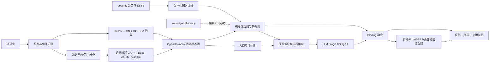
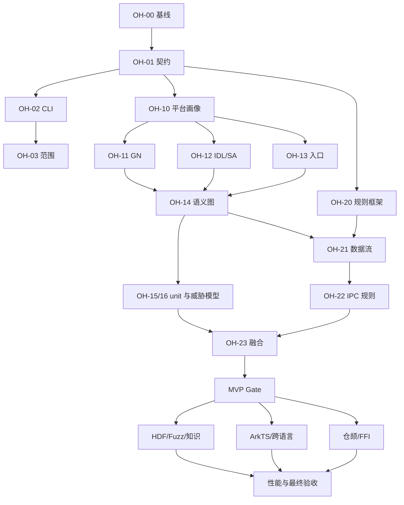

# OpenAnt 面向 OpenHarmony 源码的适配实施计划

> - 文档状态：实施前设计稿
> - 基线日期：2026-08-21
> - OpenAnt 基线：`master` / `2476527`
> - 目标：使 OpenAnt 能以 OpenHarmony 组件源码为输入，完成可度量、可复现、证据可追踪的静态安全分析。

## 1. 结论先行

OpenAnt 现有框架可以继续复用，但当前版本还不能可靠地扫描 OpenHarmony 源码。主要问题不在于“缺少几条 Prompt”，而在于平台语义缺失：它不能完整识别 ArkTS（`.ets`）和仓颉（`.cj`），不了解 `bundle.json`、GN、IDL、System Ability、Binder IPC、HDI/HDF、N-API/ANI/FFI 等 OpenHarmony 边界，也没有跨这些边界构造安全数据流。

建议采用“平台画像 + 多语言前端 + OpenHarmony 语义图 + 确定性规则 + LLM 复核”的混合架构：

1. 保留 OpenAnt 现有的解析、增强、Stage 1、Stage 2 和报告主流程。
2. 在解析前增加 OpenHarmony 平台识别与组件清单生成。
3. 在普通语言调用图之上增加 IPC、HDI/HDF、IDL、FFI 和权限检查语义边。
4. 先用 AST/数据流规则产生可解释候选，再把候选及完整证据交给 LLM 研判；LLM 继续负责复杂语义和未知漏洞，不作为唯一检测依据。
5. 第一阶段优先支持 C/C++ 原生组件、Binder IPC 与权限校验；随后支持 HDF、ArkTS/ANI/N-API，最后补齐仓颉/FFI。

按单人全职估算：

- 可用的 C/C++ + IPC 最小版本（MVP）：约 4～6 人周。
- 覆盖本地五个样例仓的完整版本：约 12～16 人周。
- 估算不包含获取完整历史补丁、搭建整机镜像和真机执行环境的时间。

## 2. 资料使用优先级

本计划按以下优先级使用现有资料，避免把尚未补全的扫描技能误当成官方完整规范。

| 优先级 | 路径 | 用途 | 不应承担的职责 |
|---|---|---|---|
| P0 | `../openharmony_reference/security` | OpenHarmony 已披露漏洞、影响、攻击面、补丁链接、SSTS 元数据和 YARA 修复特征的主要事实来源 | 不能直接替代源码级 AST/数据流规则；YARA 多数验证编译产物中的补丁特征 |
| P0 | `../openharmony_reference/openharmony_source_code` | 验证真实目录、语言、构建、IPC/HDF/FFI 模式以及后续集成测试 | 当前只是若干组件仓，不代表完整 OpenHarmony 主干 |
| P1 | `../openharmony_reference/security-skill-library` | 提炼 Parcel、IPC、资源约束、Fuzz 等检查思想和误报边界 | 内容未补全，现有脚本以正则为主，不能原样成为 OpenAnt 的核心检测引擎 |
| P1 | OpenAnt 当前源码和测试 | 确定兼容性约束、落点、数据契约和回归测试方式 | 现有通用 Web/CLI 威胁模型不能直接套用到 OpenHarmony |

`security` 中的中英文月度公告需要去重；SSTS JSON/YARA 应作为漏洞知识、补丁验证和基准标签输入，而不是直接被解释成“当前源码一定有漏洞”。所有导入记录必须保存来源文件、公告编号、版本、哈希和解析器版本。

## 3. 本地样例仓盘点

以下统计来自当前本地快照，排除了 `.git` 内容。

| 仓库 | C/C++/头文件 | Rust | ArkTS/TS/JS | 仓颉 | IDL | `BUILD.gn` | 主要适配价值 |
|---|---:|---:|---:|---:|---:|---:|---|
| `arkweb_arkweb_cangjie_wrapper` | 0 | 0 | 0/4/2 | 25 | 0 | 4 | 仓颉语法、WebView 安全 API、C FFI 边界 |
| `communication_netmanager_base` | 1085 | 68 | 4/5/0 | 0 | 1 | 85 | Binder IPC、SA、权限、网络输入、Rust 混合仓 |
| `communication_wifi` | 1168 | 0 | 209/17/0 | 0 | 5 | 87 | IPC、网络攻击面、ArkTS、权限、IDL |
| `drivers_peripheral` | 3029 | 0 | 0 | 0 | 0 | 678 | HDI/HDF、`HdfSBuf`、驱动分发、大仓性能与分区 |
| `sensors_medical_sensor` | 71 | 0 | 0/1/0 | 0 | 0 | 11 | 小型端到端样例：JS/Native → IPC → SA → HDI/HDF、健康数据权限 |

真实源码已经体现出必须建模的平台模式：

- `MedicalSensorServiceStub::OnRemoteRequest` 先校验接口令牌，再按事务码分派到成员函数；成员函数读取 `MessageParcel` 并调用权限检查。
- HDF 驱动通过 `IDeviceIoService.Dispatch`、`HDF_INIT`、`SbufToParcel` 或 `HdfSbufRead*` 接收不可信输入。
- IDL 声明 `[in]`/`[out]`、宽度、符号性、容器和回调类型，可用于校验 Proxy/Stub 两端读写顺序及类型。
- ArkTS 包含 Ability 生命周期、系统 Kit 调用和到 Native 层的桥接。
- 仓颉包装层通过 `foreign` 声明进入 C FFI，包含 URL、脚本、Cookie、证书、文件路径等高风险参数。
- `bundle.json` 提供 component、subsystem、syscap、系统类型、依赖、inner kits、构建目标和测试目标，是组件边界的重要权威输入。

## 4. 当前 OpenAnt 的主要差距

| 维度 | 当前行为 | 对 OpenHarmony 的后果 | 必须修改 |
|---|---|---|---|
| 语言发现 | `config/languages.json` 无 `.ets`、`.cj`；`.ts` 归为 JavaScript | Wi-Fi 的 209 个 ArkTS 文件和 ArkWeb 的 25 个仓颉文件不进入主要分析 | 新增独立 `arkts`、`cangjie` 前端；未支持时也必须显式报告覆盖缺口 |
| C/C++ 文件范围 | C 扫描器默认硬排除 `test/tests/fuzz/third_party/external`，且与 `skip_tests` 语义重叠 | `--no-skip-tests` 仍无法纳入大量 OpenHarmony Fuzz；目录名会覆盖用户意图 | 把“目录发现”和“源码角色过滤”分开，修复范围契约 |
| 应用类型 | 只支持 web、CLI、library、agent framework | OpenHarmony 组件可能生成上下文失败，或被当作 library 后压制本地攻击 | 增加 OpenHarmony 组件类型和不可被静默移除的本地 IPC 攻击者 |
| 入口点 | 主要识别 Web、CLI、`main` 和通用输入模式 | `OnRemoteRequest`、SA、HDF Dispatch、N-API/ANI、Ability 生命周期会被漏掉，reachable 模式可能过滤真实攻击面 | 增加平台入口点分类及证据；低置信度时采取保守保留 |
| 构建信息 | 不解析 `bundle.json`、GN、IDL、SA profile | 不知道实际编译源、组件依赖、Proxy/Stub 契约和生成代码关系 | 新增清单解析与构建图；支持静态回退和可选 `gn desc` |
| 调用图 | 每种语言单独建图，合并数据集但不合并调用图 | IPC、HDF、FFI 和跨语言链路断裂 | 保留语言内图，并增加平台语义覆盖图（overlay graph） |
| 分析单元 | C 单元只有函数、调用者/被调用者等通用元数据 | LLM 看不到事务码、调用 UID、Parcel 字段、权限保护和跨层路径 | 给 unit 增加平台、语言、边界、source/sink、guard、build target 等元数据 |
| Stage 1 Prompt | `analysis_core.py` 把所有 unit 的 `language` 固定为 `code` | 语言信息和 OpenHarmony 规则选择失效，证据呈现不准确 | 按 unit 文件/语言/profile 选择 fence、规则和平台上下文 |
| 规则能力 | 主要依靠 LLM；CodeQL 对 C/C++ 使用 build-mode none | 宏、GN 条件和平台 API 语义缺失；结果成本高且难复现 | 增加确定性规则引擎和编译命令/构建图接入 |
| 结果模型 | Finding 重点记录名称、位置、CWE 和两阶段结论 | 无法表达规则来源、source-sink 路径、权限 guard、证据置信度和覆盖缺口 | 扩展为向后兼容的证据/来源/状态字段 |
| 动态测试 | 通用 Docker；C 语言没有模板 | OpenHarmony 组件不能在普通容器中独立复现，不能把“未测试”写成“安全” | 引入验证适配器；OpenHarmony 默认明确标注 unavailable，接入构建、Fuzz、SSTS 或设备测试 |
| 大仓规模 | 语言顺序解析、之后按函数送入 LLM | `drivers_peripheral` 会产生大量单元、成本和内存压力 | 按组件/target/风险分区，缓存确定性阶段，按风险调度 LLM |

## 5. “成功实现”的分级定义

### 5.1 MVP：原生组件安全扫描可用

MVP 面向 `sensors_medical_sensor`、`communication_netmanager_base` 的 C/C++ 与 Binder IPC，必须同时满足：

1. `--platform auto` 能以高置信度识别 OpenHarmony；也可用 `--platform openharmony` 强制指定。
2. 能读取 `bundle.json`、常见 `BUILD.gn`、IDL/SA profile，并输出 `platform_profile.json` 和覆盖统计。
3. 所有满足范围策略的 C/C++ 文件都被枚举；解析失败、条件构建不确定和生成代码缺失均显式列出。
4. 能识别 `OnRemoteRequest`、事务码分发表、`MessageParcel`、接口令牌、调用者身份和权限检查。
5. 能构造 Proxy/IDL/Stub/handler 的可追踪路径；无法匹配时保留孤立边界并报告原因，不能静默丢弃。
6. 至少落地 Parcel 返回值、读写类型/顺序、长度/资源约束、空指针、权限 guard 五类高优先级规则。
7. 每个确定性发现包含 rule ID、CWE、准确文件/行、source、sink、guard、路径、置信度和修复建议。
8. LLM 收到真实语言、OpenHarmony 威胁模型和确定性证据；本地无特权应用、恶意 IPC 客户端不再被默认排除。
9. 普通 Docker 动态测试不适用时，报告必须显示 `not_applicable`/`unavailable`，不得显示为已验证或安全。
10. 在固定小型 golden fixture 上，P0 规则精度不低于 90%、召回率不低于 80%；真实仓只作为集成与性能样本，不能凭无标签结果计算精度。

### 5.2 完整目标：五个样例仓均无静默覆盖缺口

完整目标在 MVP 基础上增加：

- HDI/HDF Dispatch、`HdfSBuf`、驱动生命周期和资源规则。
- ArkTS 的函数/类/Ability 生命周期提取及系统 API source/sink。
- N-API、ANI、Taihe/生成绑定可用信息和 ArkTS ↔ Native 语义边。
- 仓颉语法提取、`foreign` FFI 与 ArkWeb 高风险参数流。
- 现有 Rust 前端与 OpenHarmony 组件画像对接。
- 五个样例仓的每种源码语言均处于 `analyzed` 或 `unsupported_with_reason`，不允许未知地缺失。
- `drivers_peripheral` 可按 bundle component 或 GN target 分区完成确定性扫描，不能因全仓 OOM 失败。

### 5.3 本阶段非目标

- 不承诺在第一版完整求值所有 GN 语法、模板和产品条件；先覆盖常见声明并记录未知表达式。
- 不把 SSTS YARA 当作源码漏洞扫描规则；它主要用于已知补丁在二进制中的存在性验证。
- 不在普通 Docker 中伪造完整 OpenHarmony 运行时。
- 不在缺少漏洞前后版本/补丁对的情况下声称真实仓精度已得到证明。
- 不用简单正则替代类型、控制流和跨函数数据流；正则只能做候选预筛和兼容性对照。

## 6. 目标架构



核心原则是：语言调用图不强行假装存在跨语言直接调用；跨 IPC/FFI/HDF 的关系进入单独的语义覆盖图，每条边都带 `kind`、证据和置信度。这样既保留现有语言前端，又能表达 OpenHarmony 的真实调用边界。

## 7. 核心数据契约

### 7.1 `RepositoryProfile`

建议新增平台无关接口，并实现 `OpenHarmonyProfileBuilder`：

```yaml
schema_version: 1
platform: openharmony
detection:
  confidence: 0.98
  evidence: [bundle.json, BUILD.gn, namespace_OHOS]
repository_root: /absolute/path
components:
  - name: medical_sensor
    subsystem: sensors
    system_types: [standard]
    syscaps: [SystemCapability.Sensors.Medical_sensor]
    build_targets: ["//base/sensors/medical_sensor/services/medical_sensor:medical_service_target"]
    source_roots: [services, frameworks, interfaces]
    dependencies: [ipc, access_token, samgr, safwk]
languages: [c, javascript]
boundaries: [binder_ipc, system_ability, hdi]
coverage:
  discovered_files: 0
  eligible_files: 0
  parsed_files: 0
  unsupported_files: []
  parse_failures: []
provenance:
  source_hashes: {}
  profile_builder_version: 1
```

该文件是后续阶段的公共输入，禁止每个模块重新猜测平台和目录边界。

### 7.2 `SemanticNode` / `SemanticEdge`

节点至少支持：function、method、IPC transaction、IDL method、SA、HDF service、Ability lifecycle、FFI symbol、permission、build target。

边至少支持：

- `calls`：语言内直接/间接调用。
- `built_into` / `depends_on`：GN target 关系。
- `proxy_to_transaction` / `transaction_to_stub` / `dispatches_to`：Binder IPC。
- `idl_declares`：IDL 到生成/实现方法。
- `arkts_to_native` / `ffi_to_native`：跨语言桥接。
- `hdf_dispatches_to`：HDF Dispatch 到处理函数。
- `guarded_by`：权限、令牌、UID/PID、系统应用等保护条件。
- `reads_from` / `writes_to`：Parcel/HdfSBuf 字段与变量映射。

每条非语法确定边必须保存 `evidence`、`confidence` 和 `resolver_version`。低置信边只能用于扩展上下文，不能单独升级漏洞严重度。

### 7.3 `FindingCandidate`

在不破坏现有报告字段的前提下增加：

```yaml
id: stable-content-hash
rule_id: OH-IPC-004
detector: deterministic
detector_version: 1.0.0
platform: openharmony
language: cpp
component: medical_sensor
location: {file: path, line: 88, function: AfeEnableInner}
cwe: {id: 20, name: Improper Input Validation}
severity: high
confidence: high
source: {api: MessageParcel.ReadUint32, expression: sensorId}
sink: {api: vector.resize, expression: sensorId}
guards: []
path: [ipc_transaction, handler, source, sink]
evidence:
  - {file: path, start_line: 88, end_line: 95, role: source_to_sink}
provenance:
  rule_file_sha256: "..."
  knowledge_ids: [OpenHarmony-SA-...]
review:
  stage1: not_run
  stage2: not_run
```

最终 Finding 需要区分：`detected`、`reviewed`、`confirmed`、`rejected`、`unverified`。确定性高置信发现不能因为 LLM 调用失败而消失；失败时保留为 `unverified` 并提示人工复核。

## 8. 详细技术方案

### 8.1 平台识别与组件清单

新增 `--platform auto|generic|openharmony`，默认 `auto`。自动识别使用多证据打分：

- 强证据：有效 `bundle.json` 且包含 `component/subsystem/build`；SA profile；OpenHarmony IDL/HDI 文件。
- 中证据：`BUILD.gn` 中 OpenHarmony target/import；`namespace OHOS`；`MessageParcel`、`SystemAbility`、`HDF_INIT`。
- 弱证据：目录名如 `interfaces/innerkits`、`services`、`frameworks`，不能单独判定。

显式平台参数优先；识别置信度低于阈值时保持 generic，但在覆盖报告中列出 OpenHarmony-like signals。平台识别结果必须写入扫描产物，不能只输出到 stderr。

### 8.2 源码范围和角色

把当前“硬编码排除目录”重构为两步：

1. 安全地枚举候选文件。
2. 根据 build graph、bundle target 和路径把文件标记为 `production`、`test`、`fuzz`、`generated`、`third_party`、`unknown`。

建议用户接口：

- `--source-scope production`：默认，只分析组件生产代码。
- `--source-scope security-tests`：生产代码 + Fuzz/安全测试，用于检查 harness 质量和攻击面覆盖。
- `--source-scope all`：包含单元测试和未知角色，适合研究扫描。

现有 Python `--no-skip-tests` 保留为兼容别名并映射到 `all`；Go CLI 需补齐同等能力。`third_party` 不应只按目录名永久丢弃：若它是 bundle 当前组件声明的源码，应由 ownership/build target 决定；真正外部代码默认不分析，但必须计数。

### 8.3 构建与接口元数据

实现三层策略：

1. **静态轻量解析**：从 `bundle.json` 读取组件和 target；从常见 GN 调用中提取 target、`sources`、`deps`、`external_deps`、`defines`、`include_dirs`、test/fuzz 类型；未知条件保留表达式和警告。
2. **IDL/配置解析**：提取接口、方法、参数方向/类型/顺序、sequenceable、SA ID/权限配置，用于构建 IPC 契约。
3. **可选精确模式**：完整构建环境存在时执行用户授权的 `gn desc`/编译数据库导出。部分仓默认不假设可以独立运行 GN。

不得用执行任意仓库 GN 脚本作为默认扫描步骤；静态解析器需要把目标仓内容视为不可信输入，并限制文件大小、递归深度和表达式复杂度。

### 8.4 语言前端

#### C/C++ 与 Rust

- 继续复用 tree-sitter C/C++ 和现有 Rust 前端。
- C/C++ unit 增加真实文件语言（C 或 C++）、build target、component、宏条件不确定性和 OpenHarmony metadata。
- 使用 GN 生成或用户提供的 compile commands 时可选接入 CodeQL build 模式；无构建上下文时明确标注 `build_context=partial`。
- 保守处理函数指针、分发表、宏和生成代码；不能解析时保留 potential edge。

#### ArkTS

- 在语言注册表中独立注册 `.ets`，不要直接把它永久并入 JavaScript。
- 第一迭代可复用 TypeScript AST 基础设施做兼容性实验，但必须用真实 `.ets` corpus 测量语法错误率；达到门槛后才开启默认支持。
- 提取类、方法、顶层函数、装饰器、Ability 生命周期、页面事件、Promise/callback、系统 Kit 调用及 `.d.ets` 声明。
- `.d.ets` 默认作为 API/类型上下文，不生成普通可执行漏洞单元。

#### 仓颉

- 先做有退出条件的 parser spike：比较可用语法树、编译器导出 AST 或容错 token parser。
- 最低能力必须提取 package/import、类型、函数、方法、`foreign` 声明、调用关系、源位置。
- 如果没有达到真实 25 个 `.cj` 文件的解析成功门槛，保持 `experimental`，报告覆盖缺口，不能把仓颉仓误报为“已扫描完成”。

### 8.5 OpenHarmony 入口点和信任边界

入口点分类至少包括：

| 类别 | 典型模式 | 默认攻击者/输入信任 |
|---|---|---|
| Binder IPC | `OnRemoteRequest`、`IRemoteStub`、事务码映射、`MessageParcel` | 本地无特权应用或受限服务；Parcel 不可信 |
| System Ability | `SystemAbility`、SA 注册与启动 | 跨进程调用者；身份和权限需验证 |
| HDF/HDI | `Dispatch`、`HDF_INIT`、`HdfSbufRead*`、`SbufToParcel` | 驱动客户端、设备/总线数据；按场景不可信或半可信 |
| ArkTS/Ability | Ability 生命周期、页面事件、Want、系统 Kit callback | 应用、外部 Want、网络/文件/用户输入 |
| N-API/ANI/Taihe | native module 注册、导出方法、生成绑定 | 上层应用传入参数不可信 |
| Cangjie FFI | `foreign` 及对应 Native symbol | FFI 参数按 API 契约分类 |
| 网络/协议 | socket、HTTP、Wi-Fi 帧/配置 | 远程或邻近攻击者 |
| Fuzz | `LLVMFuzzerTestOneInput` 等 | 只作为覆盖/测试入口，不能代替生产入口 |

reachable 模式需要从这些入口向前追踪。若某组件检测到 IPC/HDF 特征但没有解析出入口，应触发 coverage blackout 警告，并在严格模式下使扫描失败，而不是生成“0 漏洞”的成功结果。

### 8.6 IPC/HDI/FFI 语义图

Binder 路径优先按以下证据组合：

1. IDL 方法或接口头文件提供方法契约。
2. Proxy 中 `WriteInterfaceToken`、字段写入顺序和 `SendRequest(code, ...)`。
3. Stub 中 `ReadInterfaceToken`、`OnRemoteRequest(code, ...)`、switch/map/成员函数分发。
4. handler 内部的 Parcel 读取、权限 guard、业务 sink。

需要实现的关键匹配：

- transaction code 常量值/枚举/表项匹配。
- Proxy 写入序列与 Stub 读取序列对齐。
- out-param 和直接返回式 `Read*` API 均可识别。
- `GetCallingUid/Pid/TokenID`、`AccessTokenKit`、组件权限工具函数形成 guard。
- guard 必须在控制流上支配敏感操作；仅在旁路分支调用检查不算受保护。
- HDF 中 Dispatch/cmdId 到处理器、`HdfSbuf` 字段到内存/循环/设备操作的路径。
- N-API/ANI/FFI 以导出名、注册表、生成文件和符号名建边；不以名称相似度作为唯一证据。

### 8.7 确定性规则引擎

规则建议使用版本化 YAML，由 Pydantic 校验，至少包含：rule ID、平台、语言/API 条件、source、sink、sanitizer/guard、CWE、严重度、证据要求、置信度策略、参考资料和修复模板。规则文件需要随 wheel 发布并参与哈希。

首批规则：

| Rule ID | 检查 | 主要 CWE | 参考来源 |
|---|---|---|---|
| `OH-IPC-001` | Stub 是否校验正确 InterfaceToken；失败路径是否终止 | CWE-287/863 | SSTS 示例、历史 SA 模式 |
| `OH-IPC-002` | `Read*`/`Write*` 返回值是否在使用前正确处理 | CWE-252/20 | skill library `check-read-return-value` |
| `OH-IPC-003` | Proxy/IDL/Stub 的字段类型、宽度、符号性、顺序是否一致 | CWE-681/704 | skill library `check-parcel-type-mismatch` |
| `OH-IPC-004` | Parcel 派生长度/计数进入循环、容器、索引或分配前是否限界 | CWE-20/400/125/787 | skill library `check-parcel-bounds-validation` |
| `OH-IPC-005` | 敏感事务是否被调用者身份/权限 guard 支配 | CWE-862/863 | `security` 公告中的权限绕过/本地提权 |
| `OH-IPC-006` | callback/订阅/容器是否有数量、生命周期和注销约束 | CWE-400/770/401 | skill library `check-ipc-callback-oom` |
| `OH-HDF-001` | `HdfSbufRead*` 数据用于长度/指针/设备操作前的校验 | CWE-20/125/787 | 本地 HDF 源码 + 公告类别 |
| `OH-HDF-002` | Bind/Init/Release 失败路径的所有权和释放一致性 | CWE-401/415/416 | HDF 生命周期模式 |
| `OH-FUZZ-001` | harness 是否消费输入、到达真实入口、处理权限前置和异常路径 | CWE-693（质量信号） | skill library Fuzz 技能 |

skill library 的正则脚本仅用于对照实验：把其规则意图、正反例和已知局限迁移到上述 schema，检测实现采用 AST、CFG、调用图和有限数据流；不得在主流程中直接 shell 调用这些 `scan.py` 后把结果当作高置信 Finding。

### 8.8 OpenHarmony 安全知识目录

新增离线 importer，读取 `security`：

- 月度中英文公告：编号、CVE、描述、影响、严重度/CVSS、影响版本、影响仓、修复链接。
- SSTS JSON：`vul_id`、affected project/device/version、patch URL、YARA 文件映射。
- YARA：只记录 rule/file/hash/用途；不把二进制字节特征自动翻译成源码规则。

输出 `knowledge_catalog.json`，按 SA/CVE 去重并记录 zh/en 来源。用途限定为：

1. 为当前组件排序相关漏洞类别和历史高风险 API。
2. 给 LLM 提供短小、可追溯的相关案例摘要，而不是把整个公告库塞入 Prompt。
3. 构造历史补丁对 benchmark 清单。
4. 若用户提供构建产物，可选择运行 SSTS/YARA 验证已知补丁状态。

默认扫描结果不能仅因“匹配到受影响仓名”就报漏洞；必须存在当前源码证据。

### 8.9 威胁模型和 Prompt

新增 `openharmony_component` 应用类型，并从 profile 生成基线威胁模型：

- 本地无特权应用：可调用公开/暴露 IPC，控制 Parcel、回调和高频请求。
- 受限 System Ability/系统应用：权限有限但可能跨 SA 调用。
- 远程/邻近攻击者：适用于网络、Wi-Fi、蓝牙等输入链。
- 恶意或异常设备数据：适用于 HDF/HDI。
- 用户提供的文件、Want、URL、脚本和配置：按 API 进入不同信任边界。

目标仓内的 `OPENANT.THREATMODEL.md` 可以补充业务上下文，但不能静默删除平台最低攻击者集合；若确需关闭某攻击者，必须通过扫描者显式配置并在报告中留下 provenance。

`analysis_core.py` 应从 unit 获取真实语言和 `platform_context`，Prompt 只携带当前路径相关的 transaction、字段、guard、构建目标和规则证据，避免把整个组件元数据重复发送给每个单元。

### 8.10 Finding 融合和报告

确定性结果与 LLM 结果进入统一融合层：

- 稳定去重键优先使用 `rule_id + primary_location + source/sink/path`，不能只按 caller/callee 或名称去重。
- 相同根因的多个受影响事务可聚合，但每条路径仍应可展开。
- LLM 可确认、降级或补充解释；若拒绝确定性高置信发现，报告保存双方证据和拒绝原因。
- 解析/LLM/验证错误进入 coverage/error 桶，不能计入 safe。
- SARIF/JSON/Markdown 均输出 rule、line range、CWE、component、confidence、source/sink/path 和 provenance。

新增产物建议：

```text
platform_profile.json
source_inventory.json
build_graph.json
semantic_graph.json
deterministic_findings.json
knowledge_catalog.json
coverage_report.json
results.json
results_verified.json
pipeline_output.json
report/
```

### 8.11 验证策略

把“动态验证”抽象为适配器：

- `docker`：保留给现有可独立运行语言。
- `openharmony_build`：用户提供完整环境和白名单构建命令时，编译受影响 target。
- `openharmony_fuzz`：已有 harness 时生成/执行 corpus 或检查 harness 质量。
- `ssts_yara`：用户提供系统二进制/镜像时验证已知补丁特征。
- `device_poc`：以后接入设备/模拟器；必须显式授权和隔离。

没有合适环境时结果为 `unavailable`，保留静态 Finding。第一版不要创建一个看似能运行、实际缺失 OpenHarmony 依赖的通用 C Dockerfile。

### 8.12 大仓性能与缓存

- 优先按 `bundle.json` component、GN target、服务边界分区，而不是将整个 `drivers_peripheral` 一次送入 LLM。
- 解析、清单、语义图和确定性规则使用 `commit + profile + scope + parser/rule/config hash` 缓存。
- 先运行低成本规则和风险评分，再按 IPC/HDF/权限/内存高风险路径调度 LLM。
- 每个 component 设置 unit、token、时间和内存预算；预算耗尽时输出未分析清单。
- 多语言解析暂时保持顺序，避免破坏 OpenAnt 现有全局成本统计；未来并行化需先消除进程级共享状态。

## 9. 用户接口建议

Go CLI 和 Python CLI 需要保持参数一致。推荐用法：

```bash
# 自动识别 OpenHarmony，扫描生产代码；当前阶段跳过通用 Docker 动态测试
openant scan /path/to/component \
  --platform auto \
  --source-scope production \
  --strict-coverage \
  --skip-dynamic-test

# 显式指定 OpenHarmony 和组件，加入 Fuzz/安全测试审计
openant scan /path/to/repo \
  --platform openharmony \
  --component medical_sensor \
  --source-scope security-tests \
  --security-knowledge /path/to/openharmony_reference/security \
  --skip-dynamic-test
```

建议新增参数：

| 参数 | 默认值 | 说明 |
|---|---|---|
| `--platform` | `auto` | `auto|generic|openharmony` |
| `--component` | 空 | 限定 bundle component/GN target；大仓建议必填或交互选择 |
| `--source-scope` | `production` | `production|security-tests|all` |
| `--security-knowledge` | 空 | OpenHarmony `security` 本地路径；未指定时不自动猜测用户目录 |
| `--strict-coverage` | false | 选中语言/组件解析失败、入口 blackout 或未知源码时非零退出 |
| `--validation` | `auto` | `auto|none|build|fuzz|ssts`；不可用时明确记录 |

为了兼容，现有 `-l/--language`、`--no-skip-tests` 和扫描产物字段不能直接删除。平台参数控制语义，不替代语言参数。

## 10. 分阶段实施任务

任务按依赖排序；每项尽量控制在 1～5 个生产文件，并配套测试。`S/M/L` 分别约为 0.5～1、1～2、3～5 个工程日；涉及真实 corpus 调优的任务另计运行时间。

### 阶段 0：基线和兼容契约

| ID | 任务与主要文件 | 依赖 | 大小 | 完成标准 / 验证 |
|---|---|---|---|---|
| OH-00 | 建立外部 corpus manifest 和小型脱敏 golden fixtures：`tests/fixtures/openharmony/`、`tests/openharmony/test_corpus_manifest.py` | 无 | M | 用 `OPENHARMONY_CORPUS_ROOT` 可定位五仓；CI 不依赖用户绝对路径；记录当前发现/解析/入口基线 |
| OH-01 | 定义平台协议和 schema：新建 `core/platforms/base.py`，扩展 `core/schemas.py` | OH-00 | M | generic 扫描序列化结果完全兼容；profile/coverage 可 round-trip；schema 版本必填 |
| OH-02 | 打通 Go/Python 参数：`apps/openant-cli/cmd/scan.go`、`openant/cli.py`、`core/scanner.py` 及各自测试 | OH-01 | M | 两端 flags 一致；Go 参数逐项传到 Python；旧命令行为测试通过 |
| OH-03 | 修复 C 文件范围契约：`parsers/c/repository_scanner.py`、`core/parser_adapter.py` 和测试 | OH-02 | M | `fuzz/` 只在 scope 策略要求时排除；`--no-skip-tests` 真正可包含测试；覆盖统计含每类角色 |

**检查点 A：** 运行现有全部 Python/Go 测试；对五仓只做 inventory，不调用 LLM。确认没有修改 generic 默认漏洞结论，且所有未支持扩展被计数。

### 阶段 1：OpenHarmony 原生/IPC MVP

| ID | 任务与主要文件 | 依赖 | 大小 | 完成标准 / 验证 |
|---|---|---|---|---|
| OH-10 | 平台检测和 `bundle.json`：新建 `core/platforms/openharmony/profile.py`、`manifest.py`、测试 | OH-01 | M | 五仓自动识别；组件/subsystem/syscap/target/deps 与样例一致；畸形 JSON fail-safe |
| OH-11 | GN 静态提取：新建 `core/platforms/openharmony/gn.py` 与 golden tests | OH-10 | L | 提取常见 target/sources/deps/external_deps/defines；未知条件计数；不执行仓库脚本 |
| OH-12 | IDL/SA 元数据：新建 `core/platforms/openharmony/idl.py`、`sa_profile.py` 与测试 | OH-10 | L | 本地 6 个 IDL 的方法/参数方向/类型可提取；缺失生成代码时仍保存契约 |
| OH-13 | OpenHarmony 原生入口检测：扩展 `utilities/agentic_enhancer/entry_point_detector.py`，新建平台 detector 与测试 | OH-10 | M | fixture 中 `OnRemoteRequest`、SA、HDF Dispatch 均命中；接口令牌本身不被误当成入口 |
| OH-14 | 语义覆盖图骨架和 IPC resolver：新建 `core/platforms/graph.py`、`core/platforms/openharmony/ipc_graph.py` 与测试 | OH-11, OH-12, OH-13 | L | 可从 transaction code/表项连接 Stub 到 handler；每条边有证据与置信度；孤儿边可报告 |
| OH-15 | unit 平台元数据与真实语言：修改 `parsers/c/unit_generator.py`、`core/dataset_merge.py`、`core/analysis_core.py` 和测试 | OH-14 | M | Prompt 使用 `cpp/c` 而非固定 `code`；unit 带 component/target/boundary/guard；旧 dataset 仍可读 |
| OH-16 | OpenHarmony 应用上下文：修改 `context/application_context.py`、Prompt renderer 和测试 | OH-10 | M | 本地 IPC 攻击者不被压制；目标仓威胁模型不能静默删除平台最低攻击者；provenance 可见 |

**检查点 B：** 对 `sensors_medical_sensor` 和 `communication_netmanager_base` 运行 parse/profile/graph（无 LLM），人工核对若干 Proxy/Stub/handler/permission 路径；严格模式在入口 blackout 时必须失败。

### 阶段 2：规则、Finding 融合和原生验收

| ID | 任务与主要文件 | 依赖 | 大小 | 完成标准 / 验证 |
|---|---|---|---|---|
| OH-20 | 规则 schema/加载器：新建 `core/rules/schema.py`、`loader.py`、测试；更新 `pyproject.toml` 打包规则 | OH-01 | M | YAML 严格校验、版本/哈希可复现；恶意/超大规则 fail-safe；wheel 安装后规则可发现 |
| OH-21 | 有限数据流与 guard dominance：新建 `core/rules/dataflow.py`、`openharmony_semantics.py` 与测试 | OH-14, OH-20 | L | 支持 direct/out-param Parcel read、source→sink、分支 guard；跨函数深度和预算可配置 |
| OH-22 | 落地 `OH-IPC-001..006` 规则和正反 fixture | OH-21 | L | 每条规则至少 3 个正例、3 个反例；P0 golden precision ≥90%、recall ≥80%；证据行稳定 |
| OH-23 | 确定性/LLM Finding 融合：新建 `core/finding_fusion.py`，修改 `core/scanner.py`、`core/reporter.py` 与 schema tests | OH-15, OH-22 | L | LLM 失败不删除高置信候选；状态、detector、path、provenance 输出；旧报告仍能读取 |
| OH-24 | OpenHarmony Prompt/Stage 2 工具上下文：修改 prompt selector、verification prompt/repository tools 和测试 | OH-16, OH-23 | M | LLM 只收到当前路径相关证据；能请求 transaction/IDL/guard 上下文；Prompt 注入边界仍安全 |
| OH-25 | 验证适配器接口：新建 `core/validation/base.py`、`openharmony.py`，接入 scanner/report | OH-23 | M | 无 OH 环境时输出 `unavailable`；静态 Finding 不降级成 safe；通用 Docker 行为不变 |

**检查点 C（MVP Gate）：** 在固定 fixture 通过规则精度/召回门槛；在 medical/netmanager 生成完整 profile、coverage、semantic graph 和带证据报告；运行全量回归、wheel smoke test 和 Go CLI 转发测试。

### 阶段 3：HDF、Fuzz 与安全知识

| ID | 任务与主要文件 | 依赖 | 大小 | 完成标准 / 验证 |
|---|---|---|---|---|
| OH-30 | HDF 图与 `OH-HDF-001/002`：新增 `hdf_graph.py`、规则和测试 | OH-21 | L | Dispatch/HDF_INIT/Sbuf 路径可追踪；Bind/Release 所有权反例不过报 |
| OH-31 | Fuzz 角色和 `OH-FUZZ-001`：新增 fuzz analyzer、规则和测试 | OH-03, OH-21 | M | 识别 `ohos_fuzztest`/入口/BUILD.gn；报告 harness 覆盖的是质量信号而非产品漏洞 |
| OH-32 | `security` importer：新增 `core/knowledge/openharmony.py`、schema、tests | OH-20 | L | zh/en 去重；SSTS/公告字段和来源哈希保留；坏文件逐项报错但不污染目录 |
| OH-33 | 历史补丁 benchmark 工具：新增 manifest/runner/tests | OH-22, OH-32 | M | 支持 vulnerable/fixed pair；补丁 URL 未下载时标记 missing，不把 SSTS pass 当源码真值 |

**检查点 D：** 在 `drivers_peripheral` 选 2～3 个非 camera component（避免混入其独立仓内规则）运行分区扫描；确认 HDF 入口、Sbuf 数据流、峰值内存和未解析 GN 条件可见。对 skill library 运行一次旁路对照，仅比较候选覆盖和误报，不接入生产结论。

### 阶段 4：ArkTS 与跨语言桥接

| ID | 任务与主要文件 | 依赖 | 大小 | 完成标准 / 验证 |
|---|---|---|---|---|
| OH-40 | ArkTS parser spike 和语言注册：`config/languages.json`、新建 `parsers/arkts/`、registry tests | OH-00 | L | Wi-Fi 209 个 `.ets` 被发现；解析成功率 ≥95%；失败文件逐项列出；`.d.ets` 标为声明 |
| OH-41 | ArkTS 入口与系统 API 语义：新增 `arkts_semantics.py`、规则/fixture | OH-40, OH-21 | L | Ability 生命周期、事件/Want/网络/文件 source 和危险 API sink 可提取 |
| OH-42 | ArkTS ↔ N-API/ANI/Taihe 桥：新增 resolver，扩展 semantic graph 和 tests | OH-11, OH-14, OH-41 | L | 至少用两种独立证据建边；仅名称相似时保持低置信、不作为漏洞唯一证据 |

**检查点 E：** 对 `communication_wifi` 和 netmanager 的 ArkTS/Native 子图做人工 golden 对齐；显式报告生成绑定缺失或 unresolved bridge。

### 阶段 5：仓颉、性能和发布

| ID | 任务与主要文件 | 依赖 | 大小 | 完成标准 / 验证 |
|---|---|---|---|---|
| OH-50 | 仓颉 parser spike：新建 `parsers/cangjie/`、配置和 tests | OH-00 | L | 25 个 `.cj` 解析成功率 ≥95%，能提取函数/方法/foreign/位置；否则保持 experimental 并给出明确 blocker |
| OH-51 | 仓颉 FFI/ArkWeb 语义：新增 `cangjie_ffi.py`、规则/fixture | OH-50, OH-21 | L | `foreign` 声明与 Native symbol 建边；URL/JS/Cookie/path 等参数流可呈现 |
| OH-52 | 分区、缓存、风险调度：新增 cache/scheduler，接入 scanner 和 tests | OH-23, OH-30 | L | drivers 全仓不一次性送 LLM；缓存键含所有配置哈希；中断/预算耗尽有可恢复状态和缺口报告 |
| OH-53 | CI、打包和用户文档：workflow、README、安装 smoke tests | 所有阶段 | M | Linux/macOS/Windows 现有 CI 不回归；wheel 含 parser/rules；示例命令和限制准确 |
| OH-54 | 五仓最终验收与发布清单 | OH-42, OH-51, OH-52, OH-53 | L | 每仓每语言有 analyzed/unsupported reason；所有硬门槛通过；生成版本化基线报告 |

## 11. 依赖关系和推荐 PR 切分



建议 PR 序列：

1. PR-1：OH-00～03，先锁定兼容性、范围和覆盖语义。
2. PR-2：OH-10～12，平台画像、bundle/GN/IDL，不改变漏洞判断。
3. PR-3：OH-13～16，入口、语义图、unit 和威胁模型。
4. PR-4：OH-20～22，确定性规则框架与 IPC 规则。
5. PR-5：OH-23～25，融合、报告和验证适配器，形成 MVP。
6. PR-6：HDF/Fuzz/知识目录。
7. PR-7：ArkTS 与 Native bridge。
8. PR-8：仓颉与 FFI。
9. PR-9：缓存、性能、CI 和最终验收。

每个 PR 必须可单独回滚；schema 扩展优先做 additive 变更，等至少一个版本后再弃用旧字段/参数。

## 12. 测试与验收矩阵

| 层级 | 测试内容 | 运行频率 | 硬门槛 |
|---|---|---|---|
| 单元 | manifest/GN/IDL/parser、entry、数据流、规则、融合、schema | 每次提交 | 全通过；畸形输入 fail-safe |
| Golden | IPC/HDF/ArkTS/FFI 正反例和稳定证据行 | 每次 PR | P0 precision ≥90%、recall ≥80%；无 silent drop |
| 兼容 | 现有 Python 及 Go tests、旧 JSON fixture、generic 仓 | 每次 PR | 现有测试全通过；旧命令/产物可读 |
| 打包 | wheel 安装、语言配置、YAML 规则、Node/parser 资源 | 每次 PR | 在空 venv 中可发现所有声明资源 |
| 本地集成 | 五个用户提供仓，按阶段逐步纳入 | 每个检查点 | 每种语言和文件角色有覆盖结论；严格模式正确退出 |
| 历史补丁对 | security/SSTS 指向的 vulnerable/fixed 源码对 | 每次规则发布 | 修复前命中、修复后不命中；缺失样本不得计分 |
| 性能 | drivers component 分区、缓存命中/未命中、LLM 预算 | 每个里程碑 | 不 OOM；相同配置结果稳定；基线建立后性能退化不超过 20% |
| 安全 | 路径逃逸、超大/畸形 JSON/GN/YAML、Prompt 注入、符号链接 | 每个发布 | 不执行目标仓脚本；不读仓外；错误可审计 |

覆盖报告至少包含：

- 按扩展名、语言、component、target、角色统计 discovered/eligible/parsed/analyzed。
- parser error、unsupported syntax、unresolved IPC/FFI edge、unknown GN condition。
- entry point 数量及识别理由；平台特征存在但入口为零时的 blackout。
- 确定性规则扫描量、候选数、被 LLM 复核/拒绝/未复核数量。
- LLM token/成本/失败数和因预算未分析的 unit。
- 验证适配器实际执行状态；`unavailable` 与 `passed` 严格区分。

## 13. 各样例仓阶段性验收重点

| 仓库 | MVP/最终验收重点 |
|---|---|
| `sensors_medical_sensor` | 作为首个 MVP 仓：bundle 组件、SA/IPC 入口、InterfaceToken、sensor permission、Parcel 字段到业务方法；报告必须体现健康数据为敏感资产 |
| `communication_netmanager_base` | 大量 IPC Stub、调用 UID/Token、网络输入、IDL；同时验证现有 Rust 前端不会因平台模式被丢弃 |
| `communication_wifi` | IPC + 5 个 IDL + 209 ArkTS；用于验证 ArkTS/Native bridge、网络/邻近攻击者和本地权限模型 |
| `drivers_peripheral` | HDF/Hdi、`HdfSBuf`、Dispatch、Bind/Init/Release；按 component 分区验证规模、缓存和范围，不先做全仓 LLM |
| `arkweb_arkweb_cangjie_wrapper` | 不能只扫描 4 个 TS 后宣称成功；最终必须解析 25 个仓颉文件并呈现 WebView foreign FFI 高风险参数边界 |

## 14. 风险、阻塞项和应对

| 风险/阻塞项 | 影响 | 应对 |
|---|---|---|
| 本地 `security` 多数只保存补丁 URL，没有所有漏洞前后源码 | 无法立即建立真实 precision/recall | 先生成 manifest；后续经授权拉取固定 commit/patch，保存哈希；缺失样本不计分 |
| 部分源码仓不是完整产品树 | `gn desc` 和生成代码可能不可用 | 静态 GN/IDL 回退；把 unresolved 条件/边写入覆盖报告 |
| ArkTS 超出标准 TypeScript 语法 | 复用 JS parser 可能漏解析 | 先做 corpus spike，以 ≥95% 门槛决定默认启用；失败保持 experimental |
| 仓颉成熟 parser/grammar 不确定 | ArkWeb 不能完整扫描 | 设独立技术 gate；优先 AST/编译器输出，容错 parser 只做明确受限模式 |
| C/C++ 宏、模板、函数指针和生成 IPC | 调用图不完整 | GN/IDL/表项多证据融合；低置信 potential edge；blackout/coverage gate |
| 权限工具函数封装层次深 | 简单 API 名匹配产生误报 | 支持可配置 guard summary、支配关系与跨函数摘要；用正反 fixture 锁定 |
| security-skill-library 未补全且正则误报 | 直接接入会污染结果 | 只迁移规则意图和样例；生产实现必须通过统一 schema 和测试门槛 |
| 大仓 LLM 成本不可控 | 扫描慢或中断 | component/target 分区、确定性预筛、风险调度、预算和断点续扫 |
| 目标仓可影响 Prompt/配置 | Prompt 注入或放宽威胁模型 | 目标内容视为不可信；平台最低威胁模型不可由仓内文件静默关闭；保留 provenance |

在开始 OH-40 和 OH-50 前，需要分别确认 ArkTS 与仓颉解析技术路线；在开始历史补丁对 benchmark 前，需要明确是否允许联网拉取补丁，或者由用户补充离线 vulnerable/fixed 仓。其余 MVP 工作不依赖这两个决定。

## 15. 里程碑交付物

### M0：基线锁定

- corpus manifest、当前覆盖基线、schema/CLI 设计。
- 修复测试/Fuzz 范围冲突。

### M1：平台解析完成

- `platform_profile.json`、source inventory、build/IDL/SA graph。
- medical/netmanager 的真实 OpenHarmony 入口不再被 reachable 过滤掉。

### M2：C/C++ IPC MVP

- 6 条 IPC 规则、统一 Finding、OpenHarmony 威胁模型、证据报告。
- medical/netmanager 端到端扫描通过 MVP Gate。

### M3：HDF 与知识基线

- drivers 分区扫描、HDF 规则、Fuzz 审计、security catalog 和补丁 benchmark 框架。

### M4：ArkTS 与 Native

- Wi-Fi ArkTS 可见，Ability/系统 API/Native bridge 可追踪。

### M5：仓颉与发布

- ArkWeb 仓颉/FFI 可追踪；五仓覆盖、性能、打包、CI 和限制说明通过最终 Gate。

## 16. 第一轮实施建议

第一轮只做 OH-00～OH-03 和 OH-10，暂不改漏洞判断。这一轮能够快速解决三个基础问题：

1. 得到五仓可信的“发现了什么、忽略了什么、为什么忽略”基线。
2. 修复当前 C 扫描器中 `fuzz/test` 永久排除与用户参数冲突的问题。
3. 建立 `platform_profile.json`，让后续 GN、IDL、入口、规则和 Prompt 共享同一个事实源。

第一轮通过后，再进入 IPC 图和规则实现。这样每一步都有独立可验证产物，若后续 ArkTS/仓颉技术路线变化，也不会推翻 C/C++ MVP。

## 17. 实施完成定义（Definition of Done）

只有同时满足以下条件，才能称为“OpenAnt 已成功支持 OpenHarmony 源码输入”：

- 用户命令从 Go CLI 到 Python 核心参数一致，返回码能反映漏洞、错误和严格覆盖失败。
- 平台、组件、语言、文件角色、构建目标、入口和未覆盖项均有机器可读产物。
- OpenHarmony IPC/HDF/FFI 路径不是仅靠 LLM 猜测，而有 AST/清单/图证据。
- 确定性规则和 LLM 结论可区分、可融合、可追溯；任何阶段失败都不会把候选误记为 safe。
- 本地/邻近/设备攻击者按组件实际边界建模，不套用通用 library 的“本地用户不是攻击者”假设。
- `security` 是主要漏洞知识与 benchmark 来源；skill library 明确保持为辅助参考。
- 五个样例仓的所有相关扩展都有 analyzed 或明确 unsupported 原因，没有静默遗漏。
- MVP 和最终阶段对应的单元、golden、集成、兼容、打包、性能和安全测试全部通过。
- 报告保存 OpenAnt commit、目标仓 commit、规则/配置/知识库哈希，能够复现实验。
