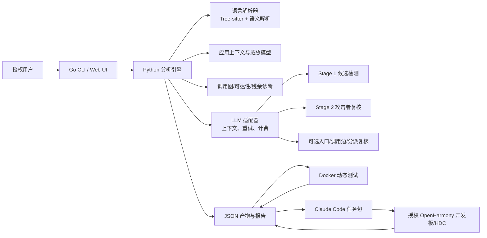

# VulnFounder 0day 漏洞挖掘智能体：设计、实现与交付运行方案

> 版本：2026-08-28  
> 适用代码：`/Users/shiyu/学习/hyl/new/VulnFounder` 当前工作树
> 目标平台：OpenHarmony 优先，同时保留通用语言扫描能力

## 1. 文档定位与责任边界

VulnFounder 是一个“静态分析为主、模型辅助判断、动态验证可选”的漏洞挖掘流水线。它把源码解析成函数级单元，识别外部输入和安全边界，使用大模型提出漏洞候选，再用独立的攻击者模拟阶段复核，最后将适合验证的候选交给 Docker 或 Claude Code/HDC 工作流。

这里的“0day”表示“尚未由本项目确认、可能尚未公开的漏洞候选”，不是对漏洞真实性、唯一性或未公开状态的保证。任何结果都必须由授权的安全人员复核；未经授权不得扫描第三方代码、连接第三方设备、利用或披露漏洞。

本文将能力分成四类，避免交付时把实验或规划误称为生产能力：

| 标记 | 含义 |
| --- | --- |
| 当前可用 | 已接入默认流水线，并有本地测试覆盖 |
| 可选实验 | 需要显式开关，结果主要作为审计证据或候选提示 |
| 手工验证 | 已在指定源码/开发板上验证过路径，但尚未成为通用自动化适配器 |
| 尚未自动化 | 文档给出接口和边界，当前版本不应承诺自动完成 |

## 2. 设计目标与核心取舍

### 2.1 目标

1. 对 OpenHarmony 服务、组件和库源码建立可追溯的函数、调用和安全上下文。
2. 将系统入口（Binder/SA、Native/Unix socket、N-API、HDF/HDI 等）转换成大模型能够理解的外部输入语义。
3. 通过两阶段 LLM 分析降低误报：Stage 1 发现候选，Stage 2 模拟攻击者复核。
4. 保留全部中间产物、模型请求统计、重试记录和最终判定，便于复现与审计。
5. 允许静态扫描先独立完成，动态验证在有设备或隔离环境时再运行。

### 2.2 关键取舍

**固定工作流 + 受约束的 Agentic 行为。** 阶段顺序、输入输出和安全门由程序固定；模型只能在阶段内完成语义判断或生成结构化建议。这样可以复现、计费和审核，避免让一个自由代理在源码仓库中无限搜索或执行不可控命令。

**确定性解析优先，LLM 只补充不确定信息。** Tree-sitter 和 OpenHarmony 语义解析器先生成基线调用图、入口和构建元数据。函数指针、宏、模板、IDL/SA 分派等无法可靠静态解析的部分进入 residual 清单，由可选模型阶段审阅。模型建议默认不直接改写持久化调用图，避免“模型猜错一条边就扩大漏洞结论”。

**原生调用图 + 语义覆盖层。** 原生图保留语言解析器的确定性结果；OpenHarmony 的 Binder/SA/IDL/HDF 关系以 `semantic_graph.json` 和可达性覆盖层表达。覆盖层是加法的：在没有可靠入口时不裁剪原图中的函数，以优先保证召回率。

**静态与动态解耦。** 静态阶段输出候选清单；动态阶段只消费已确认格式的 `pipeline_output.json`，并记录 `CONFIRMED`、`NOT_REPRODUCED`、`BLOCKED`、`INCONCLUSIVE` 等证据状态，不把“没有复现”误写成“安全”。

**项目本地可交付。** 配置模板、源码库、任务包和报告格式放在 VulnFounder 项目目录；真实密钥、设备签名材料和大型工具链不提交到 Git。这样可以复制项目给其他团队，再由对方填写自己的配置和设备信息。

## 3. 总体架构



### 3.1 组件职责

| 组件 | 目录/文件 | 职责 |
| --- | --- | --- |
| Go CLI | `apps/vulnfounder-cli/cmd/` | 参数校验、项目/配置解析、Python 进程生命周期、退出码、动态测试命令 |
| Go Web | `apps/vulnfounder-cli/internal/server/`、`ui/` | 扫描作业、阶段侧栏、日志 SSE、历史记录、产物友好查看、调用图和 Claude 面板 |
| Python CLI | `libs/vulnfounder-core/vulnfounder/cli.py` | Python 子命令和窄 JSON 信封协议 |
| 扫描编排器 | `libs/vulnfounder-core/core/scanner.py` | 阶段顺序、checkpoint、跳过原因、产物路径、最终汇总 |
| 解析器 | `libs/vulnfounder-core/parsers/` | Python/JS/TS/Go/C/C++/Ruby/PHP/Zig/Swift/Rust 等源码解析 |
| OpenHarmony 适配 | `libs/vulnfounder-core/core/platforms/openharmony/` | 平台画像、bundle/BUILD/IDL/SA/HDF 语义、入口、残余和分派证据 |
| LLM 基础设施 | `libs/vulnfounder-core/utilities/llm/` | provider、phase binding、模型探测、限流重试、token/费用统计 |
| 动态测试 | `libs/vulnfounder-core/core/dynamic_tester/`、`utilities/dynamic_tester/` | Docker 隔离测试、Claude Code 任务包、工具库和 Skill |
| 报告 | `libs/vulnfounder-core/core/reporter/`、Go report renderer | summary、disclosure、HTML/CSV/SARIF，以及 Web 中英文展示 |

Go 与 Python 之间使用单次 JSON 信封：标准输出只返回结构化结果，日志写标准错误；退出码为 `0=无已确认问题`、`1=发现候选/漏洞结果`、`2=运行错误`。Web 另外把每次作业的日志和产物保存在独立目录，避免扫描互相覆盖。

## 4. 端到端流水线

默认 `vulnfounder scan` 的逻辑顺序如下。某些步骤只有显式打开相应选项才运行；每个阶段都会产生 `<step>.report.json`，最终由 `scan.report.json` 汇总。

| 阶段 | 主要输入 | 主要输出 | 当前状态 | 失败策略 |
| --- | --- | --- | --- | --- |
| 0. 配置/模型探测 | 配置文件、provider/model | 探测日志、费用基线 | 当前可用 | 无法连接或密钥无效时尽早失败 |
| 1. 平台画像与解析 | 仓库、语言、`--platform` | `platform_profile.json`、`dataset.json`、`call_graph.json`、`semantic_graph.json`、`call_graph_residuals.json` | 当前可用 | 单语言失败可按配置继续；严格模式可中止 |
| 2. 应用安全上下文 | `VULNFOUNDER.THREATMODEL.md`（兼容读取 `OPENANT.THREATMODEL.md`）或源码摘要 | `application_context.json` | 当前可用 | 显式威胁模型格式错误时中止；模型上下文失败时记录错误 |
| 3. LLM 可达性复核 | 全量解析单元、上下文 | `llm_reachability.json`，必要时重做 reachable 过滤 | 可选实验 | 失败会保留结构化可达性结果并记录降级 |
| 4. OpenHarmony 图诊断 | 原生图、残余、函数索引 | `llm_call_graph_recovery.json`、`llm_call_graph_candidate_review.json`、`openharmony_dispatch_code_evidence.json` | 可选实验 | 只生成审计产物，不破坏原图 |
| 5. 上下文增强 | 数据集、调用者/被调用者、平台上下文 | `dataset_enhanced.json` | 当前可用（可关闭） | 单元失败告警并继续 |
| 6. Stage 1 检测 | 增强单元、漏洞标准 | `results.json` | 当前可用 | 单元级重试；错误单元保留错误状态 |
| 7. Stage 2 复核 | Stage 1 的 vulnerable/bypassable 候选 | `results_verified.json` | 可选，`--verify` | 复核失败不丢弃 Stage 1；结果标记为未复核/不确定 |
| 8. 统一输出 | Stage 1/2、上下文、动态结果 | `pipeline_output.json` | 当前可用 | 缺少前置产物时明确报错 |
| 9. 动态测试 | `pipeline_output.json`、源码、设备/容器 | `dynamic_test_results.json/.md`、证据文件 | Docker 当前可用；Claude Code 任务包可用；设备适配手工验证 | 没有候选时 `no_candidates`，未启用时 `not_requested` |
| 10. 报告 | 最终输出、动态结果 | `report/` 下 summary/disclosure/HTML 等 | 当前可用 | 报告失败不回滚静态产物 |

### 4.1 阶段 0：配置与模型探测

扫描开始时构建一次 `PhaseBinding` 注册表，覆盖 `analyze`、`enhance`、`verify`、`report`、`dynamic_test`、`llm_reach`、`app_context` 七个阶段。每个唯一的 provider+model 组合先发一个极小请求，提前发现错误的 base URL、模型名或 API key，而不是运行几十分钟后才失败。

项目默认模板使用 OpenAI 兼容 provider `autodl-openai` 和 `gpt-5.6-luna`。模型价格来自 `config/models.json`，当前记录为输入 ¥0.812/M token、输出 ¥4.872/M token。实际交付时必须由使用方填入自己的密钥，文档、Git 和日志中都不能出现密钥。

### 4.2 阶段 1：解析、平台画像和入口

通用解析器将源码转换为函数级 `unit`，至少记录单元 ID、文件、行号、语言、代码、直接调用者/被调用者和入口提示。C/C++ 使用 Tree-sitter 加自定义调用图构建器，能够覆盖直接调用、静态成员方法、接收者方法和部分继承关系；函数指针、成员指针、宏、模板、lambda、表驱动分派和跨 IDL/SA 边会进入残余诊断。

当 `--platform openharmony` 或自动画像达到阈值时，额外执行：

- 从 `bundle.json`、`BUILD.gn`/`BUILD` 等元数据判断组件和生产/测试范围；
- 解析 `.idl` 接口、Proxy/Stub、`OnRemoteRequest` 和服务注册关系；
- 解析 SA profile、HDF/HDI 注册和 native dispatch 提示；
- 生成 `semantic_graph.json`，把 IPC/SA/IDL 的跨文件关系表达为语义边；
- 生成 `call_graph_residuals.json`，说明哪些站点没有可信目标、原因是什么。

OpenHarmony 入口的判定依据不是“函数名包含某个词”，而是“外部数据是否可能进入该函数以及是否跨越信任边界”。典型输入包括：

1. Binder `MessageParcel` 的 token、整数、长度、索引、文件描述符和回调注册；
2. `OnRemoteRequest`/Stub 到 handler 的 transaction 分派；
3. SA/HDF/HDI 注册后由其他进程或驱动调用的接口；
4. Native/Unix socket 的 `recv`、`read`、`accept`、协议解析和回调；
5. N-API/JS 参数、系统事件和跨进程回调。

### 4.3 阶段 2：应用上下文

如果仓库根目录存在 `VULNFOUNDER.THREATMODEL.md`，它是人工提供的权威威胁模型；旧的 `OPENANT.THREATMODEL.md` 仍可读取。格式错误会显式中止，避免模型默默误解。否则由模型根据源码和平台画像生成 `application_context.json`，包括应用类型、攻击者画像、输入源、信任边界、漏洞判定标准和构建元数据。OpenHarmony 至少补充 Binder Parcel、calling identity、SA/IPC 边界等语义。

上下文是“分析提示”，不是漏洞结论。模型必须仍然引用函数代码、调用图和源文件位置。

### 4.4 阶段 3：LLM 可达性复核

`--llm-reachability` 会在 reachable 过滤前审阅全量解析单元，寻找结构化解析器容易漏掉的入口和外部输入点，然后将模型确认的入口作为额外 BFS 种子重新过滤。该阶段默认关闭，因为费用与整个仓库单元数相关，而不是最终保留的 reachable 单元数（实现按批次调用，约每 25 个单元一次，具体以模型和版本为准）。

它解决的是“结构解析没有把函数当入口”问题，不是通用的漏洞检测器；模型误报会增加分析范围，模型漏报仍可能导致可达性缺口。因此输出中的 `confidence`、证据片段和应用状态必须保留，不能只看最终单元数。

### 4.5 阶段 4：OpenHarmony 调用图诊断与恢复

当前有三个互相独立的可选 pass：

- `--llm-call-graph-recovery`：只审阅 residual 中没有确定候选的间接调用站点，区分本地分派、模板/宏、外部接口、回调和真正未知；
- `--llm-call-graph-candidate-review`：审阅已经有候选目标的站点，例如 Binder transaction 是否覆盖所有 handler；
- `--openharmony-dispatch-code-evidence`：从源码/头文件解析宏、enum、constexpr 和整数表达式，给 transaction selector 提供可复核的值证据。

这些 pass 的共同安全策略是：输入有界、候选来自本地函数索引、模型返回严格 JSON、值必须通过 schema 校验和证据检查；产物默认是 advisory，不直接改写 `call_graph.json`、`dataset.json` 或 reachable 结果。`llm_dispatch_review.py` 已有一个真实小批次验证：`communication_netmanager_base` 的 6 个连续隐式 enum case 全部得到高置信度值，并由独立源码核对 6/6 通过；这证明协议可用，但不代表所有仓库和所有分派形式都已解决。

### 4.6 阶段 5：上下文增强

增强阶段将调用者、被调用者、语义边、平台入口、guard signal 和外部输入标签加入每个单元。`agentic` 模式会进行更充分的上下文搜索，`single-shot` 模式更省时。增强失败只影响对应上下文，不应抹掉解析器原始代码。

### 4.7 阶段 6/7：两阶段漏洞判断

Stage 1 对每个分析单元执行统一的漏洞检测提示，要求模型区分 `vulnerable`、`bypassable`、`protected`、`safe`、`inconclusive` 和错误状态，并给出 CWE、输入来源、触发条件、保护措施、证据行和置信度。

`--verify` 才会启动 Stage 2。Stage 2 只接收 Stage 1 的高风险候选，扮演攻击者检查：

- 外部输入能否到达敏感操作；
- token、类型、宽度、长度、顺序和权限检查是否真的支配操作；
- 调用图中的中间边是否可信；
- 必要前置条件在真实运行环境中是否成立。

Stage 2 可以把 Stage 1 的 vulnerable 降为 protected，也可以给出未复现或无法判断；“不同意”不是错误，而是减少误报的重要输出。

### 4.8 阶段 8：统一输出

`pipeline_output.json` 是报告和动态测试的边界协议，包含最终 findings、验证结果、应用上下文、平台信息、输入来源、源文件位置、调用路径、跳过阶段和费用统计。动态测试不能直接读取任意模型中间文本，必须以此协议为准。

## 5. LLM 智能体设计

### 5.1 上下文组成

每次模型调用由代码构造上下文，不允许模型自行决定读取整个仓库。典型上下文包含：

- 当前函数完整代码或有界代码片段；
- 文件路径、起止行和 unit ID；
- 直接调用者/被调用者和语义边；
- 平台画像、应用上下文和安全标准；
- 入口/外部输入/guard 信号及其证据；
- 残余原因、候选目标和源码常量证据；
- 任务版本、schema 版本和明确的“不确定就返回 inconclusive”规则。

代码片段、文件内容和仓库中的注释都视为不可信数据；提示词使用边界标记，模型不得把源码中的指令当成系统指令。

### 5.2 严格结构化输出

每个阶段有独立 schema。解析失败时执行有限次数的纠正重试；重试只把错误信息和原始响应摘要发回模型，不无限追加上下文。无法修复时记录 `error`/`inconclusive`，保留原始响应哈希和阶段报告，不伪造结论。

### 5.3 重试、限流和 checkpoint

- provider 在扫描开始做探测；
- 429/暂时性网络错误按 `--backoff` 等待并重试；
- 单元级任务并行执行，失败单元不会使已完成单元丢失；
- Stage 2、Docker 动态测试和长任务写 checkpoint，可恢复或明确清理；
- 每次请求记录 input/output token、估算费用、重试次数和模型配置名。

模型费用是估算值，不等同于供应商最终账单。任何真实密钥都不能写入 JSON 产物、测试记录或 Claude 任务上下文。

## 6. 动态验证设计与当前边界

动态阶段的输入是“已经被静态阶段筛选的候选”，目标是获得运行时证据，而不是无限制模糊测试。当前支持两条路径。

### 6.1 Docker 模式（当前可用）

`core.dynamic_tester` 为每个候选生成自包含测试环境，构建并运行隔离容器，再解析最终 JSON。容器策略包括只读文件系统、tmpfs、`no-new-privileges`、丢弃 capability、进程/内存/CPU 限制、无网络或仅内部网络、不挂载宿主机、超时和有限重试。输出状态为：

| 状态 | 含义 |
| --- | --- |
| `CONFIRMED` | 在同一时间窗口观察到目标输入到达和对应进程/服务证据，并满足结果 schema |
| `NOT_REPRODUCED` | 测试执行了，但没有观察到漏洞行为；不等于安全 |
| `BLOCKED` | 环境、权限、构建或设备条件阻断 |
| `INCONCLUSIVE` | 证据不足或观测冲突 |
| `ERROR` | 测试器或解析器错误 |

### 6.2 Claude Code 模式（任务包可用，设备适配仍受控）

VulnFounder 先创建任务工作区，不在 Python 路径中自动启动 Claude Code。工作区大致为：

```text
<run-root>/
├── task/
│   ├── CLAUDE.md
│   ├── TASK.md
│   ├── task_manifest.json
│   ├── context/
│   │   ├── pipeline_output.json
│   │   ├── candidate_manifest.json
│   │   ├── artifact_manifest.json
│   │   ├── source_code.json
│   │   └── static_artifacts/
│   ├── source_code -> 授权源码仓库
│   ├── .claude/skills/vulnfounder-openharmony-dynamic/SKILL.md
│   └── results/
└── openharmony-public-tools/
    ├── README.zh-CN.md
    ├── toolchain-manifest.json
    └── bin/{hdc,hvigorw,node,hap-sign-tool.jar,java?}
```

Claude Skill 要求先查看源码和候选，再执行固定的 HDC 预检、工具链检查、构建/签名/安装、有限触发、日志和证据收集，最后为每个候选写 `verdict.json`、`notes.md`、`commands.jsonl`、标准输出/错误和证据文件。Web 模式会在动态测试阶段显示 Claude 对话、实时日志、工作区文件树和文件预览，并在会话结束后收集结果；没有候选时会记录 `no_candidates` 并跳过会话。

`--dangerously-skip-permissions` 是明确的操作者信任边界，不是沙箱。任务工作区只能来自授权源码和 VulnFounder 生成的上下文；不要把含有未知脚本的任意目录直接交给 Claude。

### 6.3 OpenHarmony 开发板路径

已经手工验证过的安全路径是：API 23 HAP 使用公开 Bundle Manager/FaultLogger 只读 API，与 `faultloggerd` 的公开 `dumpcatcher -p` 查询结合，使用 HDC 完成安装、启动、强制停止和日志采集。该验证证明工具链和 HAP 生命周期可行，但不代表所有系统服务都能由同一 HAP 访问。

当前不能承诺自动化完成：

- 任意 SA/IPC 接口的攻击载荷生成和权限配置；
- HDF/HDI 驱动级验证；
- 私有 socket、私有 faultloggerd 协议或绕过系统权限；
- 自动修改 SELinux、root、系统关键进程或设备状态；
- 不同 API 版本、签名 profile 和芯片架构的通用 HAP 构建。

历史上用于转发载荷的 TCP bridge 已移除：HAP 直接调用公开系统 API，Native/Unix socket 只在授权的真实环境中由专用适配器处理，不用网络桥接替代系统边界。

## 7. Web 交互面

```bash
cd /Users/shiyu/学习/hyl/new/VulnFounder
VULNFOUNDER_PYTHON="$PWD/.venv/bin/python" \
  ./apps/vulnfounder-cli/bin/vulnfounder serve --addr 127.0.0.1:8080
```

Web 只监听 loopback。端口被占用时服务会回退到可用端口，并在启动日志中打印实际地址；浏览器必须通过该 HTTP 地址访问，不能直接双击 `file://` 页面，否则会触发跨域/CSRF限制。

首页支持：

- 从项目内 `source_code_base/` 选择仓库；
- 选择语言、OpenHarmony 平台、Stage 2、LLM 可达性和动态测试模式；
- 查看所有历史扫描，而不是只保留最近一次；
- 逐阶段查看状态、重要字段、原始 JSON 和产物说明；
- 以节点图查看入口向下的调用子图，调整深度并进入函数源码；
- 在动态测试阶段（仅 Claude Code 模式）查看对话、日志、任务目录和文件；
- 选择中文/英文查看阶段说明、摘要、HTML 和披露列表。

Web 作业目录默认位于 `~/.vulnfounder/webui/<scan-id>/`，这是运行数据目录，不是源码交付目录；已有 `~/.openant/webui/` 数据会作为兼容回退读取。项目源代码目录仍应放在 VulnFounder 下的 `source_code_base/`，这样打包时结构可复现。

Web 的安全措施包括同源/Fetch Metadata 校验、CSRF token、安全响应头、路径归属检查、产物大小上限、拒绝符号链接越界和 loopback 监听。它不应暴露到公网；如果需要远程使用，应在外层增加经过审计的认证和反向代理。

## 8. 产物与审计结构

一次典型 OpenHarmony 扫描的输出目录如下（某些可选文件只有打开对应选项才存在）：

```text
<output>/
├── platform_profile.json
├── application_context.json
├── dataset.json
├── dataset_enhanced.json
├── analyzer_output.json
├── call_graph.json
├── semantic_graph.json
├── call_graph_residuals.json
├── llm_reachability.json
├── llm_call_graph_recovery.json
├── llm_call_graph_candidate_review.json
├── openharmony_dispatch_code_evidence.json
├── results.json
├── results_verified.json
├── pipeline_output.json
├── dynamic_test.report.json
├── dynamic_test_results.json
├── dynamic_test_results.md
├── scan.report.json
├── parse.report.json / app-context.report.json / ...
└── report/
    ├── SUMMARY_REPORT.md
    ├── SUMMARY_REPORT.zh-CN.md（Web 本地化产物可用时）
    ├── report.html / report.zh-CN.html（Web 本地化产物可用时）
    └── disclosures/*.md
```

重要字段的解释：

- `platform_profile.json`：检测到的 OpenHarmony 组件、源范围、文件覆盖和构建元数据；
- `application_context.json`：攻击者画像、输入源、信任边界和判定标准；
- `dataset*.json`：函数单元及其源位置、代码和上下文；
- `call_graph.json`：语言解析器的确定性图；
- `semantic_graph.json`：IPC/SA/IDL/HDF 等跨文件语义关系；
- `call_graph_residuals.json`：尚未有可信目标的调用/分派站点及原因；
- `llm_reachability.json`：模型提出的入口/输入信号、置信度、证据和应用状态；
- `results.json`：Stage 1 原始候选；
- `results_verified.json`：Stage 2 攻击者复核结果；
- `pipeline_output.json`：报告和动态测试消费的最终边界协议；
- `scan.report.json`：阶段耗时、成本、跳过原因、错误和产物索引。

单元 ID 相同而条目类型不同是正常的：同一个函数可以同时出现在函数索引、入口信号、外部输入信号、候选漏洞或调用边证据中。查看时必须结合 `artifact`、`type` 和 `evidence`，不能仅按 ID 去重。

## 9. 交付安装与环境

### 9.1 必需依赖

- macOS/Linux；OpenHarmony 开发板不是静态扫描的必需项；
- Python 3.11 或更高版本；
- Go 1.25 或更高版本，用于构建 CLI/Web；
- Python 依赖见 `libs/vulnfounder-core/pyproject.toml`，包括 OpenAI/Anthropic 适配器、Pydantic、HTTP 客户端和 Tree-sitter 语言包；
- API key 和可用的 provider endpoint；
- Docker 仅 Docker 动态测试需要；
- Claude Code 仅 Claude 模式需要；
- HDC、Node/Hvigor、Java 和 `hap-sign-tool.jar` 仅 HAP/设备测试需要。

### 9.2 创建项目独立 Python 环境

```bash
cd /Users/shiyu/学习/hyl/new/VulnFounder
python3.11 -m venv .venv
.venv/bin/python -m pip install --upgrade pip
.venv/bin/python -m pip install -e 'libs/vulnfounder-core[dev]'
```

运行 CLI 时用 `VULNFOUNDER_PYTHON="$PWD/.venv/bin/python"` 固定解释器。若不设置，Go CLI 会依次尝试 `~/.vulnfounder/venv/`、兼容的 `~/.openant/venv/` 和系统 PATH 中的 Python；交付环境建议显式固定，避免依赖本机旧环境。

构建 Go CLI：

```bash
cd /Users/shiyu/学习/hyl/new/VulnFounder/apps/vulnfounder-cli
make build
```

### 9.3 配置模型

```bash
cd /Users/shiyu/学习/hyl/new/VulnFounder
cp config/vulnfounder/config.example.json config/vulnfounder/config.json
chmod 600 config/vulnfounder/config.json
```

在 `llm_providers.autodl-openai` 中填入自己的 `api_key`，或使用 `VULNFOUNDER_CONFIG_FILE=/绝对路径/config.json` 指向另一份权限为 `0600` 的配置。配置文件已被 `.gitignore` 忽略，但交付前仍要手动确认没有把它复制到压缩包或日志。

### 9.4 源码和工具链布局

```text
VulnFounder/
├── source_code_base/                         # 交付时可放置已授权源码仓库
├── config/vulnfounder/config.example.json        # 无密钥模板
├── config/vulnfounder/config.json                # 本地私密配置，不提交
└── libs/vulnfounder-core/utilities/dynamic_tester/toolchains/
    └── commandline-tools-mac-arm64-6.1.0.860/ # 本机工具链，不默认提交
```

`source_code_base` 可以通过 `VULNFOUNDER_SOURCE_CODE_BASE` 覆盖，但交付部署最好把仓库放在项目目录内。设备签名 profile、私钥和开发者证书只放在本机受控位置，不能进入任务包或 Git。

## 10. 运行手册

以下命令假设当前目录是 VulnFounder 根目录，并使用项目独立 Python 环境。

### 10.1 最小健康检查（不调用大模型）

```bash
test -x .venv/bin/python
test -x apps/vulnfounder-cli/bin/vulnfounder
./apps/vulnfounder-cli/bin/vulnfounder --version
```

如果 CLI 尚未构建，先执行上一节的 `make build`。若 Python 依赖缺失，重新执行 editable install；不要混用项目环境和另一个仓库的虚拟环境。

### 10.2 低成本解析检查

先确认平台画像、文件筛选、函数和调用图，再决定是否花费模型费用：

```bash
REPO="$PWD/source_code_base/sensors_medical_sensor"
OUT="$PWD/run-output/sensors-parse"
VULNFOUNDER_PYTHON="$PWD/.venv/bin/python" \
  ./apps/vulnfounder-cli/bin/vulnfounder parse "$REPO" \
  --platform openharmony --level all --output "$OUT"
```

检查 `platform_profile.json`、`dataset.json`、`call_graph.json`、`call_graph_residuals.json` 的单元数、入口数、残余原因和代表性函数源码。不要只看“解析成功”字样。

### 10.3 静态完整流水线（建议首次先跳过动态）

```bash
REPO="$PWD/source_code_base/sensors_medical_sensor"
OUT="$PWD/run-output/sensors-static-$(date +%Y%m%d-%H%M%S)"
VULNFOUNDER_PYTHON="$PWD/.venv/bin/python" \
  ./apps/vulnfounder-cli/bin/vulnfounder scan "$REPO" \
  --platform openharmony \
  --verify \
  --skip-dynamic-test \
  --output "$OUT"
```

如果要检查模型对入口的补充，再显式加入：

```bash
  --llm-reachability \
  --llm-reachability-max-code-bytes 1500 \
  --llm-call-graph-recovery \
  --llm-call-graph-candidate-review \
  --openharmony-dispatch-code-evidence
```

这些选项会增加费用。调用图恢复和分派复核当前主要产生审计证据，不应把“模型建议的边”直接当成确定调用关系。

### 10.4 单独生成报告

```bash
VULNFOUNDER_PYTHON="$PWD/.venv/bin/python" \
  ./apps/vulnfounder-cli/bin/vulnfounder report "$OUT/results_verified.json" \
  --pipeline-output "$OUT/pipeline_output.json" \
  --dataset "$OUT/dataset_enhanced.json" \
  --format html --output "$OUT/report.html"
```

如果没有动态结果，报告应显示“未执行/未请求”，不能把它解释为动态安全结论。

### 10.5 Docker 动态测试

```bash
VULNFOUNDER_PYTHON="$PWD/.venv/bin/python" \
  ./apps/vulnfounder-cli/bin/vulnfounder dynamic-test "$OUT/pipeline_output.json" \
  --mode docker --repo-path "$REPO" --output "$OUT/dynamic"
```

运行前确认 Docker daemon、镜像构建权限和资源限制；只对授权仓库执行。审阅 `dynamic_test_results.json`、每个候选的命令日志和证据文件。

### 10.6 Claude Code 任务包

```bash
VULNFOUNDER_PYTHON="$PWD/.venv/bin/python" \
  ./apps/vulnfounder-cli/bin/vulnfounder dynamic-test "$OUT/pipeline_output.json" \
  --mode claude-code --repo-path "$REPO" --output "$OUT/claude-code"
```

命令返回任务根目录和启动提示后，进入其中的 `task/`，按 `TASK.md` 和 `.claude/skills/vulnfounder-openharmony-dynamic/SKILL.md` 操作（任务包同时保留旧路径副本）。CLI 任务包模式本身不需要再次调用 VulnFounder 的检测 LLM；Web 模式则可以在动态阶段直接打开 Claude 对话并实时查看文件。

### 10.7 Web 模式

```bash
VULNFOUNDER_PYTHON="$PWD/.venv/bin/python" \
  ./apps/vulnfounder-cli/bin/vulnfounder serve --addr 127.0.0.1:8080
```

浏览器打开启动日志给出的地址，选择项目内仓库，平台选 `OpenHarmony`。首次试跑建议勾选“Stage 2 复核”、关闭 LLM 可达性和动态测试，确认静态产物后再开高成本选项。动态测试选择 Claude Code 时，Claude 面板只在动态阶段显示。

### 10.8 设备预检（仅授权开发板）

```bash
<项目内或 PATH 中的 hdc> list targets
<项目内或 PATH 中的 hdc> list targets -v
```

确认设备序列号、API 版本、架构、开发者模式和签名 profile 后，再进行 HAP 构建/安装。所有命令、返回码、时间窗口、PID/服务日志都应写入动态测试证据；遇到权限或版本不匹配时标记 `BLOCKED`，不要通过关闭安全机制来“修复”。

## 11. 结果质量与验收标准

一次可交付运行至少应满足：

1. `scan.report.json` 存在，阶段顺序、耗时、费用和跳过原因完整；
2. `dataset.json` 中的代表性入口能回到真实文件和行号；
3. 调用图、语义图和 residual 数量可解释，未把残余静默当成“没有调用”；
4. Stage 1 和 Stage 2 的模型配置、token、重试和结果一一对应；
5. `pipeline_output.json` 与 `results_verified.json` 的 findings 数量和 ID 可对账；
6. 动态未启用、无候选、环境阻断和未复现分别有不同状态；
7. 报告中的文件、函数、漏洞摘要与 JSON 产物一致；
8. 输出目录、任务包和日志没有 API key、私钥或设备敏感信息；
9. 至少抽查一个入口的源码、调用者、下游调用链、guard 和外部输入，不以模型摘要替代人工核对；
10. 重复运行使用不同输出目录或 Web scan ID，历史结果不覆盖。

建议为每个交付仓库保留一份审计记录，包含：仓库 commit、VulnFounder commit、Python/Go/模型版本、命令行、配置名（不含密钥）、产物目录、候选数、复核数、动态状态、人工复核结论和已知遗漏。

## 12. 安全威胁模型

### 12.1 扫描输入

源码、注释、构建文件、IDL 文本和模型返回都可能包含 prompt injection 或恶意脚本。解析阶段应只读取允许的文件范围；构建/测试脚本不应因为“仓库自己要求”就自动执行。`OPENANT.THREATMODEL.md` 是显式输入，格式错误必须报错。

### 12.2 网络和配置

Web 默认 loopback；仓库 URL 不能携带嵌入式凭据；远程 clone、模型 endpoint 和工具下载要经过组织网络策略。API key 只从权限受控配置或受控环境变量读取，不进入 stdout、SSE、JSON artifact、Claude 上下文和测试记录。

### 12.3 模型和调用图

模型输出不是事实数据库。所有边、selector、入口和漏洞结论都必须带来源、置信度和证据；不确定时保留 `inconclusive` 或 residual。任何未来把 advisory 投影到图中的实现，都必须先通过单调性、独立源码核对和回归基线测试。

### 12.4 动态环境

Docker 是隔离层但不是绝对安全边界，仍需最小权限和无宿主挂载。Claude Code 的跳过权限参数代表“操作者已经信任任务目录”，不适用于未知仓库。开发板测试必须使用专用设备和可恢复快照，禁止 root、SELinux 放宽、私有协议绕过、关键服务破坏和未经授权的数据采集。

## 13. 常见问题与处理

| 现象 | 原因与处理 |
| --- | --- |
| 提示未检测到凭据 | `config/vulnfounder/config.json` 不存在、权限不是 0600 或 provider 没填 key；复制模板并只在本机填写 |
| 模型探测失败 | 检查 base URL、模型名、额度和网络；不要先跑完整仓库再排查 |
| Python 依赖找不到 | 设置 `VULNFOUNDER_PYTHON="$PWD/.venv/bin/python"` 并重新安装 editable 包 |
| 端口被占用/地址变化 | 旧 Web 进程仍在运行或指定端口不可用；停止旧进程，使用启动日志中的实际地址 |
| 浏览器 cross-origin/403 | 不要从 `file://` 打开页面；用同一 `serve` 地址访问并保留 cookie/CSRF token |
| 动态测试被跳过 | `not_requested`、`no_candidates`、`docker_unavailable` 和 `failed` 含义不同，应看 `dynamic-test.report.json` |
| 调用图有 residual | 常见于函数指针、宏、模板、表驱动或 IPC/IDL 间接边；先看 residual 证据，再决定是否打开 LLM 复核 |
| LLM 可达性单元变多 | 这是模型追加入口后的召回保护，不代表新增单元都是漏洞；抽查证据和 BFS 路径 |
| Stage 2 把漏洞降为 protected | 这是复核发现保护条件的正常结果，应保留两个阶段的差异 |
| HAP 构建/安装失败 | API 版本、签名 profile、架构或 Hvigor 配置不匹配；标记 BLOCKED 并修复环境，不关闭安全设置 |
| Claude 没有写 verdict | 检查任务包的 `TASK.md`、候选清单、工具路径和 `results/` 权限；不能用聊天文本代替结构化结果 |
| 真实扫描费用异常 | 对照各阶段 report 的 token/重试/模型；第一次探测或失败请求可能已产生供应商费用，即使本地 tracker 未落盘 |

## 14. 当前已知限制与后续路线

### 14.1 已知限制

- Tree-sitter + 自定义 C/C++ 图不能保证覆盖所有宏、模板、函数指针和跨进程动态分派；
- `--llm-reachability` 仍受模型上下文窗口、代码截断和判断偏差影响；
- OpenHarmony LLM 调用图恢复、候选边复核和 dispatch selector 复核当前以 advisory 产物为主，尚未自动合并为确定图；
- 不同 OpenHarmony 版本的 SA、签名、API 和 HAP 工具链差异大；
- Docker 动态测试需要测试器能构建可运行环境，Claude Code 需要操作者在任务包内继续执行；
- “未复现”不能推出“没有漏洞”，“没有发现”不能推出“没有 0day”；
- 本地费用统计是估算，不能替代供应商账单。

### 14.2 推荐路线

1. 先用真实 OpenHarmony 仓库建立解析、入口、残余和 Stage 1/2 的基线；
2. 在 `sensors_medical_sensor`、`communication_netmanager_base` 等小仓库上比较关闭/开启 `--llm-reachability` 的召回和费用；
3. 扩大 dispatch selector 的独立源码核对样本，再讨论是否允许“只加入高置信度、源代码可证明”的边；
4. 为 SA/IPC、Native socket、HDF/HDI 分别实现受限动态适配器，并以 `BLOCKED` 作为默认安全失败；
5. 将 Claude Code 结果收集、人工批准和报告合并做成可审计状态机；
6. 将 OpenHarmony 安全知识、规则版本和模型提示版本化，进行回归和消融评估；
7. 在满足安全审查后，再考虑 Android 等平台：复用 Go/Python/LLM/报告骨架，另写平台画像、入口语义、构建和动态适配器，不把 OpenHarmony 规则硬编码成通用事实。

## 15. 参考资料与本地证据

- 项目架构：`ARCHITECTURE.md`
- 通用运行说明：`README.md`
- OpenHarmony 流程说明：`VULNFOUNDER_COMPLETE_PIPELINE_GUIDE_OH17A.zh-CN.md`
- 调用图恢复决策：`ADR-001-OPENHARMONY-LLM-CALL-GRAPH-RECOVERY.zh-CN.md`
- 动态测试决策：`docs/decisions/ADR-003-OPENHARMONY-DYNAMIC-TEST-EXECUTION.zh-CN.md`
- 动态任务和工具说明：`libs/vulnfounder-core/utilities/dynamic_tester/README.md`、`libs/vulnfounder-core/utilities/dynamic_tester/templates/claude_code/PUBLIC_TOOLS_README.zh-CN.md`
- 模型配置模板：`config/vulnfounder/config.example.json`、`config/vulnfounder/README.md`
- OpenHarmony 源码样本：`/Users/shiyu/学习/hyl/new/openharmony_reference/openharmony_source_code`
- OpenHarmony 安全资料：`/Users/shiyu/学习/hyl/new/openharmony_reference/security`
- 开源扫描技能参考：`/Users/shiyu/学习/hyl/new/openharmony_reference/security-skill-library`
- 真实 LLM dispatch 小批次记录：`test_records/openharmony/OH-22F-3D-real-netmanager-batch1-2026-08-28.md`
- HAP 手工动态验证记录：`test_records/dynamic/OH-DYN-12-hap-system-service-probe-2026-08-24.md`

## 16. 文档交付检查

- [ ] 使用方已确认源码和设备授权范围；
- [ ] 已复制并填写 `config/vulnfounder/config.json`，权限为 `0600`，未进入 Git/压缩包；
- [ ] Python/Go/Node/Java/HDC/Docker/Claude Code 依赖按所选模式安装；
- [ ] 已用小仓库完成模型探测和解析 smoke test；
- [ ] 完整扫描的输出目录和 `scan.report.json` 已归档；
- [ ] Stage 1/2、调用图 residual 和动态状态已由人工抽查；
- [ ] 报告、候选证据和命令日志中没有密钥、私钥或不应交付的设备信息；
- [ ] 对未自动化的 SA/HDF/私有 socket 场景已向使用方说明，不将其当作已覆盖能力。
