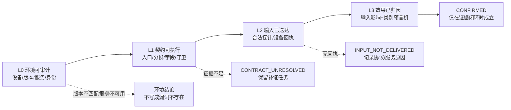
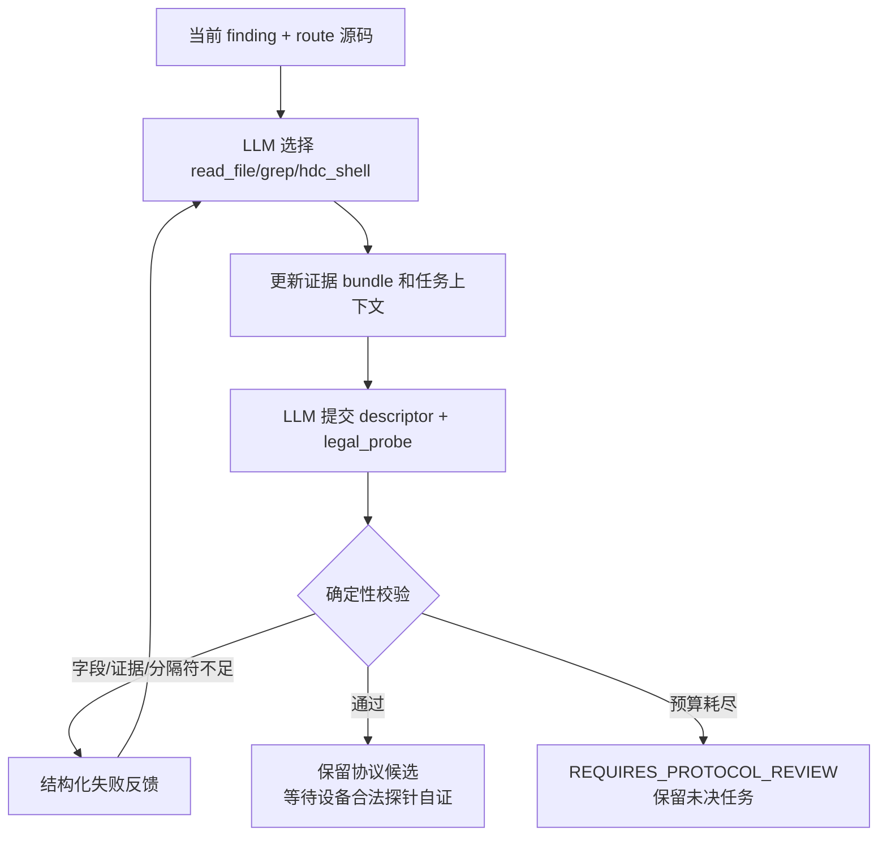
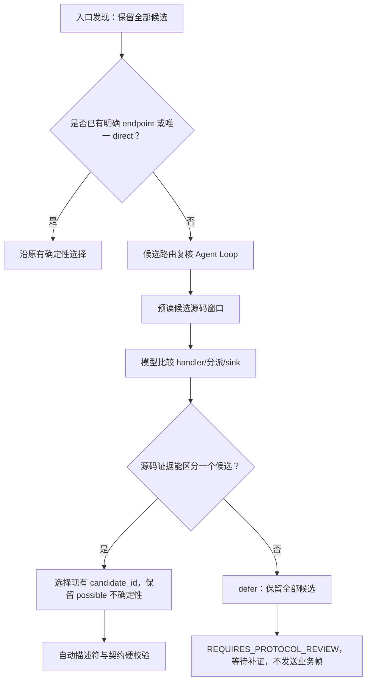

# VulnFounder 官方 24 个历史样本动态测试泛化改造进度

> 对应实施计划：[`VULNFOUNDER_OFFICIAL_24_DYNAMIC_TEST_GENERALIZATION_OPTIMIZATION_PLAN.zh-CN.md`](./VULNFOUNDER_OFFICIAL_24_DYNAMIC_TEST_GENERALIZATION_OPTIMIZATION_PLAN.zh-CN.md)
>
> 记录方式：本文件只记录已经落地到代码、经过测试或明确观察到的结果；“待完成”不等同于失败，也不把尚未执行的 24 项回归写成已通过。
>
> 最后更新：2026-09-22
>
> 当前分支：`refactor/vulnfounder-brand`
>
> 当前代码提交：`bd69184`

---

## 1. 总体结论

本轮没有重新实现已经存在的设备预检、协议恢复、载荷构造和预言机模块，而是先建立可审查的阶段进度台账。当前代码已经覆盖计划中的大量基础能力，但还没有完成“官方 24 个样本在同一设备、同一 clean-room 条件下的全量回归”。因此，当前可以确认的是**框架能力和单元/集成测试状态**，不能提前宣称 24/24 已完成 L1、L2 或 L3。

计划要求的四层结论仍保持不变：



当前最近一次代码提交已经推送到 GitHub：

| 项目 | 结果 |
|---|---|
| 远端 | `origin/refactor/vulnfounder-brand` |
| 最新提交 | `bd69184 feat: add evidence-gated route arbitration loop` |
| 工作区 | 已清理、无已跟踪文件未提交改动 |
| 本轮聚焦 | 进度记录与既有实现验收，暂不重复实现已有模块 |

---

## 2. 计划阶段状态总览

| 阶段 | 目标 | 当前状态 | 已有证据 | 尚未完成 |
|---|---|---|---|---|
| 阶段 0 | 基线、样本标准化、clean-room 输入边界 | 已有样本级基线快照 | 已新增 `dynamic_baseline.json`，记录样本身份、源码哈希、版本字段、候选数量和输入边界；clean-room 不把候选攻击链注入模型上下文 | 仍需把官方 24 项统一清单批量冻结，并补齐设备 revision 采集结果 |
| 阶段 1 | 设备指纹、服务健康、版本比较 | **L0 真机预检已完成** | `DeviceFingerprint`、版本比较状态、服务/端点/进程事实、HDC 诊断噪声隔离、两次连续驻留复核；官方 24 项已逐样本执行并归档 | 当前批次只完成环境审计，不发送业务载荷；源码/设备版本参考未提供时仍保持 `VERSION_UNVERIFIED` |
| 阶段 2 | 协议恢复 Agent Loop、字段/入口证据、失败反馈 | **23 项新增样本已完成 clean-room 编译；DP-02 仅保留既有基线** | entry discovery loop、候选路由复核 loop、descriptor synthesizer、路由切片、字段证据、legal probe 校验；23 项逐样本有独立产物，DP-06 复验验证了本地头文件端点证据扩展，DP-01 增量复验记录了多端点安全 defer | 23 项中只有 DP-16 达到 `ELIGIBLE`；其余停在协议复核，仍需后续输入载体与预言机阶段；不能把协议编译结果当作漏洞确认 |
| 阶段 3 | HAP/native/CLI/event carrier 和身份阶梯 | HAP/native 已有基础能力；CLI/event 已完成通用命令载体基础接入 | HAP、Unix native、身份降权字段、CLI/event 安全 argv、载体发送结果和交付物展示 | 24 项载体选择回归仍待完成；HAP 不是所有协议的唯一载体 |
| 阶段 4 | 输入影响与漏洞类别预言机 | 已实现多数观测器 | 文件、日志、回读、权限、崩溃、资源、状态和竞态类 oracle 代码及测试 | 24 项每个样本的 before/during/after/refutation 产物尚未重新汇总；输入到危险参数的独立证据还需逐项核查 |
| 阶段 5 | 官方 24 项 clean-room 分批回归 | 未完成 | 现有历史运行产物可作为基线，不作为本轮通过证据 | 需要按 DP-02、SmartPerf、HiView 分批重跑，并生成逐样本验收表 |

状态含义：

- **已实现基础能力**：代码路径和针对性测试已经存在，但不代表设备上的所有样本都已跑通。
- **部分完成**：已有数据结构或阶段入口，但还缺少统一的 24 项冻结基线或设备实测。
- **未完成**：没有足够的本轮证据，不能用历史产物替代。

---

## 3. 已落地能力与证据

### 3.1 L0 设备与版本预检

设备预检位于 `libs/vulnfounder-core/utilities/openharmony_dynamic/device_preflight.py`，当前已经能够：

1. 解析系统属性、进程、Unix socket、TCP/UDP 端点和目标服务。
2. 保存目标 PID、UID、SELinux 域、二进制路径及可选 hash。
3. 记录参考源码 revision、设备 revision、系统属性和端点的逐项比较结果。
4. 区分 `MATCHED`、`MISMATCH`、`UNKNOWN`、`VERSION_UNVERIFIED` 和 `SERVICE_UNAVAILABLE`。
5. 将命令错误保留在 `command_errors` 中，而不是把无法读取写成“未发现”。
6. 让版本未知时停在 `VERSION_UNVERIFIED`，不直接生成“设备不存在该问题”的结论。

这一层的边界已经明确：预检只读，不启动服务、不安装载荷、不修改设备状态。服务启动和连续健康检查仍属于运行器/设备执行阶段，不能把一次瞬时 PID 观察当作服务稳定可用。

对应提交：`e8fdf40 feat: add auditable device version comparisons`。

### 3.2 路由绑定与当前 finding 隔离

动态契约不再只记录“某服务有某协议”，而是通过 `RouteBinding` 保存当前 finding 的路由切片，包括：

- 当前 route 的 handler；
- 当前目标 sink；
- 分派条件；
- 状态读写关系；
- 证据位置；
- 假设和缺失证据。

这项设计用于防止同一个服务存在多个入口时，把其他入口的命令、字段或攻击链误并入当前样本。协议描述符表达协议族；route binding 表达当前样本实际要走的端点和处理路径。

### 3.3 协议描述符 Agent Loop

`descriptor_synthesizer.py` 已经具备有界的源码补证循环：



已落地的约束包括：

- 每个字段、守卫、发送变换和 legal probe 都要有当前源码证据引用。
- 源码证据只能来自当前 route 及允许的直接依赖，不把同服务其他端点混入。
- `key_value` 的分隔符必须在当前源码字符串/字符字面量中找到。
- 若当前源码明确出现 `SplitMsg`、`::` 等键值拆包证据，空字段的 `raw_text` 草案会被拒绝。
- legal probe 禁止 marker、shell 控制符、命令执行词和未闭合占位符。
- 每轮失败会反馈缺少字段、不可读证据、线路形态或 legal probe 失败原因。

这一层的确定性校验只证明“引用的源码片段存在”和“报文形状满足安全约束”，不把文本出现自动升级为运行时语义成立；最终还需要设备合法探针确认。

对应历史提交：`33dc49e`、`cfc9c1b`、`c1864c0`、`17cfcb9`、`7f23c02`。

### 3.4 载体与身份

当前已经具备两类主要载体：

- HAP UDP/TCP：用于声明式 ArkTS 载体，记录安装、启动、HAP 自证和实际帧。
- Unix native：使用受限 native helper 发送字节序列，保存逐系统调用结果和 payload hash。

身份模型已经包含 `hap_app`、`debug_app`、`root_su` 以及可选的设备侧降权 UID/GID。降权失败不能以 root 结果冒充普通应用结果。

HAP 不是动态测试的唯一载体。计划要求后续按契约选择 HAP、native helper、CLI 或事件发布器；因此目前 HAP/native 能力属于阶段 3 的基础完成，不代表 CLI/event_bus 已经完成泛化。

### 3.5 预言机和证据分层

`observation/oracles.py` 已经支持或接入以下观测形态：

- 文件创建/删除/属性和内容差分；
- 日志信号；
- 响应/回读差分；
- 权限/身份差分；
- faultlog 与目标进程存活关联；
- FD、内存和资源变化；
- 状态差分和竞态差分。

运行结果必须区分：

1. 输入是否真正送达；
2. 输入是否影响危险参数；
3. 是否观察到匹配的安全效果；
4. 是否被反事实或 refutation 证据否定。

因此，“目标日志出现”不能单独等价为命令注入或权限绕过确认；同样，服务没有日志也不能直接写成安全。

### 3.6 运行产物与前端交付物

当前运行记录已经可以保存契约、阶段状态、实际传输、设备命令台账、日志命中、观测和判定。Web 端已经修复“源码预览较慢导致 PoC/Exp 卡片暂时不渲染”的问题：交付物卡片先挂载，源码浏览器异步补充。

当前交付物可包括：

- `contract_poc.json`；
- `poc.hap`；
- `poc_source.zip` 和 `poc_source_manifest.json`；
- `README.md`；
- 在具备经过验证的 Exp 模板时再生成 Exp；没有安全可验证的 Exp 时明确显示 `poc_only`，不伪造 Exp。

对应最新提交：`4de39e2`。

### 3.7 CLI 与事件总线通用载体第一批接入

本次按计划补上了此前 runner 对 `cli`/`event_bus` 直接报“未支持”的缺口。新增的
`DeviceCommandTransport` 不识别服务名称，也不内置某个事件或命令；它只消费当前
契约中的 `protocol.param_space.cli_argv`、`event_argv` 或统一的 `command_argv`。

安全边界如下：

- 命令必须是字符串列表，整条 shell 字符串会在 validator 阶段拒绝；
- 禁止 NUL、控制字符、`;`、`|`、`&`、重定向、反引号和换行；
- 禁止把 `sh -c`、`bash -c` 等派生 shell 当成载体命令；
- runner 通过 HDC 参数数组执行，不将命令重新拼接成 shell；
- 实际 argv、来源键、返回码、stdout/stderr 摘要和 HDC command record 都进入
  `SendResult.transport`；
- 设备命令执行失败被记录为 `INPUT_REJECTED`，主机/HDC 基础设施异常记录为
  `INPUT_NOT_SENT`，不混写成漏洞效果失败。

同时把 `ProtocolSpec.param_space` 正式纳入数据模型，避免过去由调用方动态挂属性，
导致 JSON round-trip 与静态检查不一致。业务字段仍由协议描述符和 route 解释，设备
命令不会混进业务字段白名单。

本批次新增回归覆盖：

1. shell 字符串、`sh -c` 和控制字符被拒绝；
2. CLI 合法 argv 能执行并保存回执；
3. event_bus 非零返回码被区分为设备拒绝；
4. 缺少合法 argv 的 CLI 契约在设备交互前被拦截。

本批次尚未声称任何具体事件总线协议已经在开发板上成功发送；协议字段、事件名和
权限仍必须由当前 finding 的源码证据和合法探针恢复。

本阶段又补上了合法探针的同类支持：描述符的 `legal_probe.mode` 现在可以声明
`cli` 或 `event_bus`，并通过同一个安全命令载体执行 `command_argv`。自动描述符
自证会记录命令返回码和设备回执；不会把“主机成功生成 JSON”当成设备协议已成立。
CLI/event 合法探针同样禁止 marker、canary、shell 控制符和 `sh -c`，且不会复用漏洞
变异字段。

同时，编译结果增加了结构化 `probe_result`，并由扫描桥接层直接写入
`probe_result.json`。其中保存探针来源、描述符、entry kind、endpoint、实际
transport/argv 或帧、送达状态、设备回执和失败原因；旧的 compile note 仍保留作为
面向用户的摘要。这样“已生成探针”和“设备实际收到探针”在产物中是两个不同状态。

### 3.8 阶段 0 样本基线与 clean-room 审计快照

为避免“模型看到了历史成功帧或答案链”与“当前协议恢复能力”混在一起，扫描桥接在
finding 适配完成后立即写入 `dynamic_baseline.json`。该快照不执行设备命令，也不改变
主流程；它只冻结本轮动态测试的输入边界和可复查身份：

- `sample_id`、`unit_id`、漏洞类别、目标函数和仓库根目录；
- 当前 finding 的源码文件是否存在、文件大小和 SHA-256；
- source/reference revision（若扫描产物提供）；
- 当前 finding 携带的入口候选和候选路径数量；
- 尚未解决的问题；
- `clean_room` 允许的来源（当前 finding、当前源码证据）以及明确禁止的历史
  exemplar、历史 payload 和答案键。

候选攻击链不会被删除：它们仍保留在 `audit_only` 中，用于事后解释“扫描产物提供了
哪些线索”；但不会通过 `model_context` 进入协议描述符 Agent。这样可以同时满足两项
要求：动态测试仍然能够审计静态分析给出的候选路径，clean-room 运行又不会把预先写入
的答案链伪装成模型自己恢复的协议证据。

`dynamic_baseline.json` 已加入 Go 服务端的产物白名单和 Web 端运行档案列表，因此用户
可以在线查看和下载。源码文件不存在、重复 `sample_id` 等异常会被显式记录或拒绝，
不会静默覆盖另一个样本的基线。

### 3.9 阶段 1 服务稳定性复核

在样本进入协议恢复或载荷发送前，前置确认现在会把“瞬时发现服务”与“服务连续驻留”
分开记录。首次采集发现目标进程/端点后，系统再执行两次只读 HDC 采集；只有两次均
为 `READY` 才写入 `stability.status=STABLE`。如果进程或端点中途消失，状态会降为
`NOT_READY/UNSTABLE`，动态测试在协议阶段之前停止，并保留缺失目标和两次采集结果。

这条规则对所有服务通用，不依赖服务名称、端口或协议族。服务启动仍然只接受当前
finding 提供的参数数组且需要显式授权；启动命令返回 0 不再等价于服务已经稳定。
另外，针对部分 HDC 版本把 `FreeChannelContinue` 诊断信息混入 stdout 的情况，
结构化解析现在只取第一条有效业务行并去除 ANSI 控制序列；完整原始输出仍留在命令
账本中，避免把诊断噪声拼入 PID、SELinux 域、可执行路径或哈希字段。

### 3.10 阶段 1 官方 24 项真机预检

在上述代码变更后，已针对官方历史样本清单逐项执行一次真实开发板 L0 预检。该轮使用
当前连接设备的固定序列号和 HDC 可执行文件，**只读取设备事实**：每个样本采集进程、
Unix/IPv4/IPv6 TCP/UDP 表、UID、SELinux 域、可执行路径和哈希；第一次观察到服务后，
再执行两次间隔 0.5 秒的只读驻留复核。此轮没有安装 HAP、没有发送业务帧、没有启动或
停止服务，也没有写入设备文件。

```text
设备 serial：150100424a5444345209d945be14b900
HDC：/Users/shiyu/harmonyos-sdk/openharmony/9/toolchains/hdc
产物：/Users/shiyu/.openant/dynamic_generalization_stage1_20260922_rerun
```

全量结果为 24/24 项均有独立的 `device_fingerprint.json` 和 HDC 命令账本，汇总写入
该目录的 `summary.json`。当时设备上的 `SP_daemon` 尚未运行，因此 SmartPerf 相关样本
按“服务不可用”安全停止；这不是“样本不存在”或“漏洞不存在”的结论。HiView 样本的
服务进程可见，但本轮没有提供可比对的源码/设备版本参考，所以状态为
`VERSION_UNVERIFIED`，而不是版本匹配。

| 样本范围 | 样本编号 | 服务/入口事实 | 预检终态 | 健康状态 | 驻留复核 | 处理说明 |
|---|---|---|---|---|---|---|
| SmartPerf | DP-01～DP-18（18 项） | 目标为 `SP_daemon` 及 `127.0.0.1:8283/8284` | `SERVICE_UNAVAILABLE`（18） | `NOT_READY`（18） | 未执行（初次观察即缺失） | 未发现 `SP_daemon` 进程和对应端点，协议恢复与载荷阶段未启动 |
| HiView | HV-01～HV-06（6 项） | 事件总线入口，关联 `hiview` | `VERSION_UNVERIFIED`（6） | `READY`（6） | `STABLE`（6，均 2/2） | 进程/运行事实连续可见；缺少版本参考，保留后续版本核验任务 |

逐样本清单如下，避免把分组统计误认为只测试了一个样本：

- SmartPerf：`DP-01`、`DP-02`、`DP-03`、`DP-04`、`DP-05`、`DP-06`、`DP-07`、
  `DP-08`、`DP-09`、`DP-10`、`DP-11`、`DP-12`、`DP-13`、`DP-14`、`DP-15`、
  `DP-16`、`DP-17`、`DP-18`；
- HiView：`HV-01`、`HV-02`、`HV-03`、`HV-04`、`HV-05`、`HV-06`。

本轮还验证了 HDC 版本会把 `FreeChannelContinue` 等 ANSI 诊断行混入 stdout 的实际情形：
结构化字段不再把这类文本拼进 `hiview` 的 SELinux 域、可执行路径和版本哈希，原始命令
输出仍留在账本中。随后为后续动态运行手动以无参数方式启动了
`/system/bin/SP_daemon`，独立核验到 PID 和 8283/8284/8285 三个端点；该启动属于后续
设备准备，不改变上述“24 项 L0 预检为只读”的统计口径。

这项验收只说明设备前置审计和服务驻留判断能够对 24 项逐样本产出可复查结果；它不等价
于协议恢复成功、输入已送达、预言机命中或 `CONFIRMED`。

### 3.11 阶段 2 DP-02 clean-room 真实冒烟

在阶段 1 预检之后，使用当前官方 `DP-02` 的既有扫描 finding 和源码范围执行了一次
真实协议编译冒烟。该轮使用真实模型绑定（`llm_used=true`），不是 mock；启用
`clean_room=true`，明确不向模型提供历史 exemplar、历史成功帧或设备事实库，只允许
使用当前 finding、当前源码证据和本轮设备只读回执。为控制设备与模型成本，本轮只做
`compile_contract_with_retry`，没有安装 HAP、没有发送业务变异帧，也没有写入设备文件。

```text
样本：DP-02
产物：/Users/shiyu/.openant/dynamic_generalization_stage2_smoke_dp02
主产物：compile_summary.json、hdc_ledger.jsonl
重试上限：2
耗时：约 663.6 秒
```

本轮真正完成的步骤是：

1. 入口发现 Agent Loop 从当前源码中恢复出 `127.0.0.1:8283`、`127.0.0.1:8284` 和
   `127.0.0.1:8285` 三个候选，并把 `SpThreadSocket::HandleMsg` 作为处理器候选；
2. 协议证据提取器从 socket 创建、绑定、`recvfrom`/`recv`、拆包、命令表和守卫中提取
   当前 route 的证据；
3. 自动描述符合成器生成并批准了描述符
   `auto_b1a8d9b46053fa5d`，来源标记为 `auto_generated`，没有回退到人工注册的
   `sp_daemon_text`；
4. 侦查 Agent Loop 重新核对了 `set_pkgName` 守卫、消息分派、`LoadCmd` 到 `popen`
   的下游关系，并将设备端口事实写入审计记录；
5. 确定性校验和两次失败反馈后，结果停在 `REQUIRES_PROTOCOL_REVIEW`。

描述符生成“通过”与协议编译“完成”在本轮被明确区分：

| 项目 | 本轮结果 | 含义 |
|---|---|---|
| 入口候选 | 3 个 | 三个端点均有源码和设备绑定证据；只代表候选入口，不代表同一条攻击路径 |
| 自动描述符 | `APPROVED` | 描述符字段和源码证据引用通过确定性校验；不是人工协议回退 |
| 协议证据 | `partial` | transport 14、framing 151、dispatch 61、guards 197；endpoint 0，端点常量尚未被证据提取器归类 |
| 最终编译状态 | `REQUIRES_PROTOCOL_REVIEW` | 当前证据不足以安全生成可影响危险参数的变异帧 |
| 设备业务交互 | 未执行 | 没有 HAP 安装、没有业务帧发送、没有设备文件变更 |

阻断原因不是“模型没找到 socket”，而是**模型和源码校验都没有证明外部字段能够到达
`SPUtils::LoadCmd(cmd)` 的危险参数**。当前源码能证明：`set_pkgName` 帧必须包含字面量
`smartperf`；网络、抓取和桌面路径传入 `LoadCmd` 的命令主要来自内部命令表或固定字符串。
在缺少真实字段流证据时，系统拒绝凭经验拼出一条看似可利用的命令帧，因而没有把
`NOT_REPRODUCED` 或 `CONFIRMED` 伪造出来。

这次真实冒烟还暴露出一个与具体服务无关的 Agent Loop 问题：协议侦查模型可能重复读取
相同文件窗口或重复执行相同工具参数。已在提交 `513a294` 中加入按完整
`tool + args` 序列化键去重的通用抑制器；重复动作会记录为 `duplicate` 审计事件并反馈
模型查找新证据、固化 note 或 finalize，而不会静默消耗设备/模型预算。该规则不识别
服务名、端口或漏洞类别，也不会把“相似”动作误合并。

### 3.12 阶段 2 官方其余 23 项 clean-room 编译批次

考虑到 `DP-02` 已经有此前独立确认的成功运行，本轮没有重复把它当作泛化提升证据；
批处理器自动从官方样本目录发现其余 `DP-01、DP-03～DP-18、HV-01～HV-06`，对每个
样本执行相同的 clean-room 协议编译流程。批处理器本身不维护“样本 → 协议帧”映射，
也不安装 HAP、发送业务变异帧或修改设备；每项在独立子进程内运行，单项 900 秒超时，
最多两个并发，因而单项模型/设备异常不会覆盖其他样本的产物。

```text
批次产物：/Users/shiyu/.openant/dynamic_generalization_stage2_official23_20260922
批次配置：batch_config.json
逐项结果：<sample_id>/compile_summary.json
设备命令：<sample_id>/hdc_ledger.jsonl
模型/阶段事件：<sample_id>/events.jsonl、child.log
汇总：summary.json、progress.json
```

批次终态（23/23 均有独立结果，0 超时，0 子进程错误）：

| 终态 | 数量 | 样本 |
|---|---:|---|
| `ELIGIBLE` | 1 | `DP-16` |
| `REQUIRES_PROTOCOL_REVIEW`（自动描述符已生成，但字段/载体/预言机契约未闭环） | 6 | `DP-06`、`DP-11`、`DP-12`、`HV-02`、`HV-05`、`HV-06` |
| `REQUIRES_PROTOCOL_REVIEW`（多端点歧义，未静默选择端点） | 11 | `DP-01`、`DP-03`、`DP-04`、`DP-05`、`DP-08`、`DP-09`、`DP-13`、`DP-14`、`DP-15`、`HV-03`、`HV-04` |
| `REQUIRES_PROTOCOL_REVIEW`（没有可匹配的协议族/入口线索） | 5 | `DP-07`、`DP-10`、`DP-17`、`DP-18`、`HV-01` |

其中 7 项在批次中生成了 `auto_generated` 描述符（`DP-06`、`DP-11`、`DP-12`、
`DP-16`、`HV-02`、`HV-05`、`HV-06`），但只有 `DP-16` 通过了整个契约编译闸门。
这正是“自动生成协议描述符”与“已经能够安全发送一条完整测试帧”之间的差异：例如
`DP-11/DP-12` 的描述符证据通过后，仍因交付物表单结构未闭合被拒绝；`HV-02/HV-06`
需要 event_bus 的合法 argv 载体证据；`HV-05` 缺少完整第二帧；`DP-06` 的第一帧
不满足源码要求的 `::` key/value 结构。

批次原始结果中多端点样本都保留了全部候选及其 `route_relevance`，没有因为存在
8283/8284/8285 三个端点就默认选第一个。该行为避免把同一服务的另一个入口错误地
拼到当前 finding，但也明确暴露了下一步需要补强的能力：由当前候选攻击链、处理器
和 sink 证据完成 route 选择，而不是让用户事后手工猜端点。

### 3.13 本地协议头文件证据扩展复验

提交 `eec8796` 后，协议证据提取器会从当前 route 源文件中有界跟踪仓库内的直接
`#include "..."`，最多 32 个文件，不解析系统头、不按文件名全仓搜索，也不继续递归
整棵公共头文件树。对 SmartPerf 的 `sp_server_socket.cpp`/`sp_thread_socket.cpp`
route，证据现在能读取 `include/sp_server_socket.h` 中的：

```text
udpPort = 8283
tcpPort = 8284
udpExPort = 8285
```

DP-06 在该修改后的真实 clean-room 复验产物为：

```text
产物：/Users/shiyu/.openant/dynamic_generalization_stage2_dp06_after_include_fix
descriptor：auto_5a17428c52bae350（APPROVED）
protocol_evidence：transport=14、endpoints=3、framing=116、dispatch=236、guards=243
最终状态：REQUIRES_PROTOCOL_REVIEW
```

这项复验只证明端点常量可以进入当前 route 的证据 bundle；它没有证明业务字段能够
到达危险参数，更没有执行 HAP 或产生 `CONFIRMED`。

批次结束后对同一设备又做了两次只读健康检查（间隔 1 秒）：`SP_daemon` PID 24869
持续存在，UDP `127.0.0.1:8283`/`8285` 和 TCP `127.0.0.1:8284` 均保持绑定/监听。
这只能说明本轮协议编译期间服务稳定，不代表任一样本的业务帧已经发送。

### 3.14 候选路由复核 Agent Loop 增量实现

23 项批次表明，11 个样本并不是“没有入口”，而是入口发现器同时找到了多个
真实端点，却没有足够的业务分派证据把其中一个端点与当前 sink 唯一绑定。此前
流程在这里直接进入歧义门禁；本次提交 `bd69184` 增加了独立的候选路由复核 loop。

该 loop 的职责边界是：

1. 只接收当前 finding、当前候选及其源码/设备证据，不读取历史 exemplar 或设备
   事实库；
2. 只允许 `read_file`、`grep`、`list_dir` 等源码读取工具，不生成协议字段、攻击
   载荷或设备写命令；
3. 候选已经提供源码区间时，先有界预读每个候选最多两个源码文件窗口，避免模型
   第一轮直接 finalize 耗尽“必须先取证”的预算；
4. 模型必须提交现有 candidate_id、可核验源码引用和选择理由；如果多个候选仍有
   同等证据，只能 `defer`；
5. 选择后不会把 `route_relevance=possible` 改写成 `direct`，复核证据只写入当前
   route binding 的审计字段，后续描述符和契约校验仍然可以拒绝它。

流程如下：



真实 DP-01 增量复验产物：

```text
产物：/Users/shiyu/.openant/dynamic_generalization_stage2_route_arbitration_dp01_retry2_20260922/DP-01
结果：REQUIRES_PROTOCOL_REVIEW
route_arbitration：deferred
候选：8283/8284/8285 均保留
复核原因：三者都能到达公共 HandleMsg，但当前源码没有证明哪一个端点的
           收到字节会绑定到 LoadCmdWithLinkBreak 的 cmd 参数
```

这次 `defer` 是预期的安全结果，不是模型失败：它避免了把 8283、8284 或 8285
中的任意一个按顺序猜成目标入口。复核审计中已经保存预读源码窗口、模型理由和
三项候选的拒绝说明；后续若补齐命令分派或参数绑定证据，可在同一候选集合上重新
复核，而无需修改样本专用规则。

### 3.15 候选路由复核的官方 23 项全量复跑

在候选路由复核 loop 完成后，重新对除 DP-02 外的其余 23 个官方样本执行同一份
clean-room 阶段 2 编译流程。批处理不安装 HAP、不发送业务帧、不修改设备；每个样本
仍由独立子进程运行，并将入口、描述符、协议证据和路由复核审计分别写入样本目录。

```text
产物根目录：/Users/shiyu/.openant/dynamic_generalization_stage2_route_arbitration_official23_20260922
样本数：23/23 有 compile_summary.json
超时：0；子进程错误：0
设备业务变更：0
```

本轮样本级终态：

| 指标 | 数量 | 样本/说明 |
|---|---:|---|
| ELIGIBLE | 1 | DP-06 |
| REQUIRES_PROTOCOL_REVIEW | 22 | 其余 22 项，描述符或契约仍有未闭合证据 |
| 自动描述符已生成 | 10 | DP-06、DP-10、DP-11、DP-12、DP-13、DP-16、DP-18、HV-03、HV-04、HV-05 |
| 候选路由复核 selected | 1 | HV-04；选择结果仍保留原有 possible 不确定性 |
| 候选路由复核 deferred | 7 | DP-03、DP-04、DP-05、DP-07、DP-14、DP-15、DP-17 |
| 未进入路由复核 | 15 | 候选不足、没有可用候选或入口发现阶段已明确缺证据 |

路由复核的 `deferred` 是安全门禁的正常结果：模型读取候选源码后仍无法把端点
唯一绑定到当前 sink，就保留全部候选并停在协议复核，而不是按端口顺序猜测。HV-04
是本轮唯一提交选择的样本；它仍需经过描述符、字段、载体和预言机契约检查，不能
直接解释为设备上已触发样本风险。

与上一轮基线相比，本轮 DP-06 从协议复核提升为 ELIGIBLE，说明本地头文件端点证据
和路由/描述符闭环对该样本有效；DP-16 本轮模型输出未能保持上一轮的 ELIGIBLE，
回到 REQUIRES_PROTOCOL_REVIEW。这表明当前模型调用仍存在响应波动，不能只用一个
批次的 ELIGIBLE 数量宣称泛化能力提升；后续应冻结模型响应或增加多次重放统计。

DP-01 的本轮入口发现返回 `no_candidate`，审计中记录了设备 TCP 端点未核实、组合
shell 查询被 HDC 白名单拒绝以及 socket 到 sink 参数绑定未证明等缺口。该样本没有
被错误升级为可执行协议，也没有因此判定设备上不存在对应风险。

---

## 4. 当前测试证据

截至本次更新，已执行以下针对性测试：

```text
python -m pytest -q \
  libs/vulnfounder-core/tests/test_dynamic_baseline.py \
  libs/vulnfounder-core/tests/test_scan_artifact_standard_artifacts.py \
  libs/vulnfounder-core/tests/test_dynamic_command_transport.py \
  libs/vulnfounder-core/tests/test_device_preflight.py \
  libs/vulnfounder-core/tests/test_descriptor_synthesizer.py \
  libs/vulnfounder-core/tests/test_entry_discovery_loop.py \
  libs/vulnfounder-core/tests/test_carrier_synthesizer.py \
  libs/vulnfounder-core/tests/test_generic_dynamic_oracles.py \
  libs/vulnfounder-core/tests/test_dynamic_runner_contract.py
```

结果：

```text
87 passed in 0.31s
```

这 87 项覆盖的是样本基线哈希和 clean-room 边界、设备版本比较、服务连续驻留复核、协议描述符证据核验、入口/路由循环、HAP/native/CLI/event 载体校验、CLI/event 合法探针、通用预言机和运行器契约形状。它们证明代码级基础行为，但不等价于当前开发板上 24 个样本全部成功。

有一组更大范围的旧测试曾因网络/LLM 可用性测试等待超时，不能把该次未完成运行写成全通过。本进度文件只采用明确完成的针对性测试结果。

本次通用侦查循环和阶段 2 相关回归另行执行：

```text
python -m pytest -q \
  libs/vulnfounder-core/tests/test_recon_loop.py \
  libs/vulnfounder-core/tests/test_descriptor_synthesizer.py \
  libs/vulnfounder-core/tests/test_entry_discovery_loop.py \
  libs/vulnfounder-core/tests/test_protocol_evidence.py \
  libs/vulnfounder-core/tests/test_dynamic_runner_contract.py \
  libs/vulnfounder-core/tests/test_dynamic_command_transport.py \
  libs/vulnfounder-core/tests/test_device_preflight.py \
  libs/vulnfounder-core/tests/test_stage_context_contract.py \
  libs/vulnfounder-core/tests/test_stage_finding_adapter.py
```

结果：

```text
103 passed in 0.29s
```

其中新增的重复动作测试验证：同一 session 内再次提交完全相同的 `tool + args` 时，
系统不会再次调用工具，而是写入 `duplicate` 审计事件并把“请查新证据或 finalize”的
反馈放回下一轮模型上下文。原有的“LLM 不可用”单测也改为显式注入空绑定，避免本机
存在模型配置时意外发起网络请求；这只是测试隔离，不会改变生产环境的真实模型调用。

在加入本地 route include 证据扩展后，重新执行同一组回归，结果为：

```text
105 passed in 0.31s
```

候选路由复核增量回归：

```text
PYTHONPATH=libs/vulnfounder-core pytest -q libs/vulnfounder-core/tests/test_route_arbitration_loop.py libs/vulnfounder-core/tests/test_entry_discovery_loop.py libs/vulnfounder-core/tests/test_recon_loop.py libs/vulnfounder-core/tests/test_protocol_evidence.py libs/vulnfounder-core/tests/test_dynamic_runner_contract.py libs/vulnfounder-core/tests/test_generic_dynamic_oracles.py libs/vulnfounder-core/tests/test_artifact_serialization_contract.py
```

结果：72 passed in 0.17s。其中包括选择现有 candidate_id、拒绝越出候选源码
范围的证据、模型无法区分时 defer、以及编译器在歧义门禁前调用 route arbitration
的集成测试。

真实开发板 DP-01 增量复验使用了当前设备的 SP_daemon 无参启动实例。复验前确认
PID 25892 连续存在，并在两次间隔检查中确认 UDP 127.0.0.1:8283/8285 和 TCP
127.0.0.1:8284 稳定。复验没有安装 HAP 或发送业务变异帧；它只验证协议编译和
候选路由审计，因三端点同样缺少 sink 参数绑定证据而安全返回 deferred。

候选路由复核后的官方 23 项全量复跑已完成：23/23 个样本都有独立
`compile_summary.json`，0 超时、0 子进程错误；完整样本级统计见第 3.15 节。DP-18
和 HV-03～HV-06 在批处理观察句柄中断后曾单独补跑，最终旧批次目录已经由残留 worker
写齐 23 份产物，补跑目录另保存了 HV-03～HV-06 的 4 份独立结果，不覆盖原始结果。

Go 服务端回归：

```text
ok  github.com/synbnb/vulnfounder/apps/vulnfounder-cli/internal/server  (cached)
```

此外，官方 23 项批处理的真实执行结果见第 3.12 节；批次使用的命令为：

```text
PYTHONPATH=libs/vulnfounder-core python \
  evaluation_dataset/vulnerability/run_official24_stage2_compile.py \
  --output /Users/shiyu/.openant/dynamic_generalization_stage2_official23_20260922 \
  --exclude DP-02 --workers 2 --timeout 900
```

---

## 5. 仍需完成的工作

### 5.1 阶段 0：冻结 24 项 clean-room 基线

需要生成一份本轮专用清单，至少包括：

- sample_id、目标函数、漏洞类别；
- 当前扫描来源和源码 revision；
- 参考修复前 revision；
- 当前设备预检输入和输出路径；
- 当前 route/context_sources；
- 当前已知阻断原因；
- 是否允许进入设备发送阶段。

该清单只能用于调度和审计，不能把人工参考攻击链、历史成功帧或答案字段传给协议恢复模型。

### 5.2 阶段 2：协议覆盖与通用载体

本批次已完成前 3 项的基础接入，并新增了 CLI/event 的合法探针自证。后续仍需在
真实 24 项样本上验证协议覆盖和设备权限。当前清单如下：

1. **已完成**：为 `cli` 和 `event_bus` 增加契约驱动的安全命令数组载体，不把命令拼成未经约束的 shell 字符串。
2. **已完成**：validator 校验 CLI/event 的命令数组、shell 控制字符和 `sh -c` 形状；运行期再次校验。
3. **已完成**：runner 按 `entry.kind` 选择 HAP、native、CLI 或 event carrier，并把发送结果统一写入 `SendResult`。
4. **已完成基础记录**：合法探针记录发送 argv、返回码、stdout/stderr 摘要和 HDC command record；route_id 仍需由当前协议编译产物补齐并在 24 项回归中核验。
5. **保留待验收**：描述符失败时保留候选和补证任务，不退回某个样本专用帧作为默认答案；需要用真实 clean-room 运行确认没有隐藏回退。

此外，自动 skeleton 现在能从当前 finding 的 `entry_kind`/`transport_kind` 结构化
上下文识别 `cli`、`event_bus`、`unix_stream` 等载体；若自动描述符只声明唯一可用
transport，也会使用该证据，而不是按服务名猜测。CLI/event 没有额外的固定服务命令，
默认身份仍保守为 `root_su`，必须由后续身份事实和设备对照把它降为普通应用结论。

### 5.3 阶段 3/4：输入影响与类别 oracle 的逐样本证据

需要对每个已实际发送的样本分别生成：

- `device_fingerprint.json`；
- `entry_discovery.json`；
- `protocol_contract.json`；
- `probe_result.json`；
- `payload_manifest.json`；
- `input_influence.json`；
- `oracle_result.json`；
- `dynamic_result.json`；
- `cleanup_result.json`。

重点不是增加“CONFIRMED”数量，而是证明 payload 中的变异值确实到达危险参数，并且效果归因到当前服务 PID、运行身份和时间窗口。

### 5.4 阶段 5：24 项分批回归

建议固定顺序：

1. DP-02 clean-room 自动协议回归；
2. SmartPerf 文本协议组；
3. SmartPerf 资源/崩溃/状态组；
4. HiView 事件总线和 Unix socket 组；
5. 全量 24 项重新生成逐样本表。

每一批都要把“未进入设备发送”“合法探针已拒绝”“输入已送达但 oracle 无信号”“版本不匹配”“服务不可用”分开统计。

---

## 6. 当前不应作出的结论

以下结论在本轮证据不足时不能写入汇报：

- “24 个样本已经全部可达”；
- “所有样本都已经发送过真实载荷”；
- “未观察到 marker 就证明不存在问题”；
- “HAP 载体覆盖了所有 OpenHarmony 服务协议”；
- “模型生成的协议字段只要能序列化就一定正确”；
- “历史成功的 `sp_daemon_text` 运行可以代表其他协议族”；
- “针对性单元测试通过等于开发板动态验证通过”。

当前最准确的阶段表述是：**L0 设备/版本审计、协议证据循环、HAP/native 载体、通用预言机和前端交付物基础能力已经落地；24 项 clean-room 的全量设备回归和 CLI/event_bus 泛化仍待推进。**

---

## 7. 后续更新规则

每取得一个可复核阶段成果，按下面格式追加更新：

1. 更新本文件“阶段状态总览”和对应详细章节；
2. 写明代码提交号、测试命令、通过数量和未完成边界；
3. 如有设备运行，列出产物目录和样本级终态；
4. 只提交与本阶段相关的 tracked 文件，避免把设备运行产物、缓存和临时日志提交到仓库；
5. 提交后推送 `origin/refactor/vulnfounder-brand`，在本文件的更新记录中登记远端同步状态。

### 更新记录

| 日期 | 提交 | 进展 |
|---|---|---|
| 2026-09-22 | `4de39e2` | 完成基线同步；建立本进度文件；记录 L0、协议 Agent、HAP/native、oracle 和交付物现状；针对性测试 74 项通过 |
| 2026-09-22 | `4f8ef03` | 接入 CLI/event_bus 通用 argv 载体、契约校验和运行器分支；新增针对性测试后累计 78 项通过并已推送 |
| 2026-09-22 | `0e5f98e` | 扩展 CLI/event_bus 合法探针自证，并完善自动 skeleton 的通用载体/身份识别；新增针对性测试后累计 80 项通过并已推送 |
| 2026-09-22 | `f8ca6b4` | 将合法探针的实际载体、回执和失败原因写入 `probe_result` 与 `probe_result.json`；阶段测试累计 82 项通过并已推送 |
| 2026-09-22 | `8293baf` | 新增样本级 `dynamic_baseline.json`：冻结源码哈希、版本字段、候选线索与 clean-room 输入边界；新增 4 项基线测试，联同已有回归累计 86 项通过；已推送 `origin/refactor/vulnfounder-brand` |
| 2026-09-22 | `f37dfea` | 阶段 1 收口：隔离 HDC ANSI/诊断噪声，增加两次连续服务驻留复核，并完成官方 24 项逐样本 L0 真机预检归档；针对性测试 87 项通过，Go 服务端测试通过；已推送 `origin/refactor/vulnfounder-brand` |
| 2026-09-22 | `513a294` | 阶段 2 通用侦查循环改进：抑制相同 `tool + args` 重复动作、保留 duplicate 审计和模型反馈；DP-02 clean-room 真实协议编译冒烟完成但诚实停在 `REQUIRES_PROTOCOL_REVIEW`；阶段 2 相关回归 103 项通过，已推送 `origin/refactor/vulnfounder-brand` |
| 2026-09-22 | `338576f` | 补充 DP-02 clean-room 冒烟产物、阻断原因和重复动作审计说明；已推送 |
| 2026-09-22 | `a4a4def` | 通用提取端口命名常量/字段赋值证据，避免只识别同一行 `htons(数字)`；新增端口常量回归并已推送 |
| 2026-09-22 | `ee6cff5` | 新增官方 24 项阶段 2 clean-room 编译批处理器：自动发现样本、独立子进程、单项超时、逐项审计产物；已推送 |
| 2026-09-22 | `eec8796` | 有界读取当前 route 的本地直接 include 头文件，DP-06 真实复验端点证据由 0 恢复为 3；回归 105 项通过并已推送 |
| 2026-09-22 | `bd69184` | 新增证据门控的候选路由复核 Agent Loop；修复首轮直接 finalize 导致预算耗尽的问题；DP-01 真实增量复验安全 deferred；路由复核针对性回归 72 项通过；已推送 `origin/refactor/vulnfounder-brand` |
| 2026-09-22 | `bd69184`（真实回归） | 候选路由复核后的官方其余 23 项 clean-room 编译完成：23/23 有产物、0 超时/错误；DP-06 为 ELIGIBLE，22 项仍需协议复核；7 项安全 deferred、1 项 selected；本轮仅更新验收记录，代码沿用已推送实现 |
