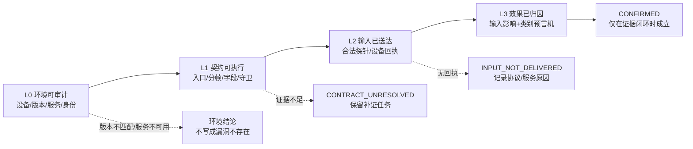
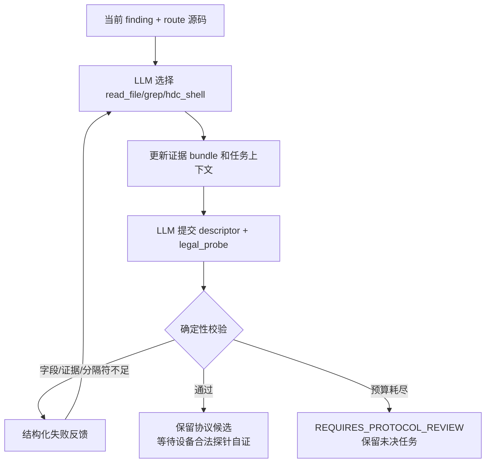

# VulnFounder 官方 24 个历史样本动态测试泛化改造进度

> 对应实施计划：[`VULNFOUNDER_OFFICIAL_24_DYNAMIC_TEST_GENERALIZATION_OPTIMIZATION_PLAN.zh-CN.md`](./VULNFOUNDER_OFFICIAL_24_DYNAMIC_TEST_GENERALIZATION_OPTIMIZATION_PLAN.zh-CN.md)
>
> 记录方式：本文件只记录已经落地到代码、经过测试或明确观察到的结果；“待完成”不等同于失败，也不把尚未执行的 24 项回归写成已通过。
>
> 最后更新：2026-09-22
>
> 当前分支：`refactor/vulnfounder-brand`
>
> 当前 Git 提交：`4de39e2`

---

## 1. 总体结论

本轮没有重新实现已经存在的设备预检、协议恢复、载荷构造和预言机模块，而是先建立可审查的阶段进度台账。当前代码已经覆盖计划中的大量基础能力，但还没有完成“官方 24 个样本在同一设备、同一 clean-room 条件下的全量回归”。因此，当前可以确认的是**框架能力和单元/集成测试状态**，不能提前宣称 24/24 已完成 L1、L2 或 L3。

计划要求的四层结论仍保持不变：



当前最近一次代码提交已经推送到 GitHub：

| 项目 | 结果 |
|---|---|
| 远端 | `origin/refactor/vulnfounder-brand` |
| 最新提交 | `4de39e2 fix: show dynamic deliverables before source preview` |
| 工作区 | 已清理、无已跟踪文件未提交改动 |
| 本轮聚焦 | 进度记录与既有实现验收，暂不重复实现已有模块 |

---

## 2. 计划阶段状态总览

| 阶段 | 目标 | 当前状态 | 已有证据 | 尚未完成 |
|---|---|---|---|---|
| 阶段 0 | 基线、样本标准化、clean-room 输入边界 | 部分完成 | 已有 finding/route/contract 结构；已有 clean-room 运行和历史产物机制 | 需要把官方 24 项统一清单、源码 revision、设备 revision 和 context_sources 冻结成一份本轮基线 |
| 阶段 1 | 设备指纹、服务健康、版本比较 | 已实现基础能力 | `DeviceFingerprint`、版本比较状态、服务/端点/进程事实和专门测试 | 尚需对当前连接开发板执行 24 项 L0 采集并归档；SP_daemon 连续健康检查的全量回归尚未完成 |
| 阶段 2 | 协议恢复 Agent Loop、字段/入口证据、失败反馈 | 已有主要能力；CLI/event 契约入口和合法探针已接入 | entry discovery loop、descriptor synthesizer、路由切片、字段证据、legal probe 校验；CLI/event 的命令数组形状校验和设备自证 | 尚需以 24 项为对象完成协议候选覆盖统计，不能只依赖已有注册描述符 |
| 阶段 3 | HAP/native/CLI/event carrier 和身份阶梯 | HAP/native 已有基础能力；CLI/event 已完成通用命令载体基础接入 | HAP、Unix native、身份降权字段、CLI/event 安全 argv、载体发送结果和交付物展示 | 24 项载体选择回归仍待完成；HAP 不是所有协议的唯一载体 |
| 阶段 4 | 输入影响与漏洞类别预言机 | 已实现多数观测器 | 文件、日志、回读、权限、崩溃、资源、状态和竞态类 oracle 代码及测试 | 24 项每个样本的 before/during/after/refutation 产物尚未重新汇总；输入到危险参数的独立证据还需逐项核查 |
| 阶段 5 | 官方 24 项 clean-room 分批回归 | 未完成 | 现有历史运行产物可作为基线，不作为本轮通过证据 | 需要按 DP-02、SmartPerf、HiView 分批重跑，并生成逐样本验收表 |

状态含义：

- **已实现基础能力**：代码路径和针对性测试已经存在，但不代表设备上的所有样本都已跑通。
- **部分完成**：已有数据结构或阶段入口，但还缺少统一的 24 项冻结基线或设备实测。
- **未完成**：没有足够的本轮证据，不能用历史产物替代。

---

## 3. 已落地能力与证据

### 3.1 L0 设备与版本预检

设备预检位于 `libs/vulnfounder-core/utilities/openharmony_dynamic/device_preflight.py`，当前已经能够：

1. 解析系统属性、进程、Unix socket、TCP/UDP 端点和目标服务。
2. 保存目标 PID、UID、SELinux 域、二进制路径及可选 hash。
3. 记录参考源码 revision、设备 revision、系统属性和端点的逐项比较结果。
4. 区分 `MATCHED`、`MISMATCH`、`UNKNOWN`、`VERSION_UNVERIFIED` 和 `SERVICE_UNAVAILABLE`。
5. 将命令错误保留在 `command_errors` 中，而不是把无法读取写成“未发现”。
6. 让版本未知时停在 `VERSION_UNVERIFIED`，不直接生成“设备不存在该问题”的结论。

这一层的边界已经明确：预检只读，不启动服务、不安装载荷、不修改设备状态。服务启动和连续健康检查仍属于运行器/设备执行阶段，不能把一次瞬时 PID 观察当作服务稳定可用。

对应提交：`e8fdf40 feat: add auditable device version comparisons`。

### 3.2 路由绑定与当前 finding 隔离

动态契约不再只记录“某服务有某协议”，而是通过 `RouteBinding` 保存当前 finding 的路由切片，包括：

- 当前 route 的 handler；
- 当前目标 sink；
- 分派条件；
- 状态读写关系；
- 证据位置；
- 假设和缺失证据。

这项设计用于防止同一个服务存在多个入口时，把其他入口的命令、字段或攻击链误并入当前样本。协议描述符表达协议族；route binding 表达当前样本实际要走的端点和处理路径。

### 3.3 协议描述符 Agent Loop

`descriptor_synthesizer.py` 已经具备有界的源码补证循环：



已落地的约束包括：

- 每个字段、守卫、发送变换和 legal probe 都要有当前源码证据引用。
- 源码证据只能来自当前 route 及允许的直接依赖，不把同服务其他端点混入。
- `key_value` 的分隔符必须在当前源码字符串/字符字面量中找到。
- 若当前源码明确出现 `SplitMsg`、`::` 等键值拆包证据，空字段的 `raw_text` 草案会被拒绝。
- legal probe 禁止 marker、shell 控制符、命令执行词和未闭合占位符。
- 每轮失败会反馈缺少字段、不可读证据、线路形态或 legal probe 失败原因。

这一层的确定性校验只证明“引用的源码片段存在”和“报文形状满足安全约束”，不把文本出现自动升级为运行时语义成立；最终还需要设备合法探针确认。

对应历史提交：`33dc49e`、`cfc9c1b`、`c1864c0`、`17cfcb9`、`7f23c02`。

### 3.4 载体与身份

当前已经具备两类主要载体：

- HAP UDP/TCP：用于声明式 ArkTS 载体，记录安装、启动、HAP 自证和实际帧。
- Unix native：使用受限 native helper 发送字节序列，保存逐系统调用结果和 payload hash。

身份模型已经包含 `hap_app`、`debug_app`、`root_su` 以及可选的设备侧降权 UID/GID。降权失败不能以 root 结果冒充普通应用结果。

HAP 不是动态测试的唯一载体。计划要求后续按契约选择 HAP、native helper、CLI 或事件发布器；因此目前 HAP/native 能力属于阶段 3 的基础完成，不代表 CLI/event_bus 已经完成泛化。

### 3.5 预言机和证据分层

`observation/oracles.py` 已经支持或接入以下观测形态：

- 文件创建/删除/属性和内容差分；
- 日志信号；
- 响应/回读差分；
- 权限/身份差分；
- faultlog 与目标进程存活关联；
- FD、内存和资源变化；
- 状态差分和竞态差分。

运行结果必须区分：

1. 输入是否真正送达；
2. 输入是否影响危险参数；
3. 是否观察到匹配的安全效果；
4. 是否被反事实或 refutation 证据否定。

因此，“目标日志出现”不能单独等价为命令注入或权限绕过确认；同样，服务没有日志也不能直接写成安全。

### 3.6 运行产物与前端交付物

当前运行记录已经可以保存契约、阶段状态、实际传输、设备命令台账、日志命中、观测和判定。Web 端已经修复“源码预览较慢导致 PoC/Exp 卡片暂时不渲染”的问题：交付物卡片先挂载，源码浏览器异步补充。

当前交付物可包括：

- `contract_poc.json`；
- `poc.hap`；
- `poc_source.zip` 和 `poc_source_manifest.json`；
- `README.md`；
- 在具备经过验证的 Exp 模板时再生成 Exp；没有安全可验证的 Exp 时明确显示 `poc_only`，不伪造 Exp。

对应最新提交：`4de39e2`。

### 3.7 CLI 与事件总线通用载体第一批接入

本次按计划补上了此前 runner 对 `cli`/`event_bus` 直接报“未支持”的缺口。新增的
`DeviceCommandTransport` 不识别服务名称，也不内置某个事件或命令；它只消费当前
契约中的 `protocol.param_space.cli_argv`、`event_argv` 或统一的 `command_argv`。

安全边界如下：

- 命令必须是字符串列表，整条 shell 字符串会在 validator 阶段拒绝；
- 禁止 NUL、控制字符、`;`、`|`、`&`、重定向、反引号和换行；
- 禁止把 `sh -c`、`bash -c` 等派生 shell 当成载体命令；
- runner 通过 HDC 参数数组执行，不将命令重新拼接成 shell；
- 实际 argv、来源键、返回码、stdout/stderr 摘要和 HDC command record 都进入
  `SendResult.transport`；
- 设备命令执行失败被记录为 `INPUT_REJECTED`，主机/HDC 基础设施异常记录为
  `INPUT_NOT_SENT`，不混写成漏洞效果失败。

同时把 `ProtocolSpec.param_space` 正式纳入数据模型，避免过去由调用方动态挂属性，
导致 JSON round-trip 与静态检查不一致。业务字段仍由协议描述符和 route 解释，设备
命令不会混进业务字段白名单。

本批次新增回归覆盖：

1. shell 字符串、`sh -c` 和控制字符被拒绝；
2. CLI 合法 argv 能执行并保存回执；
3. event_bus 非零返回码被区分为设备拒绝；
4. 缺少合法 argv 的 CLI 契约在设备交互前被拦截。

本批次尚未声称任何具体事件总线协议已经在开发板上成功发送；协议字段、事件名和
权限仍必须由当前 finding 的源码证据和合法探针恢复。

本阶段又补上了合法探针的同类支持：描述符的 `legal_probe.mode` 现在可以声明
`cli` 或 `event_bus`，并通过同一个安全命令载体执行 `command_argv`。自动描述符
自证会记录命令返回码和设备回执；不会把“主机成功生成 JSON”当成设备协议已成立。
CLI/event 合法探针同样禁止 marker、canary、shell 控制符和 `sh -c`，且不会复用漏洞
变异字段。

---

## 4. 当前测试证据

截至本次更新，已执行以下针对性测试：

```text
python -m pytest -q \
  libs/vulnfounder-core/tests/test_device_preflight.py \
  libs/vulnfounder-core/tests/test_descriptor_synthesizer.py \
  libs/vulnfounder-core/tests/test_entry_discovery_loop.py \
  libs/vulnfounder-core/tests/test_carrier_synthesizer.py \
  libs/vulnfounder-core/tests/test_generic_dynamic_oracles.py \
  libs/vulnfounder-core/tests/test_dynamic_runner_contract.py
```

结果：

```text
80 passed in 0.27s
```

这 80 项覆盖的是设备版本比较、协议描述符证据核验、入口/路由循环、HAP/native/CLI/event 载体校验、CLI/event 合法探针、通用预言机和运行器契约形状。它们证明代码级基础行为，但不等价于当前开发板上 24 个样本全部成功。

有一组更大范围的旧测试曾因网络/LLM 可用性测试等待超时，不能把该次未完成运行写成全通过。本进度文件只采用明确完成的针对性测试结果。

---

## 5. 仍需完成的工作

### 5.1 阶段 0：冻结 24 项 clean-room 基线

需要生成一份本轮专用清单，至少包括：

- sample_id、目标函数、漏洞类别；
- 当前扫描来源和源码 revision；
- 参考修复前 revision；
- 当前设备预检输入和输出路径；
- 当前 route/context_sources；
- 当前已知阻断原因；
- 是否允许进入设备发送阶段。

该清单只能用于调度和审计，不能把人工参考攻击链、历史成功帧或答案字段传给协议恢复模型。

### 5.2 阶段 2：协议覆盖与通用载体

本批次已完成前 3 项的基础接入，并新增了 CLI/event 的合法探针自证。后续仍需在
真实 24 项样本上验证协议覆盖和设备权限。当前清单如下：

1. **已完成**：为 `cli` 和 `event_bus` 增加契约驱动的安全命令数组载体，不把命令拼成未经约束的 shell 字符串。
2. **已完成**：validator 校验 CLI/event 的命令数组、shell 控制字符和 `sh -c` 形状；运行期再次校验。
3. **已完成**：runner 按 `entry.kind` 选择 HAP、native、CLI 或 event carrier，并把发送结果统一写入 `SendResult`。
4. **已完成基础记录**：合法探针记录发送 argv、返回码、stdout/stderr 摘要和 HDC command record；route_id 仍需由当前协议编译产物补齐并在 24 项回归中核验。
5. **保留待验收**：描述符失败时保留候选和补证任务，不退回某个样本专用帧作为默认答案；需要用真实 clean-room 运行确认没有隐藏回退。

此外，自动 skeleton 现在能从当前 finding 的 `entry_kind`/`transport_kind` 结构化
上下文识别 `cli`、`event_bus`、`unix_stream` 等载体；若自动描述符只声明唯一可用
transport，也会使用该证据，而不是按服务名猜测。CLI/event 没有额外的固定服务命令，
默认身份仍保守为 `root_su`，必须由后续身份事实和设备对照把它降为普通应用结论。

### 5.3 阶段 3/4：输入影响与类别 oracle 的逐样本证据

需要对每个已实际发送的样本分别生成：

- `device_fingerprint.json`；
- `entry_discovery.json`；
- `protocol_contract.json`；
- `probe_result.json`；
- `payload_manifest.json`；
- `input_influence.json`；
- `oracle_result.json`；
- `dynamic_result.json`；
- `cleanup_result.json`。

重点不是增加“CONFIRMED”数量，而是证明 payload 中的变异值确实到达危险参数，并且效果归因到当前服务 PID、运行身份和时间窗口。

### 5.4 阶段 5：24 项分批回归

建议固定顺序：

1. DP-02 clean-room 自动协议回归；
2. SmartPerf 文本协议组；
3. SmartPerf 资源/崩溃/状态组；
4. HiView 事件总线和 Unix socket 组；
5. 全量 24 项重新生成逐样本表。

每一批都要把“未进入设备发送”“合法探针已拒绝”“输入已送达但 oracle 无信号”“版本不匹配”“服务不可用”分开统计。

---

## 6. 当前不应作出的结论

以下结论在本轮证据不足时不能写入汇报：

- “24 个样本已经全部可达”；
- “所有样本都已经发送过真实载荷”；
- “未观察到 marker 就证明不存在问题”；
- “HAP 载体覆盖了所有 OpenHarmony 服务协议”；
- “模型生成的协议字段只要能序列化就一定正确”；
- “历史成功的 `sp_daemon_text` 运行可以代表其他协议族”；
- “针对性单元测试通过等于开发板动态验证通过”。

当前最准确的阶段表述是：**L0 设备/版本审计、协议证据循环、HAP/native 载体、通用预言机和前端交付物基础能力已经落地；24 项 clean-room 的全量设备回归和 CLI/event_bus 泛化仍待推进。**

---

## 7. 后续更新规则

每取得一个可复核阶段成果，按下面格式追加更新：

1. 更新本文件“阶段状态总览”和对应详细章节；
2. 写明代码提交号、测试命令、通过数量和未完成边界；
3. 如有设备运行，列出产物目录和样本级终态；
4. 只提交与本阶段相关的 tracked 文件，避免把设备运行产物、缓存和临时日志提交到仓库；
5. 提交后推送 `origin/refactor/vulnfounder-brand`，在本文件的更新记录中登记远端同步状态。

### 更新记录

| 日期 | 提交 | 进展 |
|---|---|---|
| 2026-09-22 | `4de39e2` | 完成基线同步；建立本进度文件；记录 L0、协议 Agent、HAP/native、oracle 和交付物现状；针对性测试 74 项通过 |
| 2026-09-22 | `4f8ef03` | 接入 CLI/event_bus 通用 argv 载体、契约校验和运行器分支；新增针对性测试后累计 78 项通过并已推送 |
| 2026-09-22 | `0e5f98e` | 扩展 CLI/event_bus 合法探针自证，并完善自动 skeleton 的通用载体/身份识别；新增针对性测试后累计 80 项通过并已推送 |
