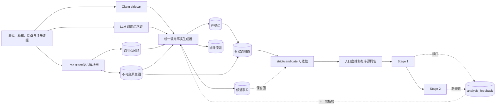

# OpenAnt 调用事实、可达性与分析反馈图

该图强调原生图不可变、严格边和候选事实分层、Stage 1/2 反馈不自动升级关系。

```mermaid
flowchart LR
    SRC["源码、构建、设备与注册证据"] --> TS["Tree-sitter/语言解析器"]
    SRC --> CLANG["Clang sidecar"]
    SRC --> LLMEDGE["LLM 调用边求证"]
    TS --> LEDGER[("调用点台账")]
    TS --> NATIVE[("不可变原生图")]
    CLANG --> FACTS["统一调用事实生成器"]
    LLMEDGE --> FACTS
    LEDGER --> FACTS
    NATIVE --> FACTS
    FACTS --> STRICT[("严格边")]
    FACTS --> CAND[("候选事实")]
    FACTS --> EXCL[("排除原因")]
    STRICT --> EFFECTIVE[("有效调用图")]
    NATIVE --> EFFECTIVE
    EFFECTIVE --> REACH["strict/candidate 可达性"]
    CAND -. "保召回" .-> REACH
    REACH --> LINEAGE["入口血缘和有序源码包"] --> S1["Stage 1"] --> S2["Stage 2"]
    S1 -. "缺口" .-> FEEDBACK[("analysis_feedback")]
    S2 -. "新线索" .-> FEEDBACK
    FEEDBACK -. "下一轮核验" .-> FACTS
```

PNG 预览：[openant-evidence-and-feedback-loop.png](openant-evidence-and-feedback-loop.png)
