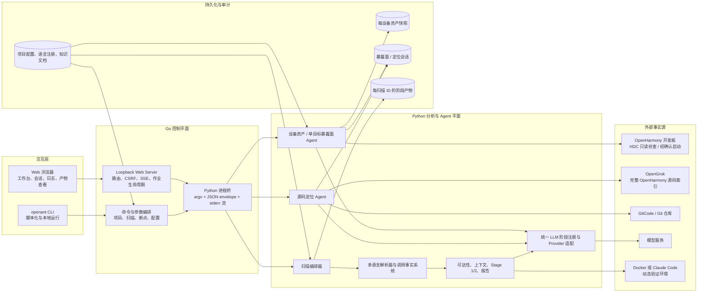

# OpenAnt 系统运行架构图

该图按交互层、Go 控制平面、Python 分析平面、外部事实源和持久化层展示运行边界。

```mermaid
flowchart LR
    subgraph USER["交互层"]
        WEB["Web 浏览器<br/>工作台、会话、日志、产物查看"]
        CLI["openant CLI<br/>脚本化与本地运行"]
    end
    subgraph GO["Go 控制平面"]
        SERVER["Loopback Web Server<br/>路由、CSRF、SSE、作业生命周期"]
        COMMAND["命令与参数编排<br/>项目、扫描、断点、配置"]
        BRIDGE["Python 进程桥<br/>argv + JSON envelope + stderr 流"]
    end
    subgraph PY["Python 分析与 Agent 平面"]
        ORCH["扫描编排器"]
        DEVICE["设备资产 / 单目标暴露面 Agent"]
        LOCATOR["源码定位 Agent"]
        PARSER["多语言解析器与调用事实系统"]
        ANALYSIS["可达性、上下文、Stage 1/2、报告"]
        LLM["统一 LLM 阶段注册与 Provider 适配"]
    end
    subgraph EXT["外部事实源"]
        BOARD["OpenHarmony 开发板<br/>HDC 只读侦查 / 经确认启动"]
        OPENGROK["OpenGrok<br/>完整 OpenHarmony 源码索引"]
        GIT["GitCode / Git 仓库"]
        MODEL["模型服务"]
        DOCKER["Docker 或 Claude Code<br/>动态验证环境"]
    end
    subgraph STORE["持久化与审计"]
        ASSET[("每设备资产快照")]
        SESSION[("暴露面 / 定位会话")]
        SCAN[("每扫描 ID 的阶段产物")]
        CONFIG[("项目配置、语言注册、知识文档")]
    end
    WEB --> SERVER --> BRIDGE
    CLI --> COMMAND --> BRIDGE
    BRIDGE --> ORCH
    BRIDGE --> DEVICE
    BRIDGE --> LOCATOR
    ORCH --> PARSER --> ANALYSIS
    DEVICE --> BOARD
    LOCATOR --> OPENGROK
    LOCATOR --> GIT
    ANALYSIS --> DOCKER
    DEVICE --> LLM
    LOCATOR --> LLM
    ANALYSIS --> LLM
    LLM --> MODEL
    DEVICE --> ASSET
    DEVICE --> SESSION
    LOCATOR --> SESSION
    ORCH --> SCAN
    CONFIG --> COMMAND
    CONFIG --> ORCH
    CONFIG --> DEVICE
```

PNG 预览：[openant-system-runtime-architecture.png](openant-system-runtime-architecture.png)
