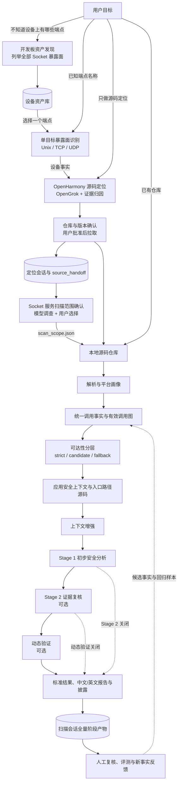

# VulnFounder 完整项目总流程图

该图展示设备资产发现、单目标暴露面识别、源码定位、仓库/范围确认、静态分析、验证和报告的当前总体关系。虚线表示可选路径或下一轮反馈，不表示候选事实已经成为严格调用关系。

PNG 预览：[vulnfounder-complete-project-overall-flow.png](vulnfounder-complete-project-overall-flow.png)
