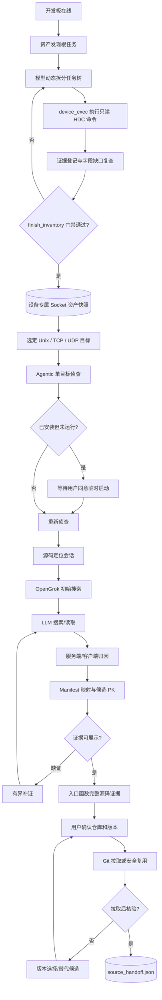

# 设备暴露面与源码定位联合流程图

该图同时展示设备资产 Agent、单目标侦查、用户启动确认、OpenGrok 证据恢复、候选仓库比较和 Git 交接。

```mermaid
flowchart TB
    D0["开发板在线"] --> D1["资产发现根任务"] --> D2["模型动态拆分任务树"]
    D2 --> D3["device_exec 执行只读 HDC 命令"] --> D4["证据登记与字段缺口复查"]
    D4 --> D5{"finish_inventory 门禁通过?"}
    D5 -->|"否"| D2
    D5 -->|"是"| D6[("设备专属 Socket 资产快照")]
    D6 --> T0["选定 Unix / TCP / UDP 目标"] --> T1["Agentic 单目标侦查"]
    T1 --> T2{"已安装但未运行?"}
    T2 -->|"是"| T3["等待用户同意临时启动"] --> T4["重新侦查"]
    T2 -->|"否"| T4
    T4 --> L0["源码定位会话"] --> L1["OpenGrok 初始搜索"] --> L2["LLM 搜索/读取"]
    L2 --> L3["服务端/客户端归因"] --> L4["Manifest 映射与候选 PK"]
    L4 --> L5{"证据可展示?"}
    L5 -->|"缺证"| L6["有界补证"] --> L2
    L5 -->|"是"| L7["入口函数完整源码证据"] --> L8["用户确认仓库和版本"]
    L8 --> L9["Git 拉取或安全复用"] --> L10{"拉取后核验?"}
    L10 -->|"否"| L11["版本选择/替代候选"] --> L8
    L10 -->|"是"| L12[("source_handoff.json")]
```

PNG 预览：[vulnfounder-exposure-location-integrated-flow.png](vulnfounder-exposure-location-integrated-flow.png)
