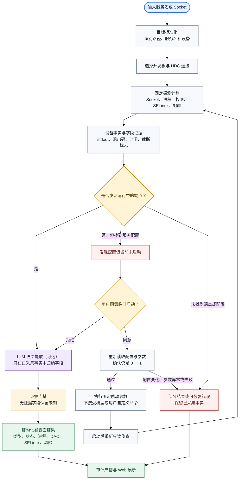

# OpenHarmony 暴露面识别流程图

这张图聚焦独立的设备侦查阶段：先以受限命令采集事实，再由可选的大模型进行字段归纳。所有字段都必须能回指设备证据；服务未启动时，启动和重新侦查必须经过用户确认。

## 输出重点

- 运行中的端点会关联 Socket 类型、进程、UID、DAC 权限和 SELinux 标签等字段。
- 已配置但未启动的服务不会被自动启动；用户拒绝时保留停止状态和已采集信息。
- 大模型只负责解释结构化探测结果，不生成任意 HDC 命令，也不能覆盖字段级证据。
- 命令失败、设备离线或字段无法确认时，结果标记为部分完成并保留未知值及审计信息。
