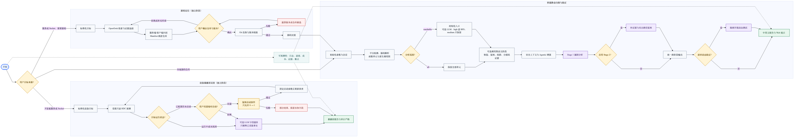

# VulnFounder 全流程图（更新版）

这张图是阶段级总览，展示当前可以独立运行的源码定位、设备暴露面识别和普通静态漏洞扫描。暴露面识别暂时不会自动改变普通扫描输入；源码定位在用户确认仓库和版本后才进行拉取。

```mermaid
%%{init: {"theme": "base", "themeVariables": {"fontFamily": "Arial, sans-serif", "fontSize": "16px", "primaryTextColor": "#17202A"}, "flowchart": {"htmlLabels": true, "curve": "linear", "nodeSpacing": 38, "rankSpacing": 54}}}%%
flowchart LR
    start(["开始"])
    intent{"用户目标来源？"}
    start --> intent
    intent -->|"本地源码仓库"| scanStart
    intent -->|"服务或 Socket，需要源码"| locStart
    intent -->|"开发板服务或 Socket"| expStart

    subgraph locator["源码定位（独立阶段）"]
        direction TB
        locStart["标准化目标"] --> locSearch["OpenGrok 检索与证据追踪"]
        locSearch --> locMap["服务端/客户端归因<br/>Manifest 映射仓库"]
        locMap --> locConfirm{"用户确认仓库与版本？"}
        locConfirm -->|"拒绝或补充约束"| locSearch
        locConfirm -->|"确认"| locClone["Git 拉取与版本校验"]
        locClone -->|"失败"| locFallback["提供版本或仓库候选"]
        locFallback --> locConfirm
        locClone -->|"通过"| locHandoff["源码交接"]
    end

    subgraph exposure["设备暴露面识别（独立阶段）"]
        direction TB
        expStart["标准化设备目标"] --> expProbe["受限只读 HDC 探测"]
        expProbe --> expState{"目标运行状态？"}
        expState -->|"运行中或未找到"| expExtract["可选 LLM 字段提取<br/>只解释已采集事实"]
        expState -->|"已配置但未启动"| expAsk{"用户同意临时启动？"}
        expAsk -->|"同意"| expRecheck["复核启动条件<br/>只允许 0 → 1"]
        expRecheck -->|"通过"| expSet["固定启动参数后重新侦查"]
        expRecheck -->|"失败"| expPartial["部分结果，保留未知字段"]
        expSet --> expProbe
        expAsk -->|"拒绝"| expExtract
        expExtract --> expReport["暴露面报告与审计产物"]
        expPartial --> expReport
    end

    subgraph scan["普通静态扫描与验证"]
        direction TB
        scanStart["初始化参数与会话"] --> parse["平台检测、源码解析<br/>函数单元与原生调用图"]
        parse --> scope{"分析范围？"}
        scope -->|"all"| allUnits["保留全部单元"]
        scope -->|"reachable"| reach["结构化入口<br/>可选 LLM：high 进 BFS、medium 只保留"]
        allUnits --> sem["可选调用图语义阶段<br/>恢复、复核、投影、分派码证据"]
        reach --> sem
        sem --> context["安全上下文与 Agentic 增强"]
        context --> stage1["Stage 1 漏洞分析"]
        stage1 --> stage2Opt{"启用 Stage 2？"}
        stage2Opt -->|"是"| stage2["补证据与攻击路径复核"]
        stage2Opt -->|"否"| output["统一跨阶段输出"]
        stage2 --> output
        output --> dynOpt{"请求动态验证？"}
        dynOpt -->|"是"| dynamic["隔离环境动态测试"]
        dynOpt -->|"否"| report["中英文报告与 Web 展示"]
        dynamic --> report
    end

    locHandoff --> scanStart
    start -.-> observe["可观测性：日志、进度、成本、证据、断点"]
    observe -.-> expReport
    observe -.-> report

    classDef start fill:#E8F1FF,stroke:#2F6BFF,stroke-width:2px,color:#17315C
    classDef process fill:#F7F9FC,stroke:#64748B,stroke-width:1.2px,color:#17202A
    classDef decision fill:#FFF4D6,stroke:#C98A00,stroke-width:1.5px,color:#5C4100
    classDef model fill:#F1EAFE,stroke:#815AC7,stroke-width:1.5px,color:#38215F
    classDef output fill:#E8F7EE,stroke:#2E8B57,stroke-width:1.5px,color:#164B2D
    classDef warning fill:#FFF0F0,stroke:#C94C4C,stroke-width:1.5px,color:#6B2020
    classDef observe fill:#EEF7F7,stroke:#2D7F7F,stroke-dasharray: 5 4,color:#174B4B

    class start start
    class intent,locConfirm,expState,expAsk,expRecheck,scope,stage2Opt,dynOpt decision
    class locStart,locSearch,locMap,locClone,locFallback,locHandoff process
    class expStart,expProbe,expSet,expPartial process
    class scanStart,parse,allUnits,reach,sem,context,output process
    class expExtract,stage1,stage2,dynamic model
    class expReport,report output
    class locFallback,expPartial warning
    class observe observe
```

## 阅读要点

- 灰色节点是确定性处理；紫色节点是可选的大模型语义分析或验证。
- 黄色节点是用户选择或运行条件；红色节点是失败、重试或部分结果路径；绿色节点是阶段输出。
- 设备端启动只允许在用户同意、配置复核通过且参数仍为 `0 → 1` 时执行，随后重新侦查。
- LLM 可达性中的 `high` 信号可进入 BFS，`medium` 信号只保留对应单元；调用图语义四阶段按开关独立产出。
- 细节见 `vulnfounder-exposure-surface-flow` 和 `vulnfounder-integrated-future-pipeline-flow` 两张专题图。
