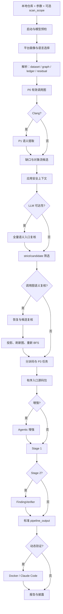

# VulnFounder 仓库扫描详细流程图

该图展示普通扫描的必要阶段和可选分支。它不是 Web 卡片数量的机械复制，而是 Python 编排器内部真实的分析依赖顺序。

```mermaid
flowchart TB
    I["本地仓库 + 参数 + 可选 scan_scope"] --> P0["启动与模型预检"]
    P0 --> P1["平台画像与语言选择"] --> P2["解析：dataset / graph / ledger / residual"]
    P2 --> P3["P0 有效调用图"] --> P4{"Clang?"}
    P4 -->|"是"| P5["P1 语义提取"] --> P6["缺口与对象流候选"]
    P4 -->|"否"| P6
    P6 --> P7["应用安全上下文"] --> P8{"LLM 可达性?"}
    P8 -->|"是"| P9["全量语义入口复核"] --> P10["strict/candidate 筛选"]
    P8 -->|"否"| P10
    P10 --> P11{"调用图语义复核?"}
    P11 -->|"是"| P12["恢复与候选复核"] --> P13["投影、刷新图、重新 BFS"] --> P14["分派码与 P3 任务"]
    P11 -->|"否"| P14
    P14 --> P15["有序入口源码包"] --> P16{"增强?"}
    P16 -->|"是"| P17["Agentic 增强"] --> P18["Stage 1"]
    P16 -->|"否"| P18
    P18 --> P19{"Stage 2?"}
    P19 -->|"是"| P20["FindingVerifier"] --> P21["标准 pipeline_output"]
    P19 -->|"否"| P21
    P21 --> P22{"动态验证?"}
    P22 -->|"是"| P23["Docker / Claude Code"] --> P24["报告与披露"]
    P22 -->|"否"| P24
```

PNG 预览：[vulnfounder-repository-scan-detailed-flow.png](vulnfounder-repository-scan-detailed-flow.png)
